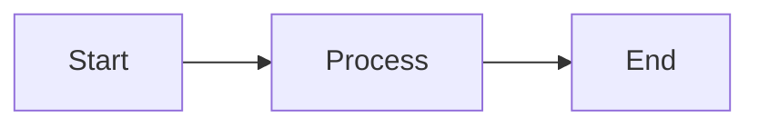

# Contributing to Awesome Cybersecurity Researcher Collection

🎉 First off, thank you for considering contributing to this repository!

## How Can I Contribute?

### 🐛 Reporting Bugs

If you find an error in the documentation:

1. **Check existing issues** to avoid duplicates
2. **Create a new issue** with:
   - Clear, descriptive title
   - Steps to reproduce (if applicable)
   - Expected vs actual behavior
   - Screenshots or code snippets
   - Your environment details

### 💡 Suggesting Enhancements

We welcome suggestions for:

- New security techniques or vulnerabilities
- Additional tools and resources
- Improved documentation
- Better organization or structure
- New case studies or examples

**Submit enhancement suggestions via GitHub Issues** with the `enhancement` label.

### 📝 Pull Requests

#### Before You Start

1. **Fork the repository**
2. **Create a new branch**: `git checkout -b feature/your-feature-name`
3. **Check existing content** to avoid duplication

#### Content Guidelines

##### 📚 Documentation Standards

- Use **clear, concise language**
- Include **practical examples** where possible
- Provide **references and sources**
- Follow the existing **markdown structure**
- Use **proper heading hierarchy** (H1 → H2 → H3)

##### 🎨 Style Guide

**Markdown Formatting**:
```markdown
# Main Title (H1)

## Section (H2)

### Subsection (H3)

- Bullet points for lists
- Use `code` for commands and filenames
- Use **bold** for emphasis
- Use *italic* for definitions
```

**Code Blocks**:
````markdown
```python
# Always specify language for syntax highlighting
def example():
    return "Use proper indentation"
```
````

**Diagrams**:
```markdown
# Use Mermaid for diagrams

```

##### 🔒 Security Content Requirements

When adding security techniques:

1. **Always include disclaimer**: Educational/authorized use only
2. **Provide defensive perspective**: How to detect/prevent
3. **Include real-world context**: When/why this is used
4. **Reference CVEs** when applicable
5. **Cite sources**: Papers, blogs, official docs

**Example Structure**:
```markdown
## Vulnerability Name

### Overview
Brief description of the vulnerability

### Technical Details
How it works, root cause

### Exploitation
Step-by-step exploitation (for authorized testing)

### Detection
How blue teams can detect this

### Mitigation
How to fix/prevent this

### References
- [CVE-XXXX-XXXX](link)
- [Original Research](link)
```

##### 🛠️ Tool Recommendations

When adding tools:

- **Verify current status**: Is it maintained?
- **Include version**: Specify compatible versions
- **Provide setup instructions**: Basic usage
- **Link to official source**: GitHub, website
- **Note alternatives**: Similar tools

#### Commit Messages

Follow [Conventional Commits](https://www.conventionalcommits.org/):

```
feat: add new EDR bypass technique
fix: correct link to mitigation document
docs: improve fuzzing tutorial clarity
style: format code blocks in exploit guide
refactor: reorganize defense section
```

#### Pull Request Process

1. **Update documentation** if needed
2. **Ensure all links work** and point to correct files
3. **Test code examples** if you've added any
4. **Update table of contents** if adding new sections
5. **Add yourself to contributors** list (optional)

**PR Template**:
```markdown
## Description
Brief description of changes

## Type of Change
- [ ] Bug fix (broken link, typo)
- [ ] New content (technique, tool, case study)
- [ ] Enhancement (improved explanation, better examples)
- [ ] Refactoring (reorganization, cleanup)

## Checklist
- [ ] I have tested all links
- [ ] Code examples are working
- [ ] Documentation follows style guide
- [ ] I have added references where applicable
- [ ] Content is educational/authorized use only
```

### 🌍 Translation Contributions

We welcome translations! Current priorities:
- English ↔ Turkish
- Additional languages welcome

**Translation Guidelines**:
- Maintain technical accuracy
- Keep original formatting
- Update links to translated versions
- Add language identifier in filename: `file-en.md`, `file-tr.md`

### 📊 Case Study Contributions

High-quality case studies are especially valuable!

**Requirements**:
- Real-world vulnerability (CVE preferred)
- Step-by-step technical analysis
- Complete exploitation walkthrough
- Defensive recommendations
- Verified, working examples

**Case Study Template**: See [case-study-template.md](case-study-template.md)

## 🏷️ Labels

We use the following labels for issues and PRs:

| Label | Description |
|-------|-------------|
| `bug` | Something isn't working |
| `enhancement` | New feature or request |
| `documentation` | Improvements to docs |
| `good first issue` | Good for newcomers |
| `help wanted` | Extra attention needed |
| `translation` | Translation work |
| `case-study` | Real-world examples |
| `tool` | New tool addition |
| `technique` | New security technique |

## 🔍 Review Process

1. **Automated checks** run on all PRs (link validation, markdown linting)
2. **Manual review** by maintainers
3. **Discussion** if changes needed
4. **Merge** when approved

Typical review time: **3-7 days**

## 🤝 Code of Conduct

### Our Standards

- **Be respectful** and constructive
- **Focus on technical accuracy** over opinions
- **Help newcomers** learn and contribute
- **Assume good intentions**
- **Provide constructive feedback**

### Unacceptable Behavior

- Personal attacks or harassment
- Trolling or inflammatory comments
- Publishing others' private information
- Sharing malicious code or exploits
- Illegal activity promotion

## 📜 Legal and Ethical Guidelines

### Content Restrictions

**DO NOT contribute**:
- 0-day exploits (unreported to vendors)
- Malware or malicious code
- Tools designed solely for malicious use
- Techniques for bypassing legal protections
- Content violating copyright/licenses

**ALWAYS include**:
- Educational purpose statements
- Authorized use disclaimers
- Defensive perspectives
- Legal compliance notes

### Responsible Disclosure

If your contribution involves:
- Previously unknown vulnerabilities
- Discovered during research
- Not yet patched

**Follow responsible disclosure**:
1. Report to vendor first
2. Allow 90-day disclosure window
3. Coordinate public disclosure
4. Obtain CVE if applicable

## 🎓 Recognition

Contributors are recognized in:
- GitHub contributors page
- [CONTRIBUTORS.md](CONTRIBUTORS.md) file
- Release notes (for major contributions)

## 📞 Questions?

- **GitHub Discussions**: For general questions
- **GitHub Issues**: For specific problems
- **Email**: For private inquiries

## 🚀 Getting Started

Ready to contribute?

1. **Star the repo** ⭐
2. **Fork it** 🍴
3. **Clone your fork**: `git clone https://github.com/your-username/Awesome-Collection.git`
4. **Create a branch**: `git checkout -b feature/amazing-feature`
5. **Make your changes** ✨
6. **Commit**: `git commit -m 'feat: add amazing feature'`
7. **Push**: `git push origin feature/amazing-feature`
8. **Open a Pull Request** 🎉

---

**Thank you for making cybersecurity education better!** 🛡️

---

Last Updated: January 2025
