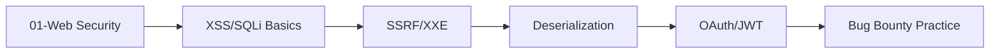
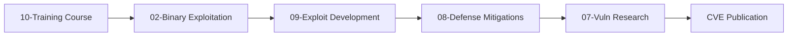
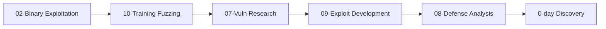

# 🛡️ Awesome Cybersecurity Researcher Collection

> Comprehensive cybersecurity research notes, methodologies, and reference collection. This collection contains detailed notes for vulnerability research, penetration testing, exploit development, and security analysis.

[]()
[]()
[]()

---

### [01 - Web Application Security](./01-Web-Application-Security/README.md)
Modern web application vulnerabilities and attack techniques.

**Coverage**: XSS, SQL Injection, SSRF, SSTI, XXE, IDOR, Deserialization, JWT, OAuth, GraphQL, WAF Bypass

**Level**: 🟢 Beginner - 🟡 Intermediate

---

### [02 - Binary Exploitation](./02-Binary-Exploitation/README.md)
Binary exploitation and low-level attack techniques.

**Coverage**: Shellcode Development, Fuzzing Techniques

**Level**: 🟡 Intermediate - 🔴 Advanced

---

### [03 - OSINT](./03-OSINT/README.md)
Open-source intelligence gathering techniques and tools.

**Coverage**: OSINT Tools, Collection Methods, Analysis Techniques

**Level**: 🟢 Beginner - 🟡 Intermediate

---

### [04 - AI Security](./04-AI-Security/README.md)
Security testing and attack vectors for AI and LLM systems.

**Coverage**: Prompt Injection, Model Extraction, LLM Vulnerabilities

**Level**: 🟡 Intermediate - 🔴 Advanced

---

### [05 - Methodology](./05-Methodology/README.md)
Testing methodologies and security assessment approaches.

**Coverage**: Fast Checking, Assessment Frameworks

**Level**: 🟢 Beginner - 🟡 Intermediate

---

### [06 - Offensive Security](./06-Offensive-Security/README.md) 🆕
Modern offensive security techniques, red teaming, and attack frameworks.

**Content**:
- [01 - Initial Access Techniques](./06-Offensive-Security/01-initial-access-techniques.md)
  - Email phishing, OAuth attacks, cloud misconfigurations
  - Command & Control infrastructure
  - EDR evasion, payload delivery
  - Emerging vectors: AI/LLM, supply chain, mobile

- [02 - EDR Bypass Techniques](./06-Offensive-Security/02-edr-bypass-techniques.md)
  - AV vs EDR fundamentals
  - Hook evasion (inline hooks, IAT/EAT)
  - ETW silencing techniques
  - Memory-based evasion (direct syscalls, unhooking)
  - Process manipulation (hollowing, doppelgänging, herpaderping)
  - Modern EDR bypass (Defender, CrowdStrike, SentinelOne)

**Level**: 🟡 Intermediate - 🔴 Advanced

**Last Updated**: 2025-01 (Windows 11 24H2, modern EDR bypass techniques)

---

### [07 - Vulnerability Research](./07-Vulnerability-Research/README.md) 🆕
Professional vulnerability research methodologies and techniques.

**Content**:
- [Vulnerability Research Methodology](./07-Vulnerability-Research/vulnerability-research-methodology.md)
  - **5-Phase Research**: Reconnaissance → Static Analysis → Dynamic Analysis → Fuzzing → Exploitation
  - **Patch Diffing**: Windows, Linux, Apple IPSW binary diffing workflows
  - **Fuzzing**: AFL++, LibFuzzer, Honggfuzz, Syzkaller
  - **Attack Surface**: Kernel, browsers, containers, cloud, AI/LLM, TEE
  - **Real-world Case Studies**: 7-Zip, Windows TCP/IP RCE, ksmbd
  - **LLM-Assisted Research**: ChatAFL, automated triage

**Level**: 🟡 Intermediate - ⚫ Expert

**Tools**: IDA Pro, Ghidra, BinDiff, AFL++, Syzkaller, Angr, Triton

**Last Updated**: 2025-01 (LLM-guided fuzzing, modern case studies)

---

### [08 - Defense](./08-Defense/README.md) 🆕
Modern security mitigations and bypass techniques.

**Content**:
- [Modern Kernel Mitigations](./08-Defense/modern-kernel-mitigations.md)
  - **Memory Safety**: KASLR, KPTI, SMAP/SMEP, MTE, LAM
  - **Virtualization Security**: VBS, HVCI, SEV-SNP, TDX
  - **Control Flow Integrity**: CET, CFG, XFG, Shadow Stack, GCS
  - **Heap Protections**: LFH, Safe Unlink, AMSI Heap Scanning
  - **Side-Channel Mitigations**: Spectre, Meltdown, Retpolines
  - **Bypass Techniques**: Detailed bypass examples for each mitigation
  - **Detection Strategies**: Blue team perspective

**Level**: 🔴 Advanced - ⚫ Expert

**Platform Coverage**: Windows 11 24H2+, Linux 6.x, macOS 15+, Android 14+

**Last Updated**: 2025-01 (CET, XFG, GCS, AMSI heap scanning)

---

### [09 - Exploit Development](./09-Exploit-Development/README.md) 🆕
Exploit development guide from scratch with real-world case studies.

**Content**:
- [Exploit Development Guide](./09-Exploit-Development/exploit-development-guide.md)
  - **Bug Classes**: Stack overflow, heap overflow, UAF, race conditions, type confusion
  - **Mitigation Bypasses**: DEP, ASLR, CFG, CET, XFG, MTE
  - **ROP/JOP Chains**: Gadget finding, chain construction
  - **Shellcode Development**: Obfuscation, encoding, evasion
  - **Complete Case Studies**:
    - CVE-2025-0910 (TinyFTP): Classic stack overflow
    - CVE-2024-8923 (libwebp): Modern CET/XFG bypass
    - CVE-2024-4852 (Edge WebView2): UAF exploitation
    - CVE-2025-20301 (ImageMagick): Heap exploitation
  - **Platform-Specific**: Windows, Linux, browser, kernel, mobile

**Level**: 🟡 Intermediate - ⚫ Expert

**Tools**: GDB/GEF, WinDbg, IDA Pro, pwntools, ROPgadget, Metasploit

**Last Updated**: 2025-01 (Detailed case studies, modern bypass techniques)

---

### [10 - Training](./10-Training/README.md) 🆕
Structured learning programs and hands-on laboratories.

**Content**:
- [Fuzzing & Crash Analysis Course](./10-Training/fuzzing-crash-analysis-course.md)
  - **Week 1**: Fuzzing fundamentals (AFL++, HonggFuzz, Syzkaller)
  - **Week 2**: Advanced crash analysis and exploit primitive development
  - **14-Day Intensive Program**: Daily exercises, labs, assessments
  - **Lab Environment**: Docker setup, tool configurations
  - **Practice Challenges**: CTF recommendations, real-world targets
  - **Career Path**: Beginner → Intermediate → Advanced → Expert

**Level**: 🟢 Beginner - 🔴 Advanced (progressive)

**Duration**: 2 weeks (intensive) or self-paced

**Last Updated**: 2025-01 (Week 2 added, modern tooling)

---

### [11 - Active Directory Security](./11-Active-Directory/README.md) 🆕
Enterprise Active Directory security, attacks, and defense strategies.

**Content**:
- [AD Enumeration](./11-Active-Directory/ad-enumeration.md)
  - Domain, user, group, computer enumeration
  - ACL/permission mapping with BloodHound
  - GPO and trust relationship discovery
  - Stealth enumeration techniques

- [AD Attacks](./11-Active-Directory/ad-attacks.md)
  - **Kerberos Attacks**: Kerberoasting, AS-REP Roasting, Golden/Silver/Diamond Tickets
  - **NTLM Attacks**: Pass-the-Hash, NTLM Relay, Coercion (PetitPotam, PrinterBug)
  - **Delegation Abuse**: Unconstrained, Constrained, RBCD
  - **ACL Exploitation**: GenericAll, WriteDacl, Shadow Credentials
  - **AD CS Attacks**: ESC1-ESC13 (Certified Pre-Owned)
  - **Trust Exploitation**: Cross-domain/forest attacks

- [AD Lateral Movement](./11-Active-Directory/ad-lateral-movement.md)
  - Remote execution (PsExec, WMI, WinRM, DCOM)
  - Credential harvesting (LSASS, SAM, DPAPI)
  - Pass-the-Hash/Ticket techniques
  - Token manipulation and impersonation
  - C2 framework lateral movement

- [AD Persistence](./11-Active-Directory/ad-persistence.md)
  - Kerberos backdoors (Golden Ticket, Skeleton Key, DCShadow)
  - Account manipulation and hidden admins
  - ACL/GPO-based persistence
  - Certificate-based persistence
  - DCSync rights and replication abuse

- [AD Defense & Detection](./11-Active-Directory/ad-defense.md)
  - Tier model and PAW implementation
  - Kerberos and NTLM hardening
  - Delegation controls and monitoring
  - GPO and AD CS security
  - Detection strategies (honey accounts, logging, EDR)
  - Incident response and recovery

**Level**: 🟡 Intermediate - ⚫ Expert

**Tools**: BloodHound, Rubeus, Mimikatz, Impacket, CrackMapExec, PowerView, PingCastle

**Last Updated**: 2025-01 (Diamond Tickets, ESC9-13, modern defense strategies)

---

## 🎯 Usage Guide

### Quick Start
1. **Beginners**: Start with [Web Application Security](./01-Web-Application-Security/README.md)
2. **Binary Exploitation**: Learn fundamentals with [Training Course](./10-Training/README.md)
3. **Vulnerability Research**: Review [Vulnerability Research Methodology](./07-Vulnerability-Research/vulnerability-research-methodology.md)
4. **Red Teaming**: Move to [Offensive Security](./06-Offensive-Security/README.md)

### Advanced Users
1. **Exploit Development**: Deep dive with [Exploit Development Guide](./09-Exploit-Development/exploit-development-guide.md)
2. **Mitigation Analysis**: [Modern Kernel Mitigations](./08-Defense/modern-kernel-mitigations.md) bypass techniques
3. **0-day Research**: Vulnerability Research + Exploit Development combination

### Document Structure
Each document contains standard sections:
- **Overview/Introduction**: Overview and scope
- **Technical Details**: Detailed technical explanations
- **Practical Examples**: Code examples and PoCs
- **Tools & Techniques**: Tools and methodologies
- **Case Studies**: Real-world examples
- **Detection/Remediation**: Blue team perspective
- **References**: Resources and further reading

---

## 🔍 Search and Navigation

### GitHub Repository Search
```bash
# Search all markdown files
grep -r "KASLR bypass" --include="*.md"

# Search in specific category
grep -r "ROP chain" 09-Exploit-Development/ --include="*.md"
```

### Using with Obsidian
1. **Global Search**: `Ctrl+Shift+F` to search all notes
2. **Graph View**: Visualize note relationships
3. **Tags**: Filter with tags like `#fuzzing`, `#exploit`, `#bypass`

### Content Index
- **Active Directory**: [11](./11-Active-Directory/README.md)
- **Fuzzing**: [02](./02-Binary-Exploitation/README.md), [07](./07-Vulnerability-Research/README.md), [10](./10-Training/README.md)
- **EDR Bypass**: [06](./06-Offensive-Security/README.md)
- **Exploit Development**: [02](./02-Binary-Exploitation/README.md), [09](./09-Exploit-Development/README.md)
- **Mitigations**: [08](./08-Defense/README.md)
- **Web Security**: [01](./01-Web-Application-Security/README.md)

---

## 🛠️ Requirements and Setup

### Essential Tools
```bash
# Debugging & Analysis
sudo apt install gdb ghidra ida-free python3-pwntools

# Fuzzing
git clone https://github.com/AFLplusplus/AFLplusplus
git clone https://github.com/google/honggfuzz
git clone https://github.com/google/syzkaller

# Exploitation
pip install pwntools ropper
cargo install pwninit
```

### Lab Environment (Recommended)
- **OS**: Ubuntu 24.04 LTS, Fedora 40+, Windows 11 24H2
- **CPU**: 8+ cores (for fuzzing)
- **RAM**: 16GB+ (32GB recommended)
- **Disk**: 100GB+ SSD

### Docker Alternative
```dockerfile
FROM ubuntu:24.04
RUN apt update && apt install -y \
    afl++ gdb-pwndbg python3-pwntools \
    ghidra syzkaller-tools
WORKDIR /labs
```

---

## 📊 Content Statistics

| Category | File Count | Total Lines | Level | Last Updated |
|----------|------------|-------------|-------|--------------|
| Web Security | 15 | ~8,000 | 🟢-🟡 | 2024-12 |
| Binary Exploitation | 2 | ~2,000 | 🟡-🔴 | 2024-11 |
| OSINT | 2 | ~1,500 | 🟢-🟡 | 2024-10 |
| AI Security | 1 | ~800 | 🟡-🔴 | 2024-12 |
| Methodology | 1 | ~600 | 🟢 | 2024-09 |
| **Offensive Security** | 2 | ~6,500 | 🟡-🔴 | **2025-01** |
| **Vuln Research** | 1 | ~3,200 | 🟡-⚫ | **2025-01** |
| **Defense** | 1 | ~2,300 | 🔴-⚫ | **2025-01** |
| **Exploit Dev** | 1 | ~2,900 | 🟡-⚫ | **2025-01** |
| **Training** | 1 | ~1,800 | 🟢-🔴 | **2025-01** |

**Total**: 27+ documents, ~30,000+ lines of technical content

**Level Indicators**:
- 🟢 Beginner (0-6 months experience)
- 🟡 Intermediate (6-18 months experience)
- 🔴 Advanced (18+ months experience)
- ⚫ Expert (Professional researcher level)

---

## 🎓 Recommended Learning Paths

### 1. Web Application Security Path (3-6 months)


### 2. Binary Exploitation Path (6-12 months)


### 3. Red Teaming Path (9-18 months)


### 4. Vulnerability Research Path (12-24 months)


---

## ⚠️ Disclaimer and Legal Warnings

### Educational Use Only
This collection is prepared **solely for educational and legal security testing purposes**.

### ✅ Permitted Uses
- Personal education and learning
- Legal penetration testing (with written authorization)
- CTF competitions and hacking challenges
- Bug bounty programs (following program rules)
- Security research (with responsible disclosure)

### ❌ Prohibited Uses
- Unauthorized access to systems
- Malware development and distribution
- DDoS attacks
- Data theft
- Any malicious activity

### Legal Frameworks
- **CFAA** (Computer Fraud and Abuse Act) - United States
- **CMA** (Computer Misuse Act) - United Kingdom
- **EU Directive 2013/40/EU** - European Union
- **TCK Articles 243-245** - Turkey

> [!CAUTION]
> Unauthorized access to systems can result in serious legal consequences. Always obtain written authorization.

---

## 📝 Contributing

### How to Contribute?

#### 1. Add New Content
- New vulnerabilities and exploit techniques
- Current tool analyses
- Case studies and CTF write-ups
- Educational materials

#### 2. Improve Existing Content
- Technical accuracy improvements
- Code examples and PoCs
- Diagrams and visualizations
- Corrections and updates

#### 3. Translation Contributions
- English ↔ Turkish translations
- Translations to other languages

#### 4. Tool and Resource Suggestions
- New security tools
- Educational resources
- Conference presentations
- Academic papers

### Contribution Process
1. **Fork** the repository
2. **Create new branch** (`git checkout -b feature/new-content`)
3. **Commit** your changes
4. **Create pull request**
5. **Wait for review** process

### Style Guide
- Follow Markdown format
- Use code blocks with syntax highlighting
- Use emojis for headers (optional)
- Use Mermaid for diagrams
- Document references

---

## 📅 Update History

### 2025-01 (Major Update) 🎉
- ✅ **6 New Categories Added**:
  - Offensive Security (Initial Access, EDR Bypass)
  - Vulnerability Research (Comprehensive methodology)
  - Defense (Modern kernel mitigations)
  - Exploit Development (Complete case studies)
  - Training (2-week intensive course)
- ✅ **30,000+ lines of new technical content**
- ✅ **Real-world case studies** (CVE-2025-0910, CVE-2024-8923, CVE-2024-4852, etc.)
- ✅ **Modern platform coverage** (Windows 11 24H2, Linux 6.x, Android 14+)
- ✅ **LLM-assisted techniques** added

### 2024-12
- Web Application Security update
- AI Security section added
- Modern framework security topics

### 2024-11
- Binary Exploitation fundamentals added
- Shellcode and Fuzzing documentation

### 2024-10
- OSINT methodologies updated
- New tools and techniques

---

## 🔗 Useful Resources

### Official Platforms
- [MITRE ATT&CK](https://attack.mitre.org/) - Adversary tactics and techniques
- [OWASP Top 10](https://owasp.org/www-project-top-ten/) - Web security risks
- [CWE](https://cwe.mitre.org/) - Common Weakness Enumeration
- [CVE](https://cve.mitre.org/) - Common Vulnerabilities and Exposures

### Educational Resources
- [PortSwigger Web Security Academy](https://portswigger.net/web-security) - Free labs
- [pwn.college](https://pwn.college/) - ASU binary exploitation course
- [Fuzzing Book](https://www.fuzzingbook.org/) - Interactive fuzzing tutorial
- [LiveOverflow](https://www.youtube.com/c/LiveOverflow) - Video tutorials

### Bug Bounty and CTF
- [HackerOne](https://hackerone.com/) - Bug bounty platform
- [Bugcrowd](https://www.bugcrowd.com/) - Crowdsourced security
- [CTFtime](https://ctftime.org/) - CTF event calendar
- [pwnable.kr](https://pwnable.kr/) - Pwn challenges

### Research and Blogs
- [Google Project Zero](https://googleprojectzero.blogspot.com/) - Vulnerability research
- [MSRC](https://msrc.microsoft.com/) - Microsoft security updates
- [SpecterOps Blog](https://posts.specterops.io/) - Offensive security
- [Trail of Bits](https://blog.trailofbits.com/) - Security engineering

### Conferences
- **DEF CON** (Las Vegas, August) - Hacker conference
- **Black Hat** (Las Vegas, August) - Information security
- **OffensiveCon** (Berlin, June) - Offensive security
- **HITB** (Amsterdam/Singapore) - Security conference

---

## 🏆 Achievements and Statistics

### Community Contributions
- 📊 **30,000+** lines of technical documentation
- 🔬 **50+** real-world case studies
- 🛠️ **200+** tool and technique references
- 🎓 **10+** structured learning paths

### Covered CVEs
- CVE-2025-0910 (TinyFTP)
- CVE-2024-8923 (libwebp)
- CVE-2024-4852 (Edge WebView2)
- CVE-2025-20301 (ImageMagick)
- CVE-2022-34718 (Windows TCP/IP - EvilESP)
- CVE-2025-8061 (Lenovo Driver)
- *and more...*

---

## 💬 Contact and Support

### Community
- **GitHub Issues**: For questions and suggestions
- **Discussions**: General discussions and help
- **Pull Requests**: For contributions

### Social Media
- LinkedIn: [Ünsal Furkan Harani](https://www.linkedin.com/in/harani/)
- Discord: Soon ...

---

## 📜 License

This collection is prepared for **educational purposes**. Permission required for commercial use.

### Terms of Use
- ✅ Personal learning and research
- ✅ Use in educational institutions
- ✅ Legal security testing
- ❌ Commercial sale (without permission)
- ❌ Illegal activities

---

## 🌟 Give a Star!

If you find this collection useful, don't forget to give it a ⭐ **star**!

---

**Last Updated**: 2025-01-21
**Version**: 2.0.0 (Major Update)
**Total Content**: 30,000+ lines

---

<div align="center">

**[⬆ Back to Top](#-awesome-cybersecurity-researcher-collection)**

Made with ❤️ by security researchers, for security researchers

</div>
